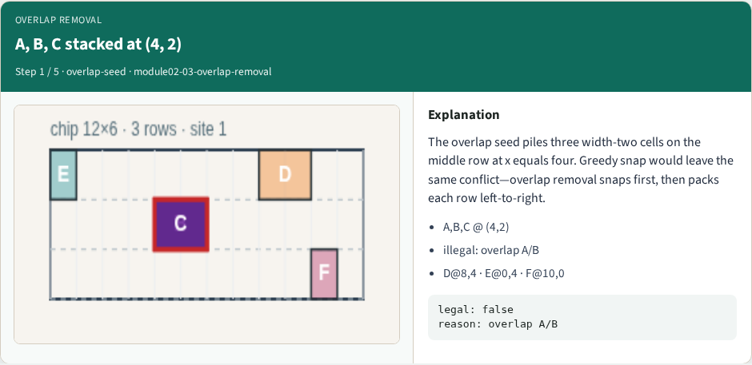
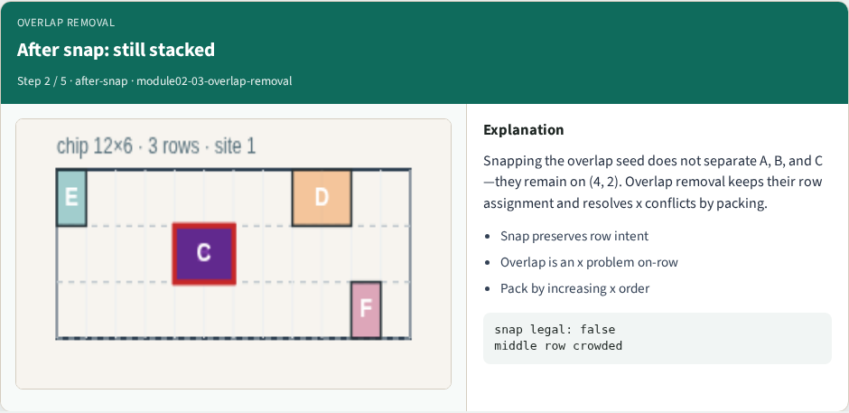
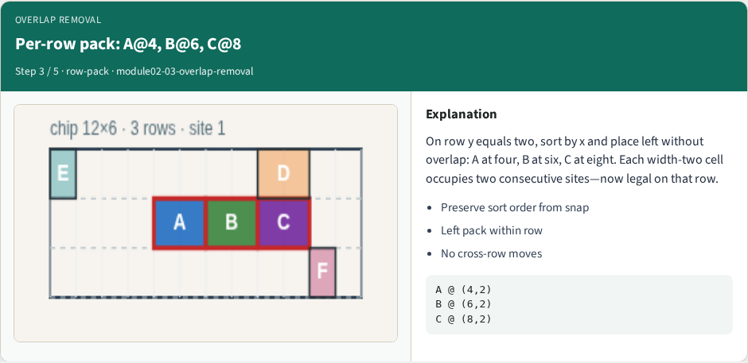
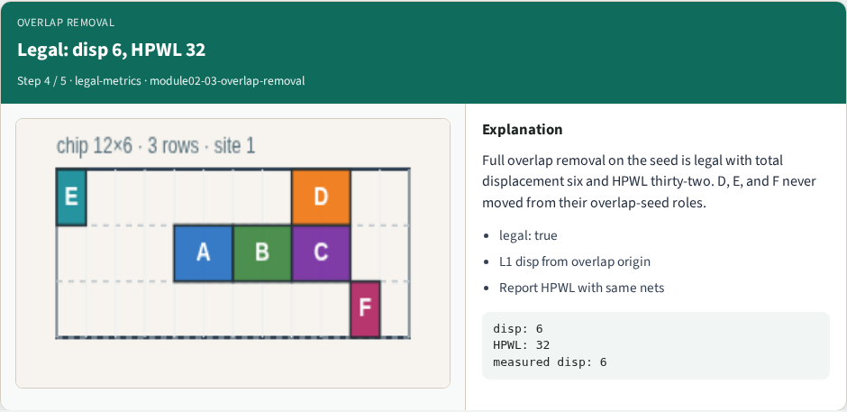
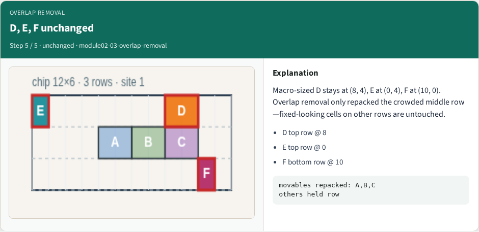

# Overlap removal

**Module id:** module02-03-overlap-removal
**Lab:** overlap-removal
**Tracks:** A (implement) · B (browser lab)

## Slide 1 — Overlap removal

Overlap removal snaps first, then left-packs each row without changing row assignment. From the triple stack at (4, 2), A stays at four, B moves to six, C to eight on the middle row—legal with displacement six and HPWL thirty-two.

## Slide 2 — The idea

Sort movables by x within each row and place left without overlap. D, E, and F keep their seed roles on other rows. This is the same shelf pack Tetris uses—simple, deterministic, and a good global legalize baseline.

<!-- algorithm-walkthrough -->

## Slide 3 — A, B, C stacked at (4, 2)

The overlap seed piles three width-two cells on the middle row at x equals four. Greedy snap would leave the same conflict—overlap removal snaps first, then packs each row left-to-right.

## Slide 4 — After snap: still stacked

Snapping the overlap seed does not separate A, B, and C—they remain on (4, 2). Overlap removal keeps their row assignment and resolves x conflicts by packing.

## Slide 5 — Per-row pack: A@4, B@6, C@8

On row y equals two, sort by x and place left without overlap: A at four, B at six, C at eight. Each width-two cell occupies two consecutive sites—now legal on that row.

## Slide 6 — Legal: disp 6, HPWL 32

Full overlap removal on the seed is legal with total displacement six and HPWL thirty-two. D, E, and F never moved from their overlap-seed roles.

## Slide 7 — D, E, F unchanged

Macro-sized D stays at (8, 4), E at (0, 4), F at (10, 0). Overlap removal only repacked the crowded middle row—fixed-looking cells on other rows are untouched.

<!-- /algorithm-walkthrough -->

## Slide 8 — Browser lab track

In the browser lab track, open the **overlap-removal** lab from the tools shelf. Load the overlap or float starter, run the legalizer once, and read legality plus displacement and HPWL when the panel shows them. Work the challenges that lock the goldens, then come back to implement the same loop yourself.

## Slide 9 — Implement track

In the implement track, open this module's examples and the course `common/` solvers. Parse `tiny_legal.json`, run the algorithm with deterministic coordinates, and print legality, displacement, and HPWL. Match the browser goldens before you claim the checklist.

## Slide 10 — Pitfalls

Common traps: assuming snap alone legalizes; forgetting site width when checking overlap; ignoring fixed macro D at (8, 4); reporting HPWL without legality; and comparing Abacus and Tetris without naming displacement versus wirelength tradeoffs.

## Slide 11 — Your turn

Complete the checklist for at least one track—preferably both. Implement until your metrics match the starter goldens. When you're ready, take the short quiz, then continue to the next module.
