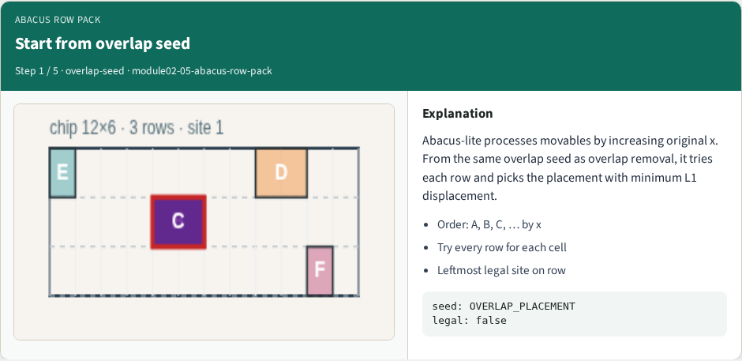
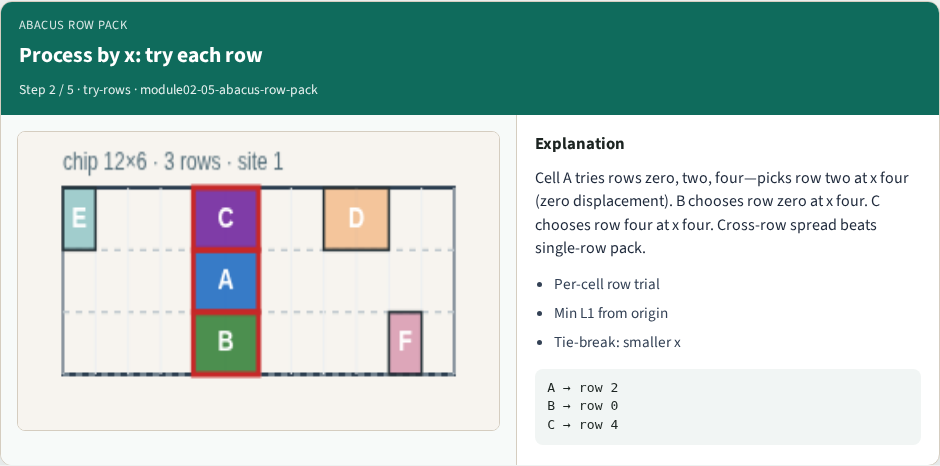
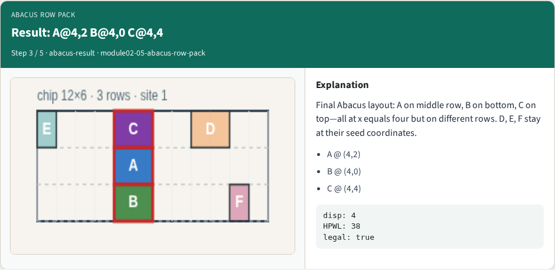
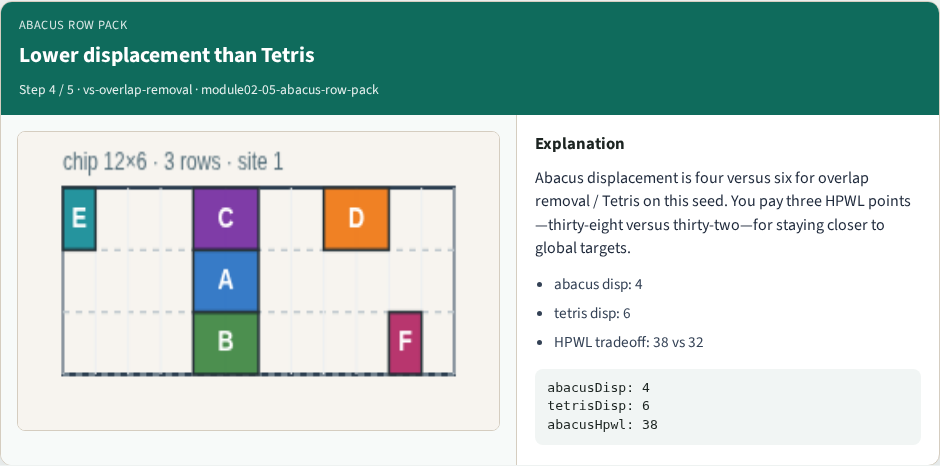
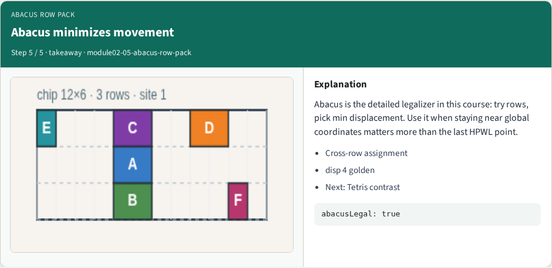

# Abacus row packing

**Module id:** module02-05-abacus-row-pack
**Lab:** abacus-row-pack
**Tracks:** A (implement) · B (browser lab)

## Slide 1 — Abacus row packing

Abacus-lite processes cells by increasing x and tries every row. For each trial it finds the leftmost legal site and picks the row with minimum L1 displacement from the origin. On the overlap seed: A at (4, 2), B at (4, 0), C at (4, 4).

## Slide 2 — The idea

Cross-row spread beats single-row shelf pack on displacement—four versus six here—with HPWL thirty-eight versus thirty-two for Tetris. Abacus is the detailed legalizer in this course: more search, less movement.


## Slide 3 — Pseudocode

Abacus needs a nested loop in pseudocode: outer cells in x order, inner trial of every row. For each trial you compute leftmost legal x and an L1 cost back to the origin, then keep the cheapest row.

Open this module's examples file and find the Pseudocode section. That written sketch is what you implement on the implement track and what the browser challenges measure.

## Slide 4 — Algorithm sketch

Fixed macros sit first so their intervals block later trials. On the overlap seed the sketch lands A at four two, B at four zero, C at four four—displacement four and HPWL thirty-eight, tighter movement than Tetris.

```text
INPUT: origin, widths, rows Y[], fixed macros
OUTPUT: legal pack minimizing Σ L1 move
place fixed macros first
order ← movables by origin.x
for each cell c in order:
  for each row y: trial leftmost legal x
  keep (x,y) with min |Δx|+|Δy| to origin
  place c at best
GOLDEN: A(4,2) B(4,0) C(4,4); disp=4; HPWL=38
```


<!-- algorithm-walkthrough -->

## Slide 5 — Start from overlap seed



Abacus-lite processes movables by increasing original x. From the same overlap seed as overlap removal, it tries each row and picks the placement with minimum L1 displacement.

## Slide 6 — Process by x: try each row



Cell A tries rows zero, two, four—picks row two at x four (zero displacement). B chooses row zero at x four. C chooses row four at x four. Cross-row spread beats single-row pack.

## Slide 7 — Result: A@4,2 B@4,0 C@4,4



Final Abacus layout: A on middle row, B on bottom, C on top—all at x equals four but on different rows. D, E, F stay at their seed coordinates.

## Slide 8 — Lower displacement than Tetris



Abacus displacement is four versus six for overlap removal / Tetris on this seed. You pay three HPWL points—thirty-eight versus thirty-two—for staying closer to global targets.

## Slide 9 — Abacus minimizes movement



Abacus is the detailed legalizer in this course: try rows, pick min displacement. Use it when staying near global coordinates matters more than the last HPWL point.

<!-- /algorithm-walkthrough -->


## Slide 10 — Browser lab track

In the browser lab track, open the **abacus-row-pack** lab from the tools shelf. Open the interactive lab, place or snap cells on the site and row grid—or use an Apply helper—then Check. Reveal golden is study-only. Work the challenges that lock the goldens, then come back to implement the same loop yourself.

## Slide 11 — Implement track

In the implement track, open this module's EXAMPLES.md Pseudocode section and the course common solvers. Parse `tiny_legal.json`, run the algorithm with deterministic coordinates, and print legality, displacement, and HPWL. Match the browser goldens before you claim the checklist.

## Slide 12 — Pitfalls

Common traps: assuming snap alone legalizes; forgetting site width when checking overlap; ignoring fixed macro D at (8, 4); reporting HPWL without legality; and comparing Abacus and Tetris without naming displacement versus wirelength tradeoffs.

## Slide 13 — Your turn

Complete the checklist for at least one track—preferably both. Implement until your metrics match the starter goldens. When you're ready, take the short quiz, then continue to the next module.
