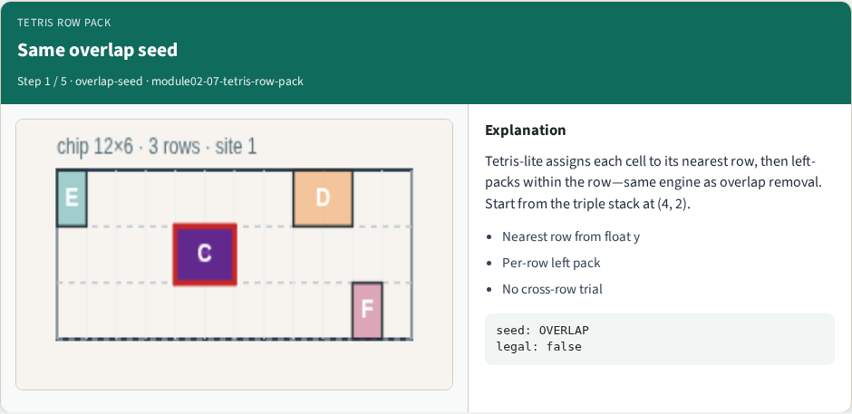
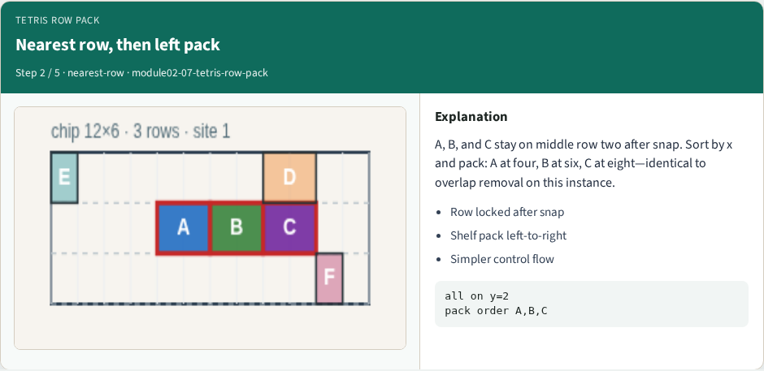
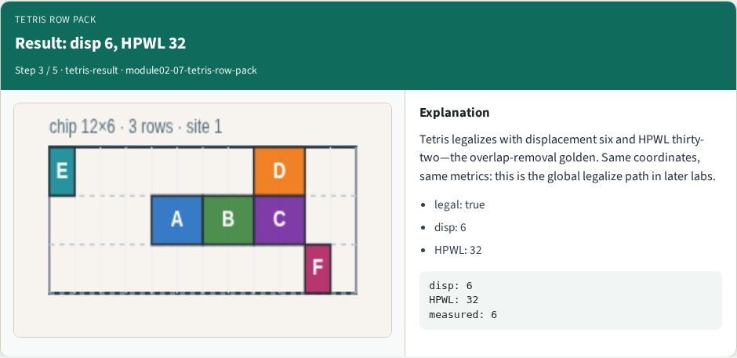
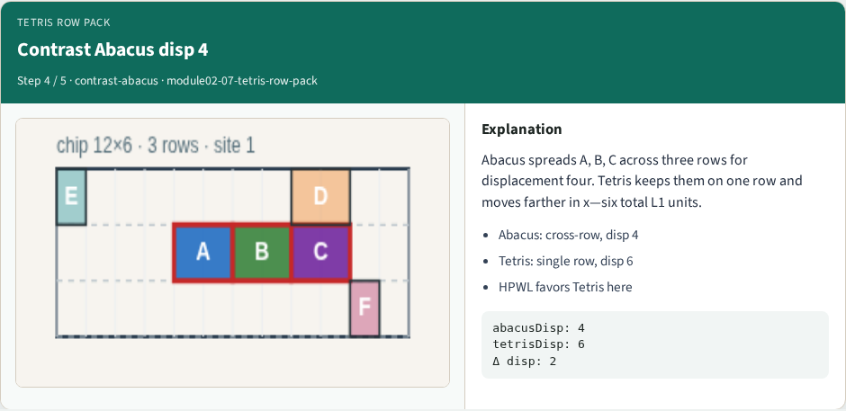
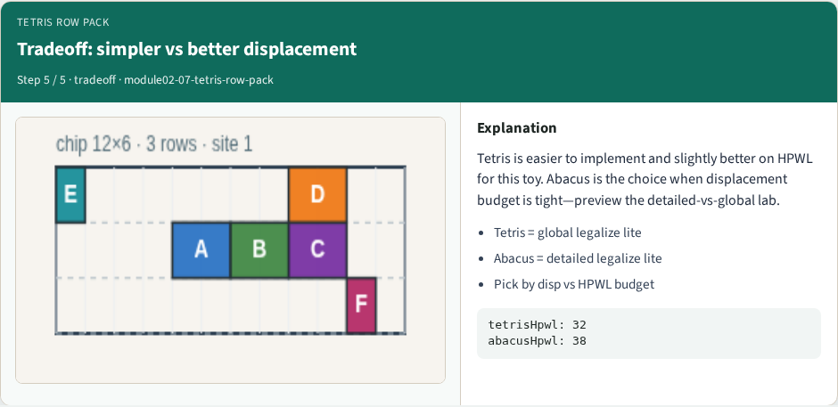

# Tetris row packing

Tetris-lite assigns each cell to its nearest row, then left-packs like overlap removal

---

## The idea
- Tetris is simpler than Abacus but moves cells farther on this toy
- Contrast disp six versus Abacus disp four
- Trade simpler control flow against a tighter displacement budget and slightly higher HPWL

---

## Pseudocode
- Tetris pseudocode is shorter than Abacus on purpose
- First assign each cell to its nearest row and freeze that choice
- Then reuse the per-row left pack from overlap removal
- Open this module's examples file and find the Pseudocode section
- That written sketch is what you implement on the implement track and what the browser

---

## Algorithm sketch
- Same teaching seed, same numbers as overlap removal: displacement six, HPWL thirty-two
- Write the compare line in the sketch so you remember Abacus spends search to cut

---

## Algorithm sketch — try these

```
INPUT: positions, widths, rows Y[], fixed macros
OUTPUT: legal packing (shelf / Tetris-lite)
for each movable c: y ← nearest row (freeze)
then per-row left pack (see overlap removal)
GOLDEN: A@4 B@6 C@8 on y=2; disp=6; HPWL=32
COMPARE: Abacus disp=4 (more search)
```

---

## Same overlap seed


---

## Nearest row, then left pack


---

## Result: disp 6, HPWL 32


---

## Contrast Abacus disp 4


---

## Tradeoff: simpler vs better displacement


---

## Browser lab track
- In the browser lab track, open the **tetris-row-pack** lab from the tools shelf
- Open the interactive lab
- Reveal golden is study-only
- Work the challenges that lock the goldens

---

## Implement track
- In the implement track
- Parse `tiny_legal.json`, run the algorithm with deterministic coordinates
- Match the browser goldens before you claim the checklist

---

## Pitfalls
- Common traps

---

## Your turn
- Complete the checklist for at least one track, preferably both
- Implement until your metrics match the starter goldens
- When you're ready, take the short quiz, then continue to the next module

