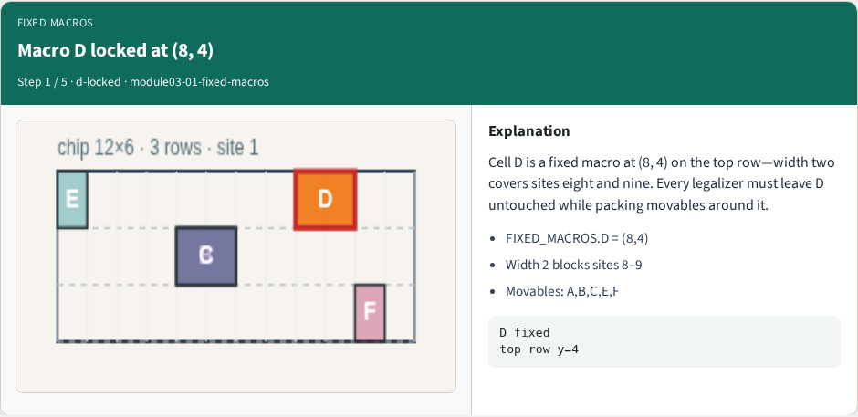
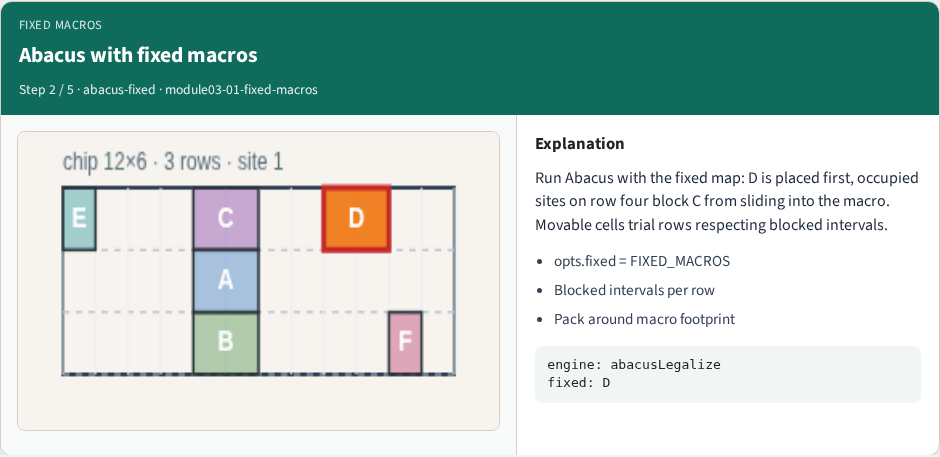
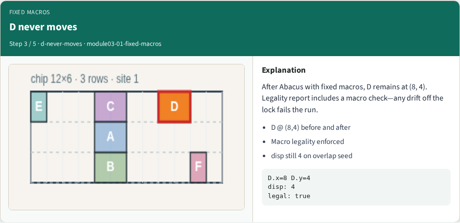
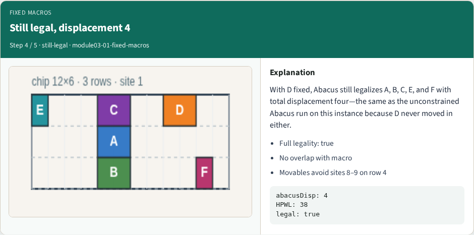
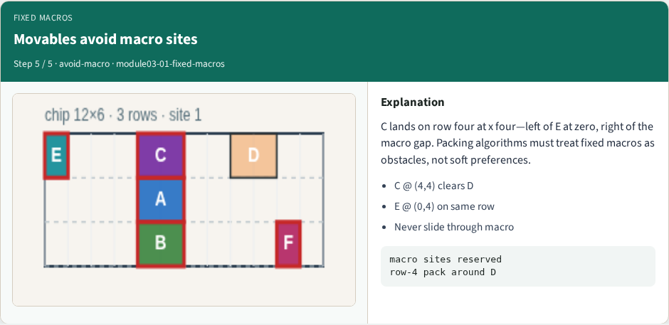

# Fixed macros

Macro D is locked at (8, 4) on the top row, width two blocks sites eight and nine

---

## The idea
- Fixed cells are placed first; occupied intervals block shelf and Abacus trials on that row
- Legality adds a macro check, any drift off the lock fails
- Movable cells must route around macro sites, not slide through them
- <!-- algorithm-walkthrough -->

---

## Macro D locked at (8, 4)

---

## Abacus with fixed macros

---

## D never moves

---

## Still legal, displacement 4

---

## Movables avoid macro sites

---

## Browser lab track
- In the browser lab track, open the **fixed-macros** lab from the tools shelf
- Load the overlap or float starter, run the legalizer once
- Work the challenges that lock the goldens

---

## Implement track
- In the implement track, open this module's examples and the course `common/` solvers
- Parse `tiny_legal.json`, run the algorithm with deterministic coordinates
- Match the browser goldens before you claim the checklist

---

## Pitfalls
- Common traps

---

## Your turn
- Complete the checklist for at least one track, preferably both
- Implement until your metrics match the starter goldens
- When you're ready, take the short quiz, then continue to the next module

