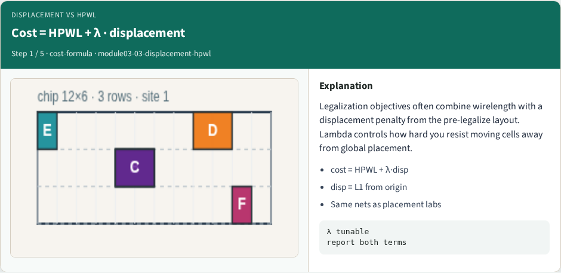
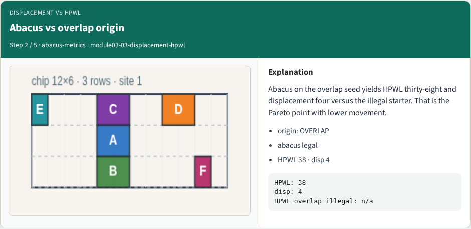
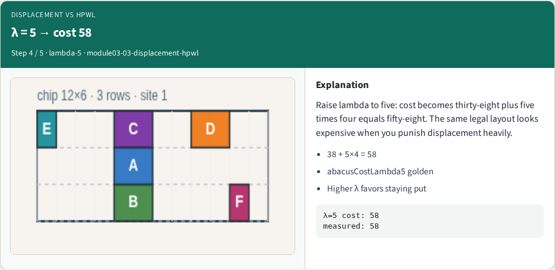
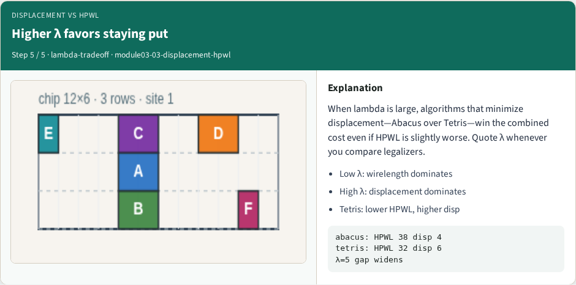

# Displacement versus HPWL

Legalization cost combines HPWL and displacement

---

## The idea
- Lambda one gives cost forty-two
- Higher lambda favors staying near global placement even when wirelength could be slightly

---

## Pseudocode
- This module’s pseudocode is a cost function, not a packer
- After you have a legal layout
- Open this module's examples file and find the Pseudocode section
- That written sketch is what you implement on the implement track and what the browser

---

## Algorithm sketch
- Plug in the Abacus goldens: thirty-eight plus lambda times four
- Lambda one costs forty-two; lambda five costs fifty-eight
- Higher lambda means the sketch favors staying near the global place

---

## Algorithm sketch — try these

```
INPUT: legal positions, origin, nets, λ≥0
OUTPUT: cost, HPWL, disp
disp ← Σ|Δx|+|Δy| vs origin
HPWL ← Σ net bbox (cell centers)
cost ← HPWL + λ · disp
GOLDEN Abacus: HPWL=38 disp=4
  λ=1 → 42;  λ=5 → 58
```

---

## Cost = HPWL + λ · displacement


---

## Abacus vs overlap origin


---

## λ = 1 → cost 42


---

## λ = 5 → cost 58


---

## Higher λ favors staying put


---

## Browser lab track
- In the browser lab track, open the **displacement-hpwl** lab from the tools shelf
- Open the interactive lab
- Reveal golden is study-only
- Work the challenges that lock the goldens

---

## Implement track
- In the implement track
- Parse `tiny_legal.json`, run the algorithm with deterministic coordinates
- Match the browser goldens before you claim the checklist

---

## Pitfalls
- Common traps

---

## Your turn
- Complete the checklist for at least one track, preferably both
- Implement until your metrics match the starter goldens
- When you're ready, take the short quiz, then continue to the next module

