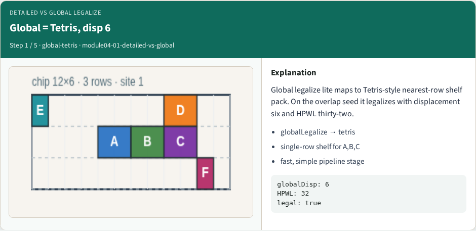
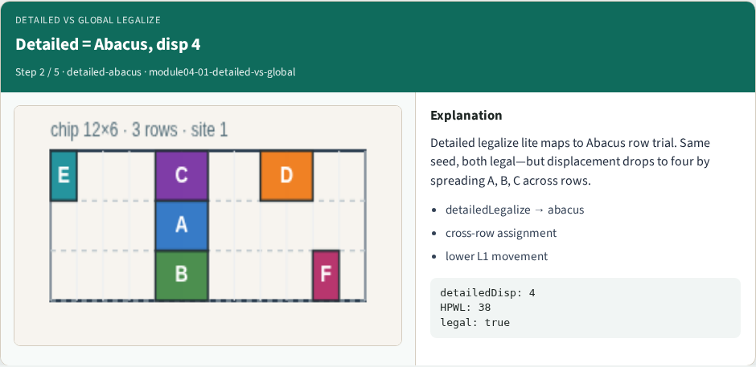
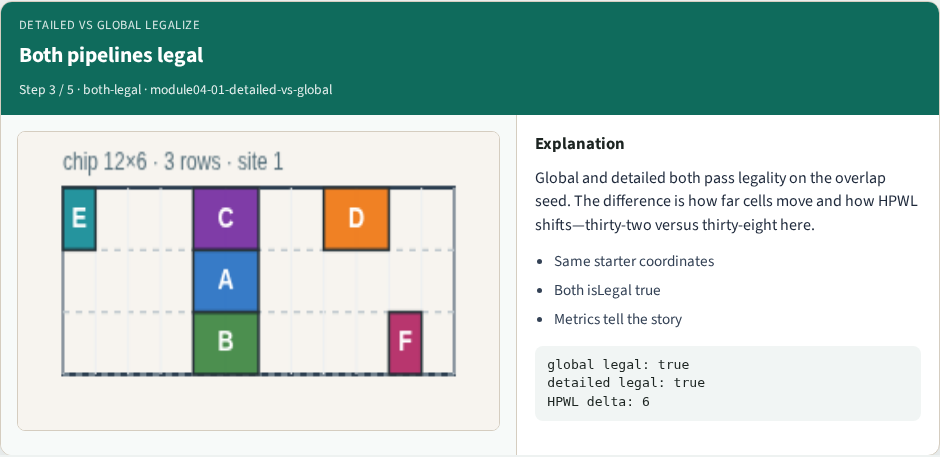
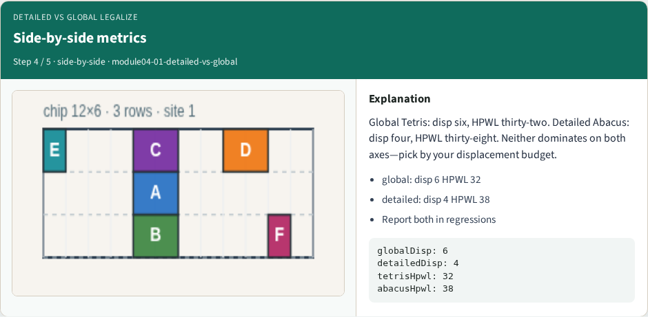
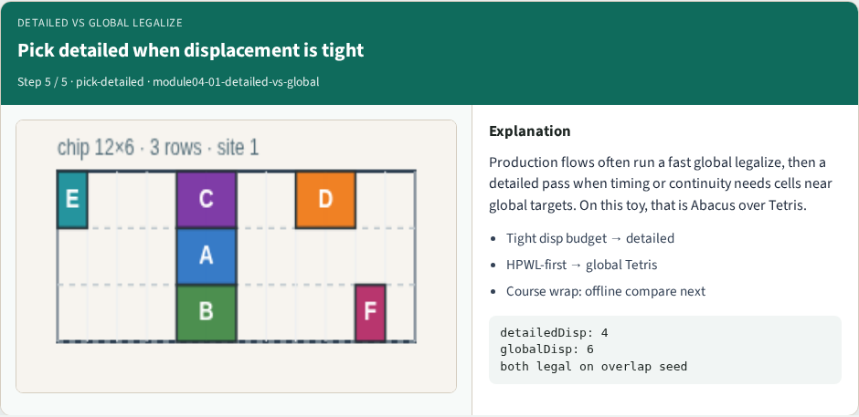

# Detailed versus global legalize

Global legalize lite maps to Tetris shelf pack, displacement six, HPWL thirty-two

---

## The idea
- Pick global Tetris when you want a fast pass and can afford extra movement
- Pick detailed Abacus when displacement budget is tight
- Report both pipelines side by side in regressions, legal first, then disp and HPWL
- <!-- algorithm-walkthrough -->

---

## Global = Tetris, disp 6

---

## Detailed = Abacus, disp 4

---

## Both pipelines legal

---

## Side-by-side metrics

---

## Pick detailed when displacement is tight

---

## Browser lab track
- In the browser lab track, open the **detailed-vs-global** lab from the tools shelf
- Load the overlap or float starter, run the legalizer once
- Work the challenges that lock the goldens

---

## Implement track
- In the implement track, open this module's examples and the course `common/` solvers
- Parse `tiny_legal.json`, run the algorithm with deterministic coordinates
- Match the browser goldens before you claim the checklist

---

## Pitfalls
- Common traps

---

## Your turn
- Complete the checklist for at least one track, preferably both
- Implement until your metrics match the starter goldens
- When you're ready, take the short quiz, then continue to the next module

