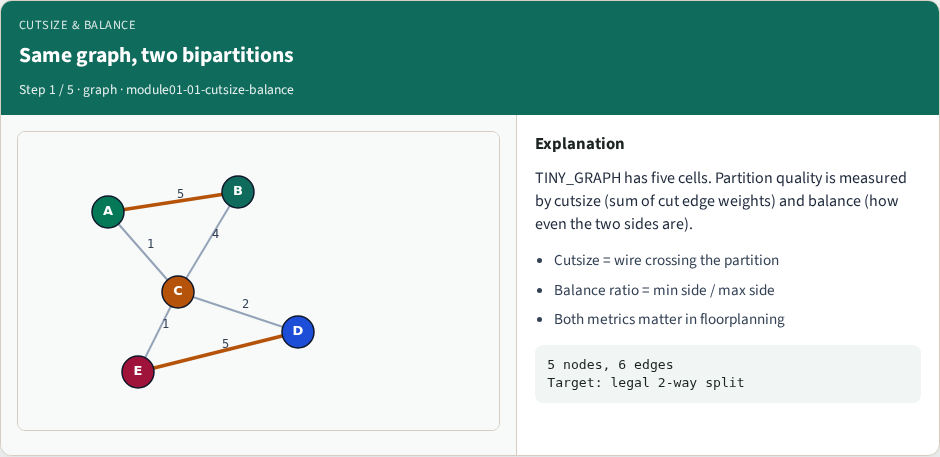
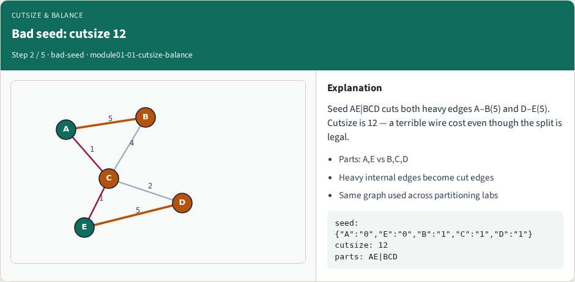
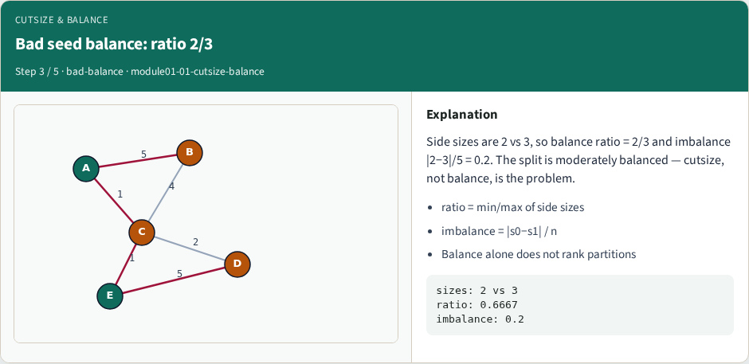
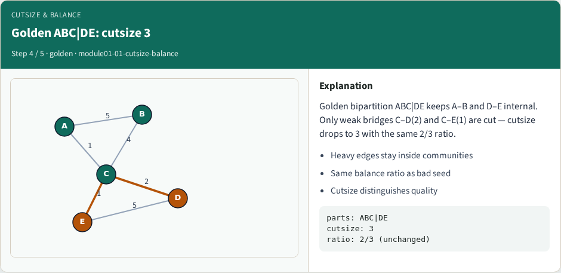
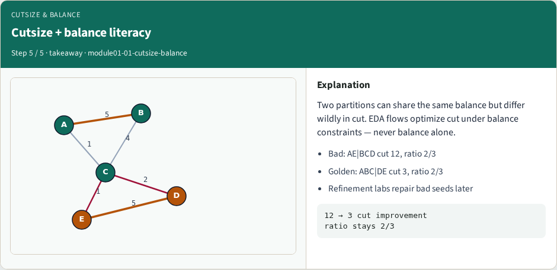

# Cutsize and balance

Cutsize adds the weights of edges that cross the cut

---

## The idea
- For every edge, if the endpoints sit in different parts, add its weight to the cut
- Balance ratio is the smaller part size over the larger
- Never celebrate a zero cut that parks every node on one side

---

## Pseudocode
- Before any refinement, write the metrics
- Pseudocode sums cut edges for cutsize and part sizes for balance
- Imbalance is the absolute size gap over total size
- Open this module's examples file and find the Pseudocode section
- That written sketch is what you implement on the implement track and what the browser

---

## Algorithm sketch
- Bad seed AE versus BCD cuts both heavy edges for cutsize twelve
- Golden ABC versus DE drops the cut to three with sizes three and two

---

## Algorithm sketch — try these

```
INPUT: assignment side[v], weighted edges
OUTPUT: cutsize, sizes, imbalance
cut ← Σ w(u,v) where side[u]≠side[v]
size[p] ← Σ node_size on side p
imbalance ← |s0−s1| / (s0+s1)
GOLDEN bad AE|BCD: cut=12, sizes 2|3
GOLDEN ABC|DE: cut=3, sizes 3|2
```

---

## Same graph, two bipartitions


---

## Bad seed: cutsize 12


---

## Bad seed balance: ratio 2/3


---

## Golden ABC|DE: cutsize 3


---

## Cutsize + balance literacy


---

## Browser lab track
- In the browser lab track, open the **cutsize-balance** lab from the tools shelf
- Load the starter graph, run the algorithm once
- Work the challenges that lock the goldens

---

## Implement track
- In the implement track
- Parse the tiny graph, run the algorithm with a deterministic seed
- Match the browser goldens before you claim the checklist

---

## Pitfalls
- Common traps
- For multilevel flows, verify coarsening before you blame the refiner

---

## Your turn
- Complete the checklist for at least one track, preferably both
- Implement until your metrics match the starter goldens
- When you’re ready, take the short quiz, then continue to the next module

