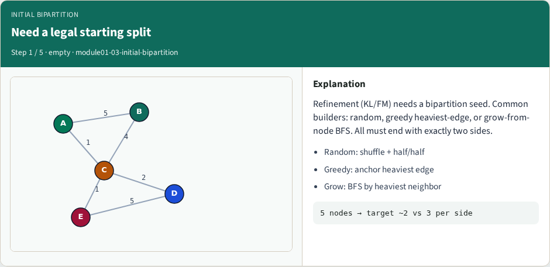
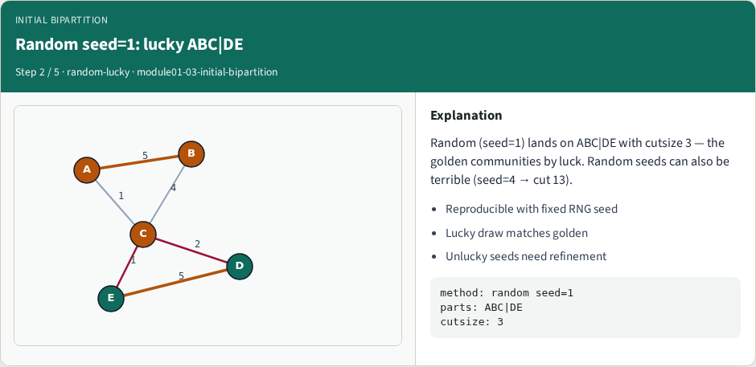
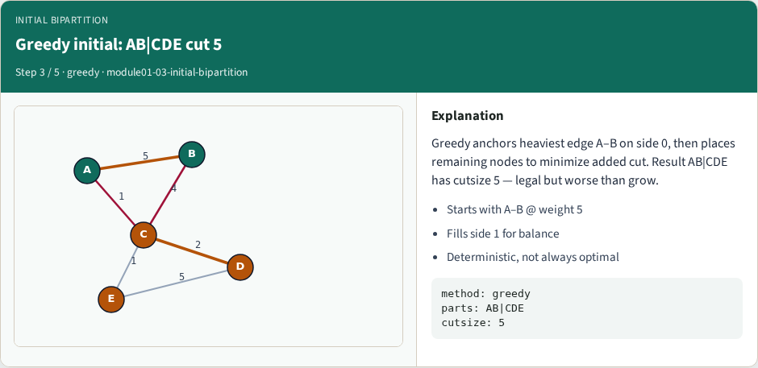
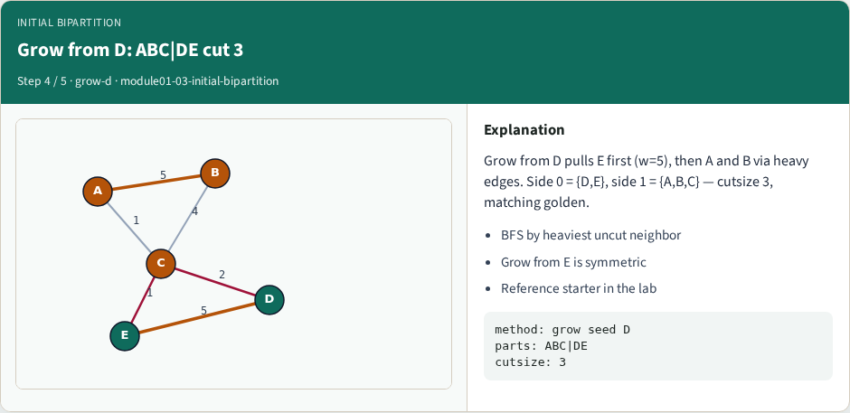
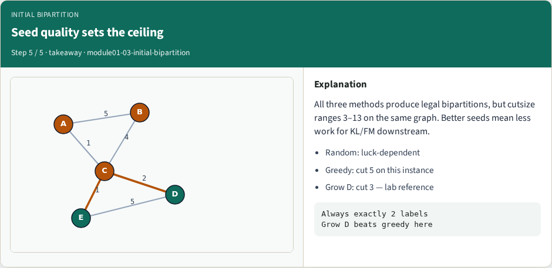

# Initial bipartition — step-by-step (for slides / transcript)

**Module:** `module01-03-initial-bipartition`  
**Lab / algo:** `initial-bipartition`  
**Viewer:** `/tools/algorithm-walkthrough/?algo=initial-bipartition&step=1`

Use each **Caption** as spoken prose (or a shortened slide note).
Use **Bullets** on the PPT; pair with the PNG in `assets/steps/`.

## Step 1 — Need a legal starting split



**Caption (transcript):** Refinement (KL/FM) needs a bipartition seed. Common builders: random, greedy heaviest-edge, or grow-from-node BFS. All must end with exactly two sides.

**Slide bullets:**

- Random: shuffle + half/half
- Greedy: anchor heaviest edge
- Grow: BFS by heaviest neighbor

**On-screen metrics:**

```
5 nodes → target ~2 vs 3 per side
```

## Step 2 — Random seed=1: lucky ABC|DE



**Caption (transcript):** Random (seed=1) lands on ABC|DE with cutsize 3 — the golden communities by luck. Random seeds can also be terrible (seed=4 → cut 13).

**Slide bullets:**

- Reproducible with fixed RNG seed
- Lucky draw matches golden
- Unlucky seeds need refinement

**On-screen metrics:**

```
method: random seed=1
parts: ABC|DE
cutsize: 3
```

## Step 3 — Greedy initial: AB|CDE cut 5



**Caption (transcript):** Greedy anchors heaviest edge A–B on side 0, then places remaining nodes to minimize added cut. Result AB|CDE has cutsize 5 — legal but worse than grow.

**Slide bullets:**

- Starts with A–B @ weight 5
- Fills side 1 for balance
- Deterministic, not always optimal

**On-screen metrics:**

```
method: greedy
parts: AB|CDE
cutsize: 5
```

## Step 4 — Grow from D: ABC|DE cut 3



**Caption (transcript):** Grow from D pulls E first (w=5), then A and B via heavy edges. Side 0 = {D,E}, side 1 = {A,B,C} — cutsize 3, matching golden.

**Slide bullets:**

- BFS by heaviest uncut neighbor
- Grow from E is symmetric
- Reference starter in the lab

**On-screen metrics:**

```
method: grow seed D
parts: ABC|DE
cutsize: 3
```

## Step 5 — Seed quality sets the ceiling



**Caption (transcript):** All three methods produce legal bipartitions, but cutsize ranges 3–13 on the same graph. Better seeds mean less work for KL/FM downstream.

**Slide bullets:**

- Random: luck-dependent
- Greedy: cut 5 on this instance
- Grow D: cut 3 — lab reference

**On-screen metrics:**

```
Always exactly 2 labels
Grow D beats greedy here
```

