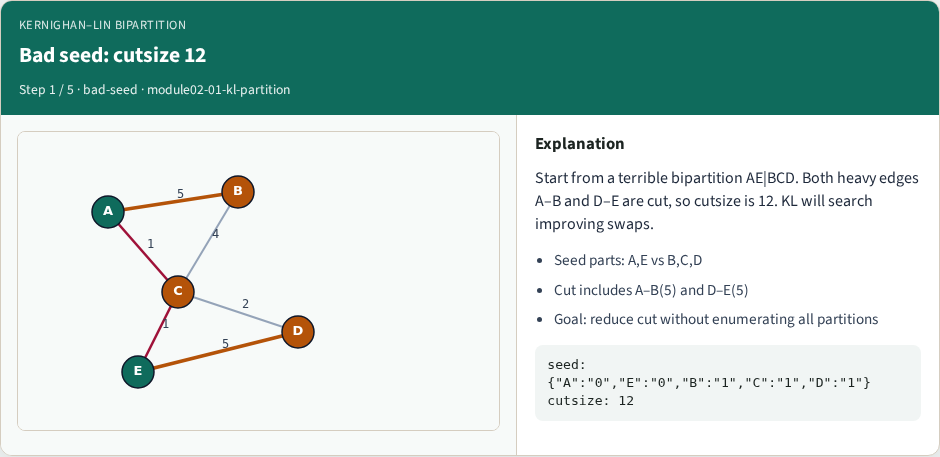
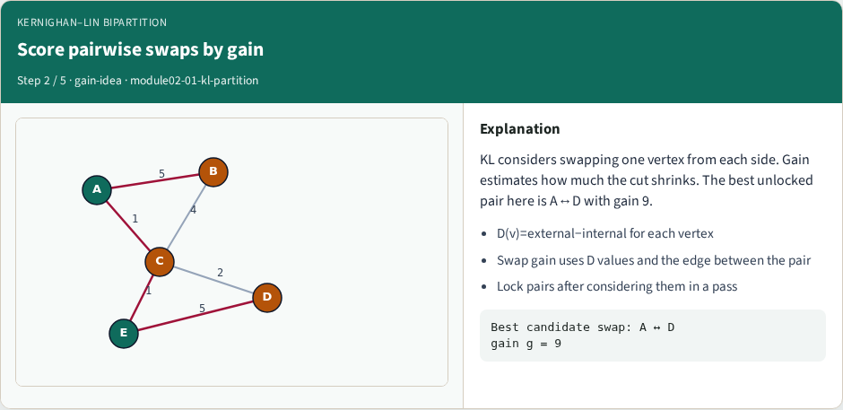
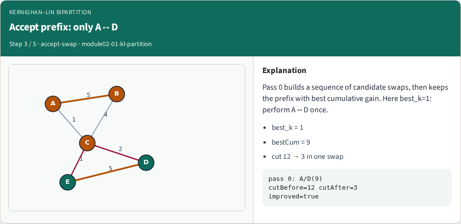
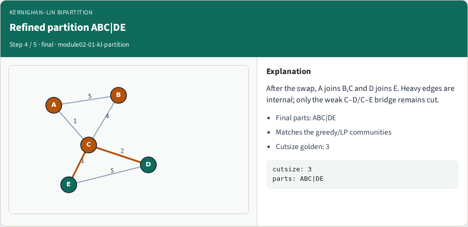
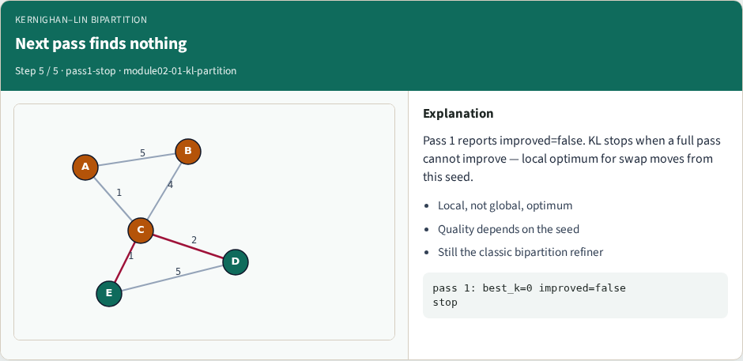

# Kernighan–Lin bipartition

Kernighan–Lin improves an existing bipartition by swapping pairs across the cut

---

## The idea
- Score each unlocked pair by swap gain
- Here the winning prefix is one swap: A with D, gain nine
- Pass one then finds nothing and KL stops at a local optimum for swap moves
- <!-- algorithm-walkthrough -->

---

## Bad seed: cutsize 12

---

## Score pairwise swaps by gain

---

## Accept prefix: only A↔D

---

## Refined partition ABC|DE

---

## Next pass finds nothing

---

## Browser lab track
- In the browser lab track, open the **kl-partition** lab from the tools shelf
- Load the starter graph, run the algorithm once
- Work the challenges that lock the goldens

---

## Implement track
- In the implement track, open this module’s examples and the course `common/` solvers
- Parse the tiny graph, run the algorithm with a deterministic seed
- Match the browser goldens before you claim the checklist

---

## Pitfalls
- Common traps
- For multilevel flows, verify coarsening before you blame the refiner

---

## Your turn
- Complete the checklist for at least one track, preferably both
- Implement until your metrics match the starter goldens
- When you’re ready, take the short quiz, then continue to the next module

