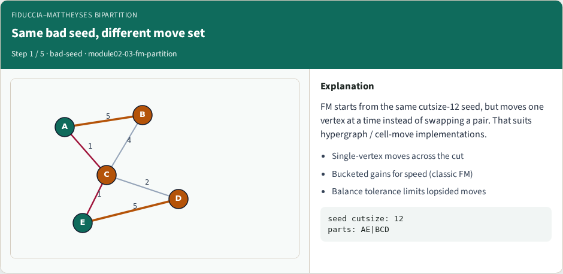
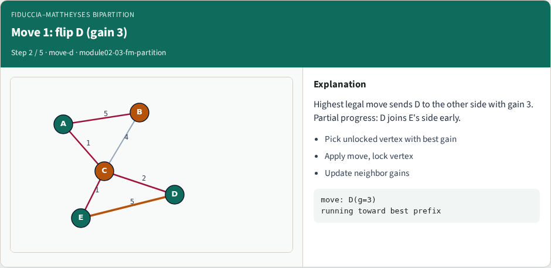
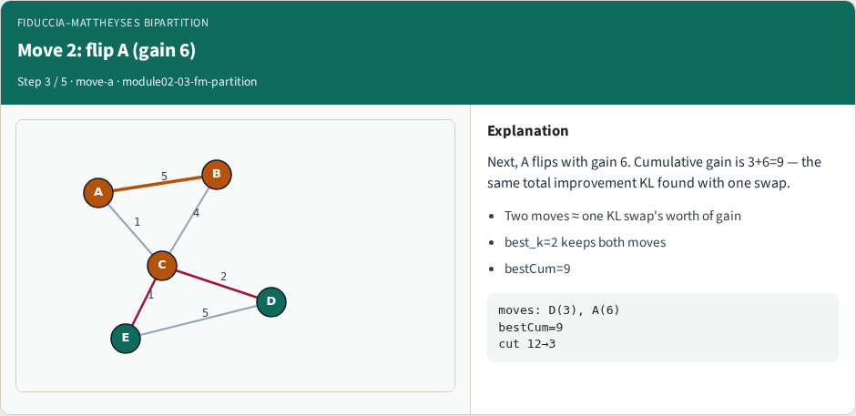
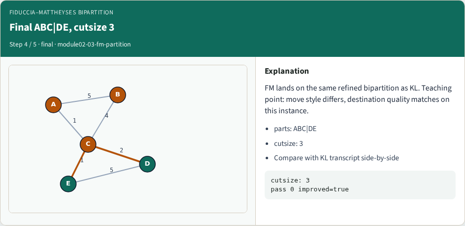
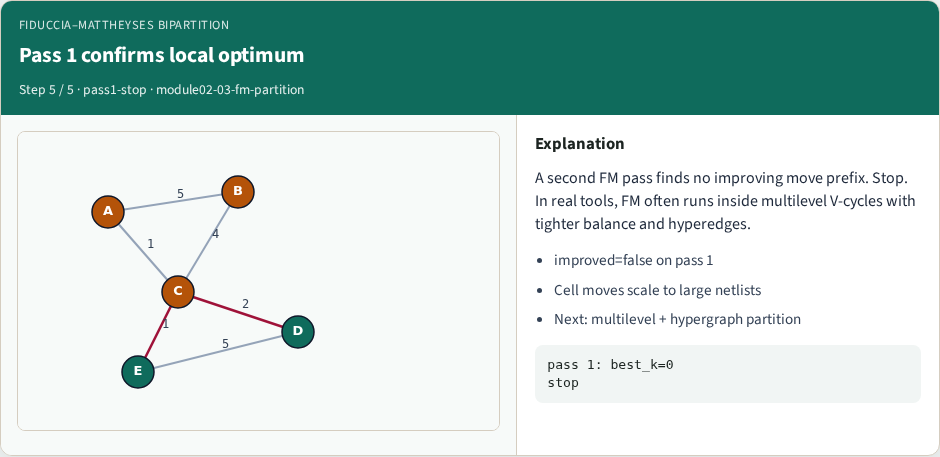

# Fiduccia–Mattheyses bipartition

Fiduccia–Mattheyses moves one vertex at a time instead of swapping a pair

---

## The idea
- Bucketed single-vertex gains, lock after each move
- Two legal flips can equal one KL swap’s total gain on this instance

---

## Pseudocode
- FM moves one vertex at a time
- Pseudocode ranks unlocked legal flips by gain
- Open this module's examples file and find the Pseudocode section
- That written sketch is what you implement on the implement track and what the browser

---

## Algorithm sketch
- Same bad seed as KL

---

## Algorithm sketch — try these

```
INPUT: side[], balance_tol, max_passes
OUTPUT: refined side[]
each pass: while unlocked legal moves exist:
  pick v with max gain among balance-ok flips
  lock v; flip on working copy
keep best positive-gain prefix; apply
stop when a pass cannot improve
GOLDEN BAD_SEED → flip D then A → cut 3
```

---

## Same bad seed, different move set


---

## Move 1: flip D (gain 3)


---

## Move 2: flip A (gain 6)


---

## Final ABC|DE, cutsize 3


---

## Pass 1 confirms local optimum


---

## Browser lab track
- In the browser lab track, open the **fm-partition** lab from the tools shelf
- Load the starter graph, run the algorithm once
- Work the challenges that lock the goldens

---

## Implement track
- In the implement track
- Parse the tiny graph, run the algorithm with a deterministic seed
- Match the browser goldens before you claim the checklist

---

## Pitfalls
- Common traps
- For multilevel flows, verify coarsening before you blame the refiner

---

## Your turn
- Complete the checklist for at least one track, preferably both
- Implement until your metrics match the starter goldens
- When you’re ready, take the short quiz, then continue to the next module

