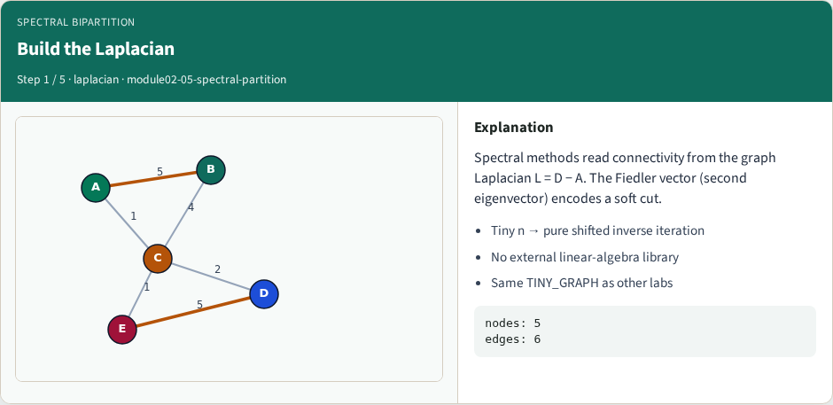
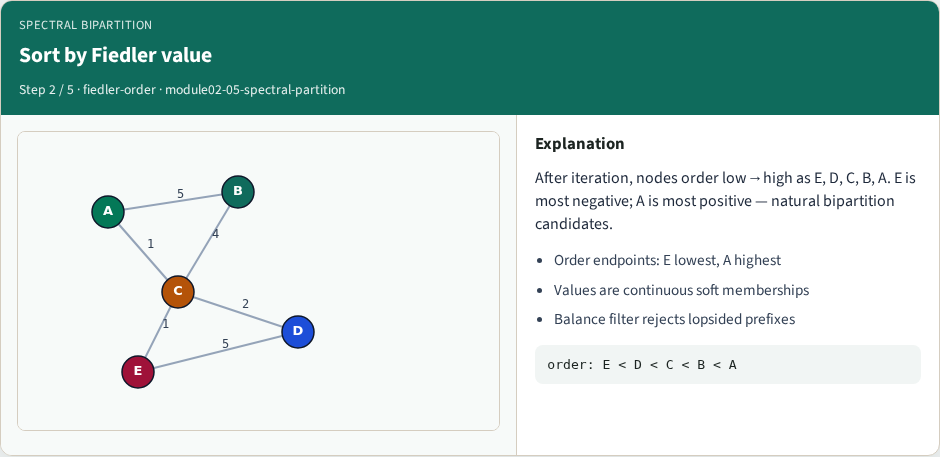
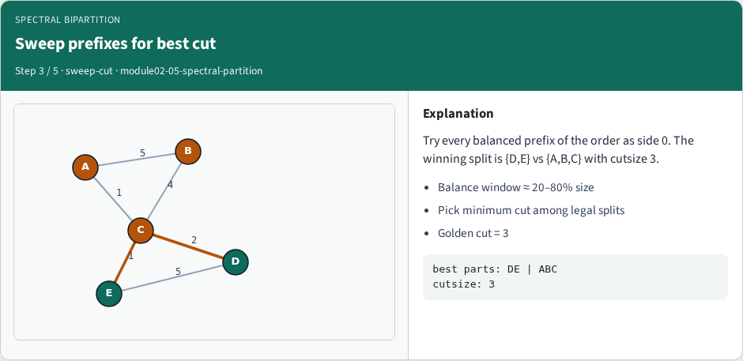
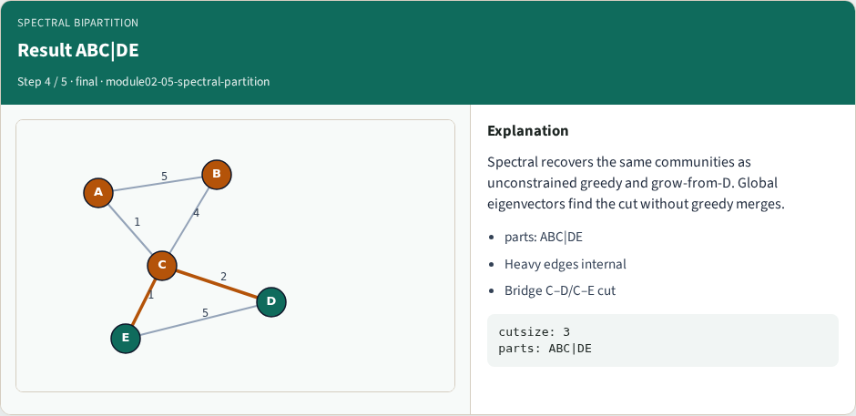
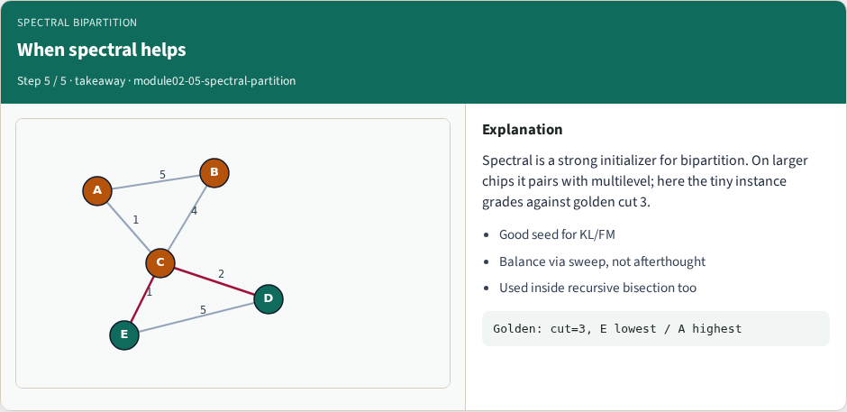

# Spectral bipartition

Spectral bipartition reads connectivity from the graph Laplacian

---

## The idea
- Build L equals D minus A, take the second eigenvector, sort nodes
- Reject lopsided splits
- The continuous membership becomes a hard bipartition only after the sweep chooses the best

---

## Pseudocode
- Spectral bipartition reads the Fiedler vector of the Laplacian
- Open this module's examples file and find the Pseudocode section
- That written sketch is what you implement on the implement track and what the browser

---

## Algorithm sketch
- On the starter graph the winning split is D E versus A B C with cutsize three

---

## Algorithm sketch — try these

```
INPUT: weighted undirected G
OUTPUT: side[] bipartition
L ← Laplacian; take Fiedler eigenvector
order ← nodes sorted by Fiedler value
sweep balanced prefixes; pick min cutsize
GOLDEN: DE|ABC (or ABC|DE) cut=3
```

---

## Build the Laplacian


---

## Sort by Fiedler value


---

## Sweep prefixes for best cut


---

## Result ABC|DE


---

## When spectral helps


---

## Browser lab track
- In the browser lab track, open the **spectral-partition** lab from the tools shelf
- Load the starter graph, run the algorithm once
- Work the challenges that lock the goldens

---

## Implement track
- In the implement track
- Parse the tiny graph, run the algorithm with a deterministic seed
- Match the browser goldens before you claim the checklist

---

## Pitfalls
- Common traps
- For multilevel flows, verify coarsening before you blame the refiner

---

## Your turn
- Complete the checklist for at least one track, preferably both
- Implement until your metrics match the starter goldens
- When you’re ready, take the short quiz, then continue to the next module

