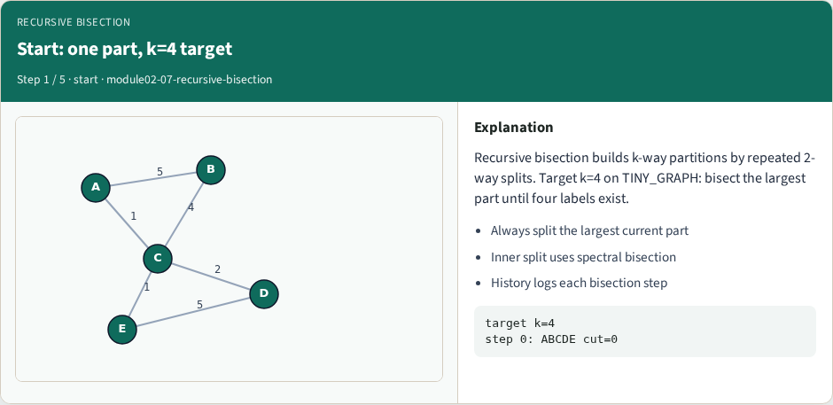
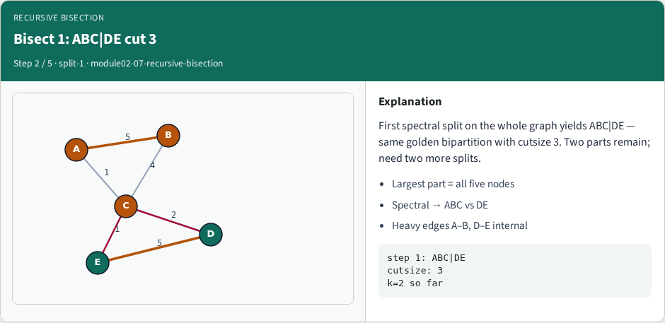
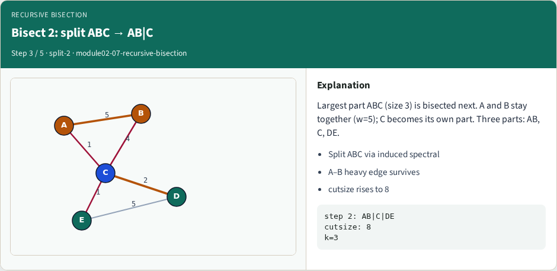
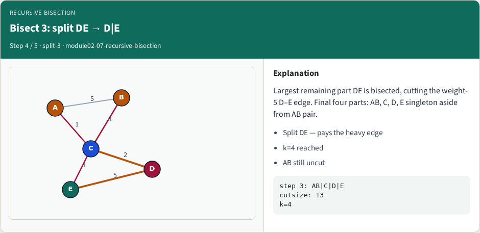
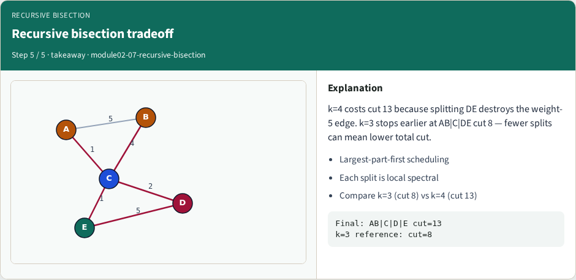

# Recursive bisection

Recursive bisection builds a multiway partition by repeatedly bipartitioning the largest part until you reach k parts

---

## The idea
- Each step is an ordinary bipartition on an induced subgraph
- Quality compounds: a weak first cut leaves later bisectors fewer good options
- Always report total cut across all part boundaries and the part-size vector

---

## Pseudocode
- Recursive bisection is a loop over parts
- Open this module's examples file and find the Pseudocode section
- That written sketch is what you implement on the implement track and what the browser

---

## Algorithm sketch
- First split yields ABC versus DE at cut three
- For k equals three the sketch bisects ABC next into A B versus C with D E untouched

---

## Algorithm sketch — try these

```
INPUT: G, target k parts
OUTPUT: side[v] ∈ {0..k−1}
parts ← {all nodes}
while |parts| < k:
  pick largest part P
  bipartition P (spectral/KL/FM)
  replace P with the two halves
GOLDEN k=2: ABC|DE cut=3
k=3 continues on ABC → AB|C|DE
```

---

## Start: one part, k=4 target


---

## Bisect 1: ABC|DE cut 3


---

## Bisect 2: split ABC → AB|C


---

## Bisect 3: split DE → D|E


---

## Recursive bisection tradeoff


---

## Browser lab track
- In the browser lab track, open the **recursive-bisection** lab from the tools shelf
- Load the starter graph, run the algorithm once
- Work the challenges that lock the goldens

---

## Implement track
- In the implement track
- Parse the tiny graph, run the algorithm with a deterministic seed
- Match the browser goldens before you claim the checklist

---

## Pitfalls
- Common traps
- For multilevel flows, verify coarsening before you blame the refiner

---

## Your turn
- Complete the checklist for at least one track, preferably both
- Implement until your metrics match the starter goldens
- When you’re ready, take the short quiz, then continue to the next module

