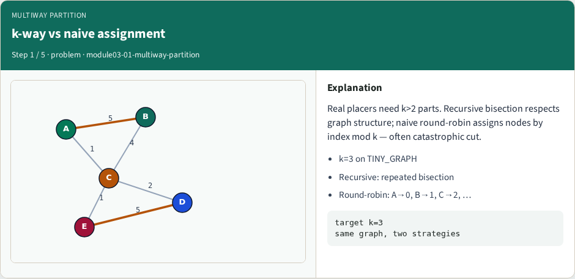
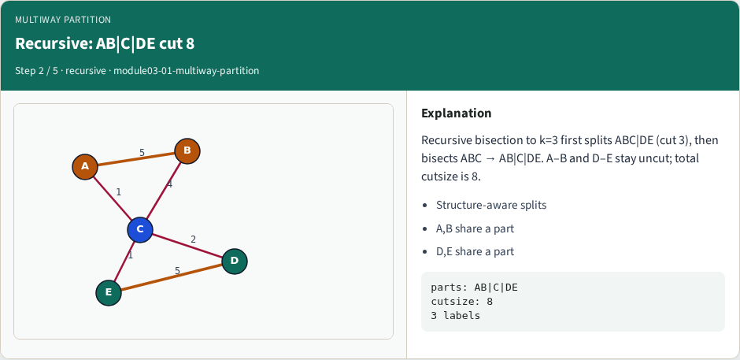
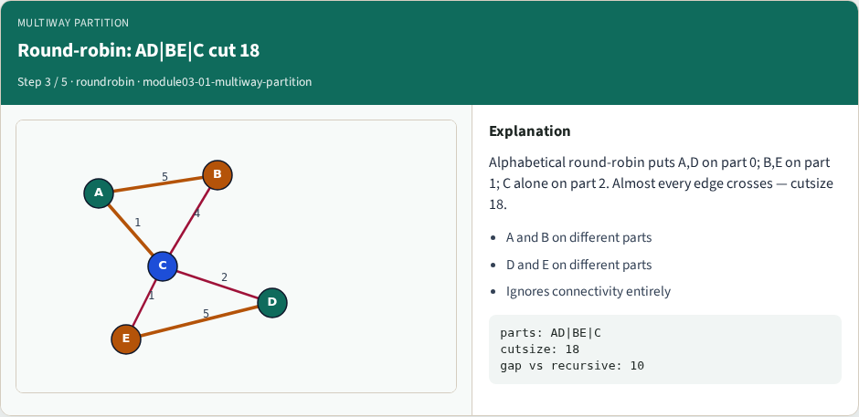
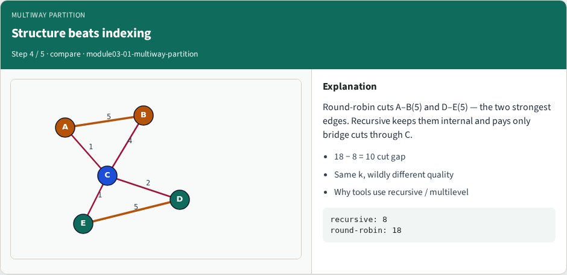
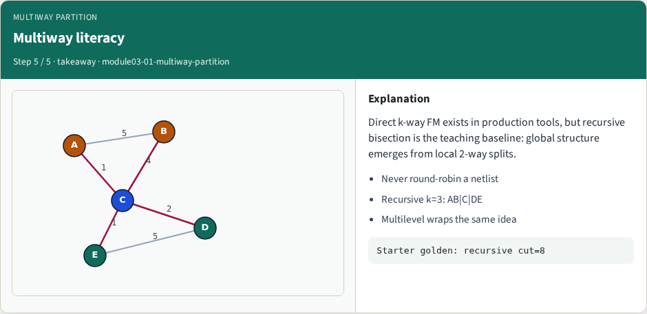

# Multiway partitioning

Direct multiway partitioning assigns nodes to k parts without forcing a binary tree of cuts

---

## The idea
- Multiway objectives count every edge that leaves its part
- Balance becomes a k-way size vector
- Teaching point
- <!-- algorithm-walkthrough -->

---

## k-way vs naive assignment

---

## Recursive: AB|C|DE cut 8

---

## Round-robin: AD|BE|C cut 18

---

## Structure beats indexing

---

## Multiway literacy

---

## Browser lab track
- In the browser lab track, open the **multiway-partition** lab from the tools shelf
- Load the starter graph, run the algorithm once
- Work the challenges that lock the goldens

---

## Implement track
- In the implement track, open this module’s examples and the course `common/` solvers
- Parse the tiny graph, run the algorithm with a deterministic seed
- Match the browser goldens before you claim the checklist

---

## Pitfalls
- Common traps
- For multilevel flows, verify coarsening before you blame the refiner

---

## Your turn
- Complete the checklist for at least one track, preferably both
- Implement until your metrics match the starter goldens
- When you’re ready, take the short quiz, then continue to the next module

