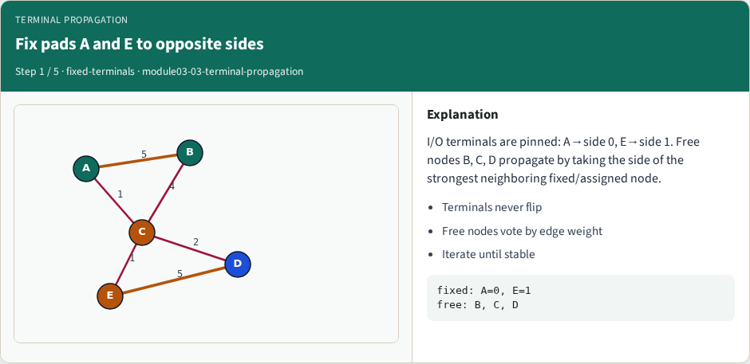
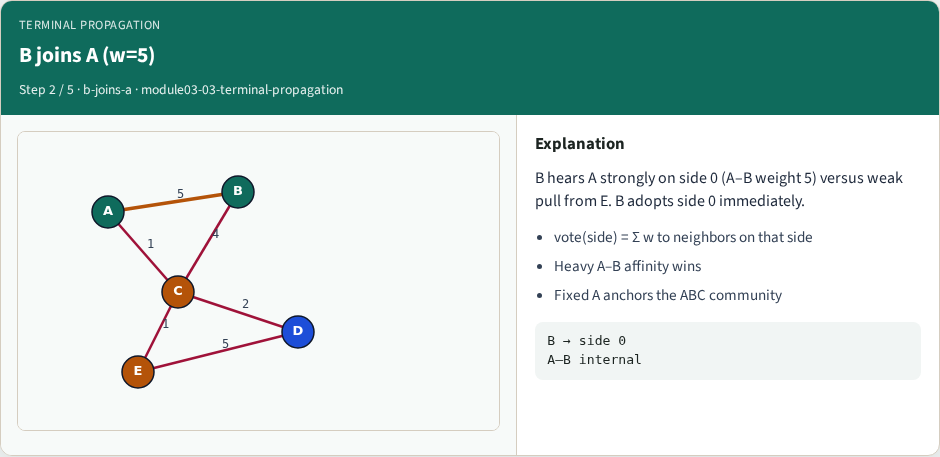
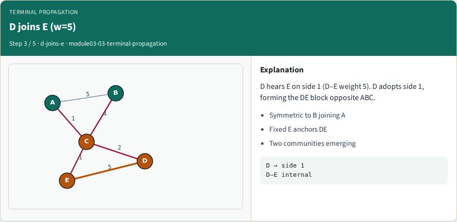
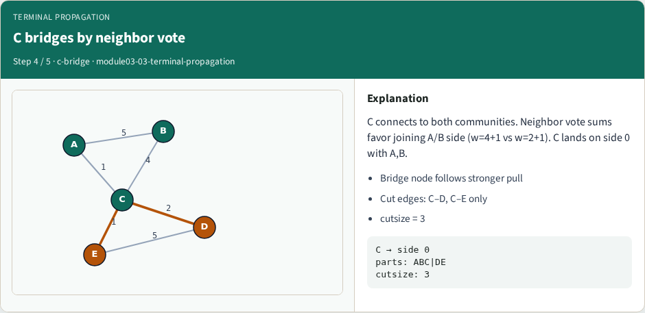
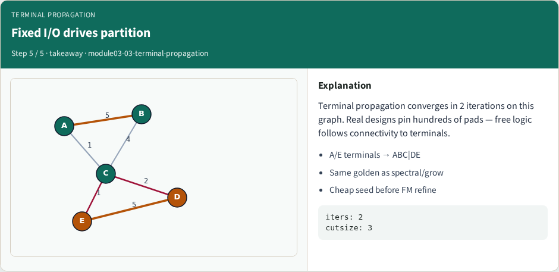

# Terminal propagation

**Module id:** module03-03-terminal-propagation
**Lab:** terminal-propagation
**Tracks:** A (implement) · B (browser lab)

## Slide 1 — Terminal propagation

Pads and fixed I/O pin nodes to sides before free cells move. Terminal propagation carries those constraints into the partition so the cut respects the chip boundary. Pin A to one side and E to the other and watch which free nodes follow.

## Slide 2 — The idea

Fixed terminals never flip. Their neighbors inherit a pull toward the terminal’s part. Ignoring terminals produces pretty cuts that violate the floorplan interface—illegal in real flows.


## Slide 3 — Pseudocode

Terminal propagation adds locked nodes to the bipartition sketch. Fixed terminals keep their sides and act as immovable anchors while free cells move.

Open this module's examples file and find the Pseudocode section. That written sketch is what you implement on the implement track and what the browser challenges measure.

## Slide 4 — Algorithm sketch

After locks are placed, run the same refiner on free cells only. Cutsize still counts every edge, including those that touch terminals.

```text
INPUT: G, fixed terminals T with side
OUTPUT: side for free cells
lock every t∈T at its side
partition free nodes (KL/FM/spectral)
treat T as immovable during moves
report cutsize with terminals included
GOLDEN: fixed terminals steer free cells
```


<!-- algorithm-walkthrough -->

## Slide 5 — Fix pads A and E to opposite sides



I/O terminals are pinned: A→side 0, E→side 1. Free nodes B, C, D propagate by taking the side of the strongest neighboring fixed/assigned node.

## Slide 6 — B joins A (w=5)



B hears A strongly on side 0 (A–B weight 5) versus weak pull from E. B adopts side 0 immediately.

## Slide 7 — D joins E (w=5)



D hears E on side 1 (D–E weight 5). D adopts side 1, forming the DE block opposite ABC.

## Slide 8 — C bridges by neighbor vote



C connects to both communities. Neighbor vote sums favor joining A/B side (w=4+1 vs w=2+1). C lands on side 0 with A,B.

## Slide 9 — Fixed I/O drives partition



Terminal propagation converges in 2 iterations on this graph. Real designs pin hundreds of pads — free logic follows connectivity to terminals.

<!-- /algorithm-walkthrough -->


## Slide 10 — Browser lab track

In the browser lab track, open the **terminal-propagation** lab from the tools shelf. Load the starter graph, run the algorithm once, and read cutsize and balance in the metrics panel. Work the challenges that lock the goldens, then come back to implement the same loop yourself.

## Slide 11 — Implement track

In the implement track, open this module's EXAMPLES.md Pseudocode section and the course common solvers. Parse the tiny graph, run the algorithm with a deterministic seed, and print the assignment plus cutsize and balance. Match the browser goldens before you claim the checklist.

## Slide 12 — Pitfalls

Common traps: optimizing cut while ignoring balance; reporting pairwise cut when the instance is a hypergraph; flipping locked terminals; and stopping before rollback to the best KL or FM prefix. For multilevel flows, verify coarsening before you blame the refiner.

## Slide 13 — Your turn

Complete the checklist for at least one track—preferably both. Implement until your metrics match the starter goldens. When you’re ready, take the short quiz, then continue to the next module.
