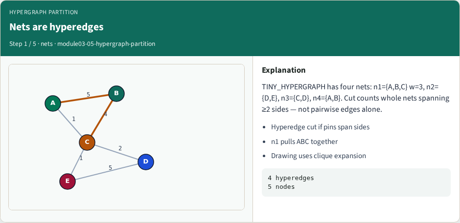
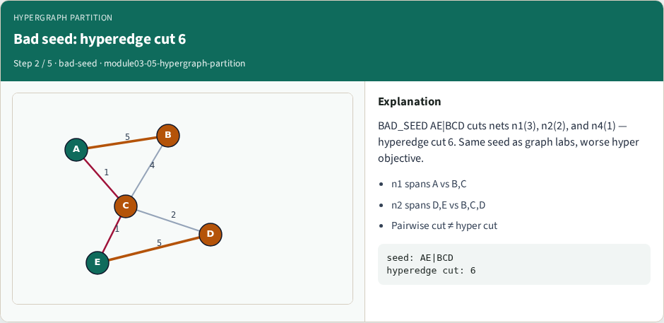
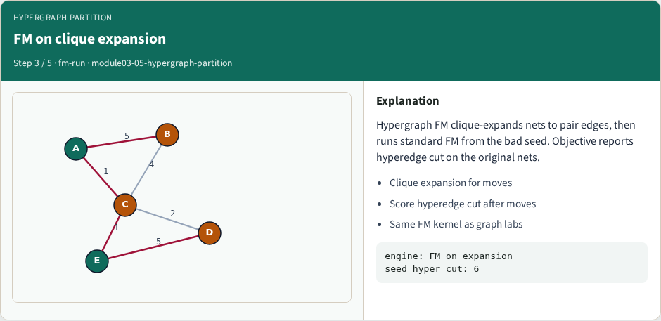
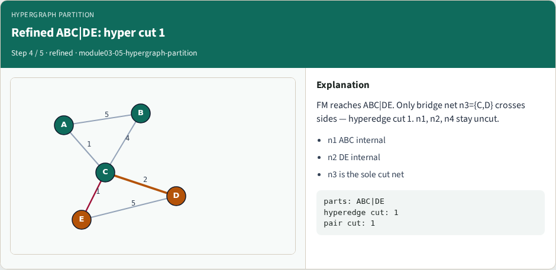
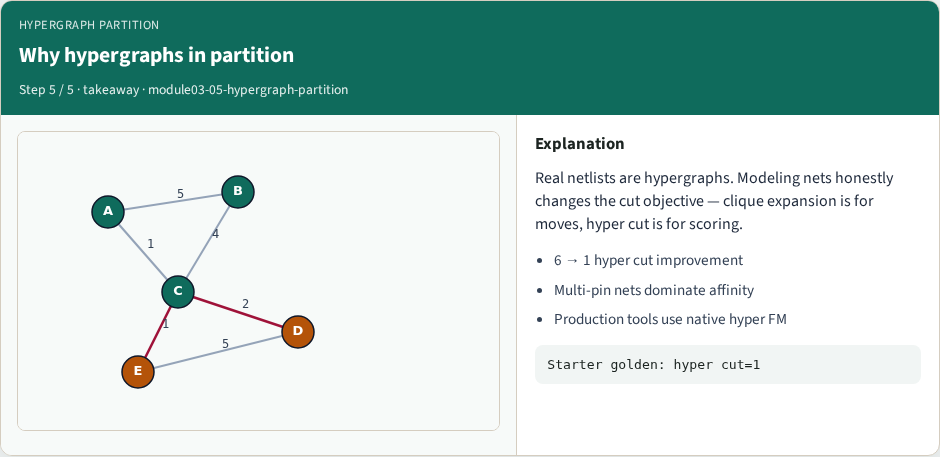

# Hypergraph partitioning

Netlists are hypergraphs: one net can touch many cells

---

## The idea
- Optimize hyperedge cut, not only pairwise edge cut
- Multi-pin nets dominate affinity in real designs
- Use clique expansion only for drawing or as a heuristic substrate
- <!-- algorithm-walkthrough -->

---

## Nets are hyperedges

---

## Bad seed: hyperedge cut 6

---

## FM on clique expansion

---

## Refined ABC|DE: hyper cut 1

---

## Why hypergraphs in partition

---

## Browser lab track
- In the browser lab track, open the **hypergraph-partition** lab from the tools shelf
- Load the starter graph, run the algorithm once
- Work the challenges that lock the goldens

---

## Implement track
- In the implement track, open this module’s examples and the course `common/` solvers
- Parse the tiny graph, run the algorithm with a deterministic seed
- Match the browser goldens before you claim the checklist

---

## Pitfalls
- Common traps
- For multilevel flows, verify coarsening before you blame the refiner

---

## Your turn
- Complete the checklist for at least one track, preferably both
- Implement until your metrics match the starter goldens
- When you’re ready, take the short quiz, then continue to the next module

