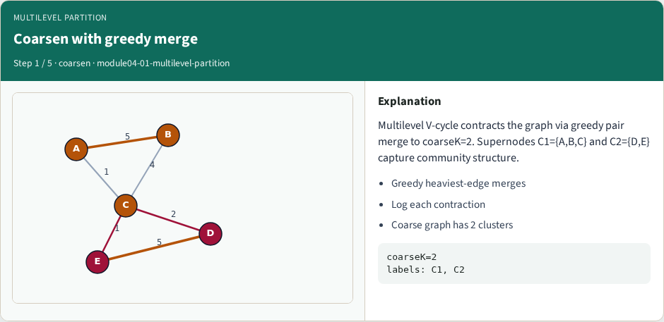
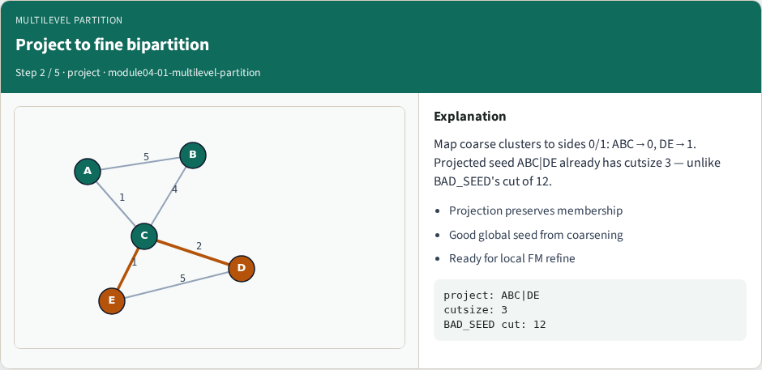
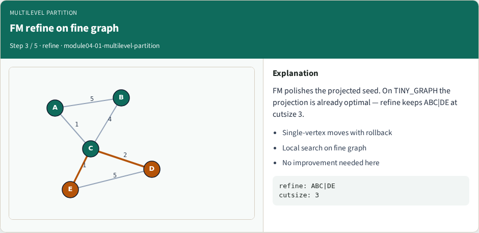
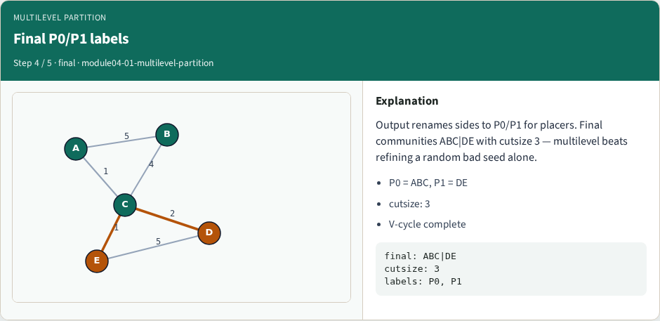
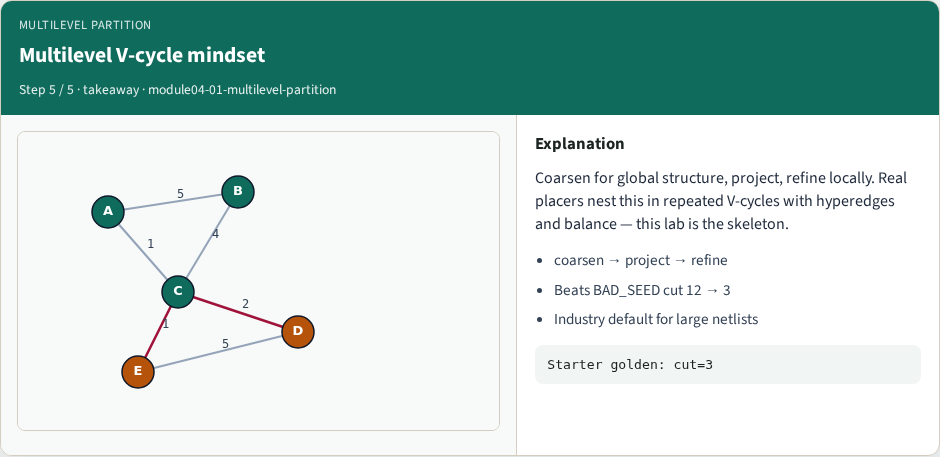

# Multilevel partitioning

A multilevel V-cycle coarsens the graph, partitions the tiny problem, projects the assignment back

---

## The idea
- Coarsening shrinks the search space
- The coarse partition is cheap
- Projection gives a feasible fine assignment that FM or KL can polish
- A bug in coarsening poisons every finer level
- <!-- algorithm-walkthrough -->

---

## Coarsen with greedy merge

---

## Project to fine bipartition

---

## FM refine on fine graph

---

## Final P0/P1 labels

---

## Multilevel V-cycle mindset

---

## Browser lab track
- In the browser lab track, open the **multilevel-partition** lab from the tools shelf
- Load the starter graph, run the algorithm once
- Work the challenges that lock the goldens

---

## Implement track
- In the implement track, open this module’s examples and the course `common/` solvers
- Parse the tiny graph, run the algorithm with a deterministic seed
- Match the browser goldens before you claim the checklist

---

## Pitfalls
- Common traps
- For multilevel flows, verify coarsening before you blame the refiner

---

## Your turn
- Complete the checklist for at least one track, preferably both
- Implement until your metrics match the starter goldens
- When you’re ready, take the short quiz, then continue to the next module

