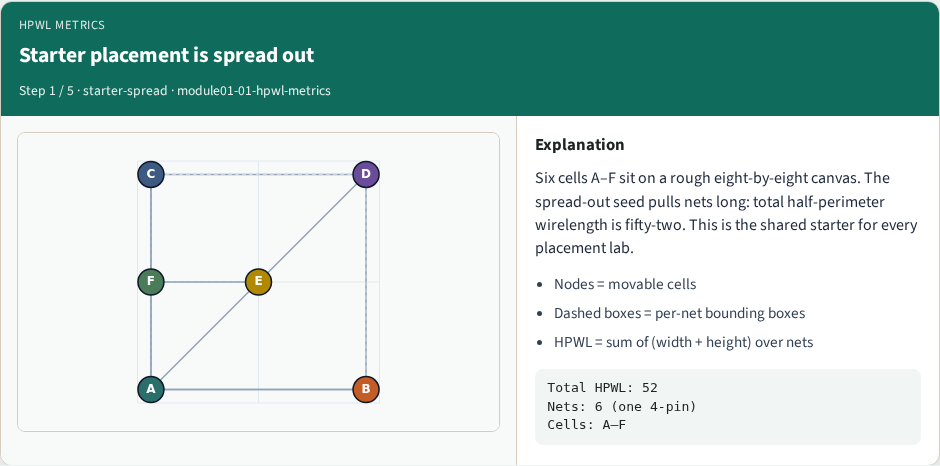
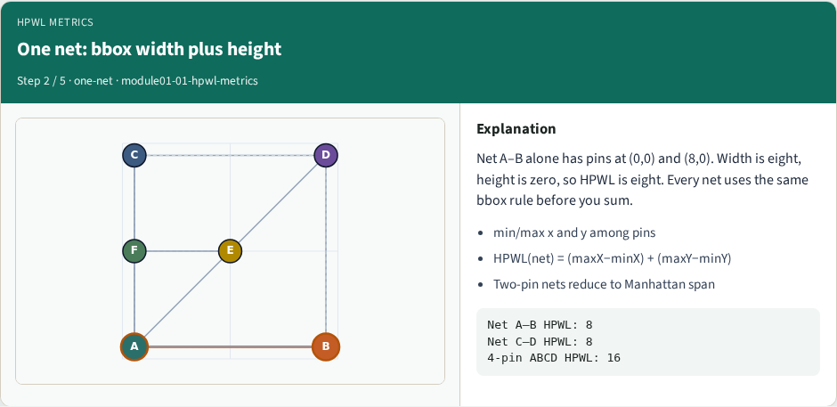
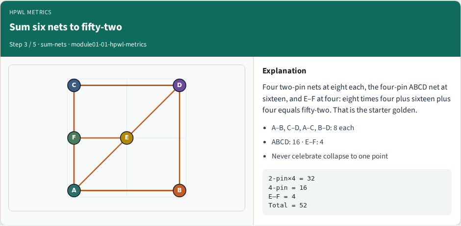
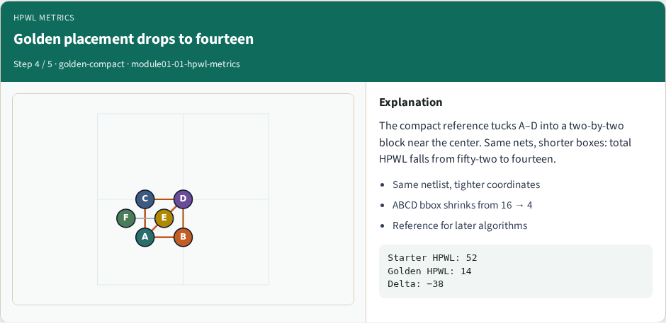
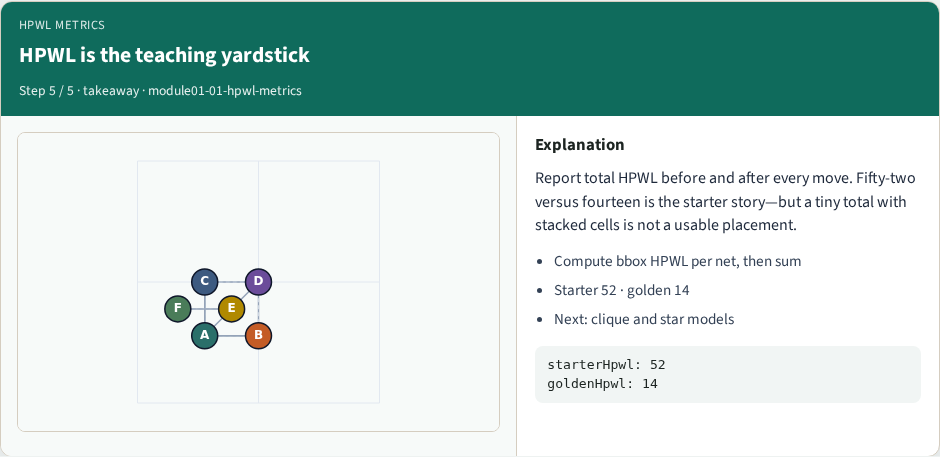

# Half-perimeter wirelength

Half-perimeter wirelength is the teaching yardstick for placement

---

## The idea
- For every net
- Sum over nets for total HPWL
- Never celebrate a tiny total that piles every cell on one point
- <!-- algorithm-walkthrough -->

---

## Starter placement is spread out

---

## One net: bbox width plus height

---

## Sum six nets to fifty-two

---

## Golden placement drops to fourteen

---

## HPWL is the teaching yardstick

---

## Browser lab track
- In the browser lab track, open the **hpwl-metrics** lab from the tools shelf
- Load the starter placement, run the algorithm once
- Work the challenges that lock the goldens

---

## Implement track
- In the implement track, open this module’s examples and the course `common/` solvers
- Parse `tiny_place.json`, run the algorithm with a deterministic seed
- Match the browser goldens before you claim the checklist

---

## Pitfalls
- Common traps

---

## Your turn
- Complete the checklist for at least one track, preferably both
- Implement until your metrics match the starter goldens
- When you’re ready, take the short quiz, then continue to the next module

