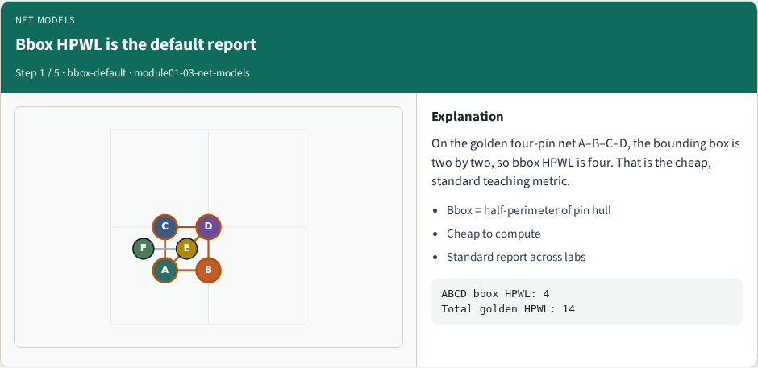
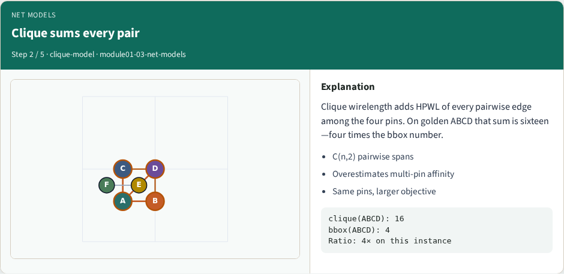
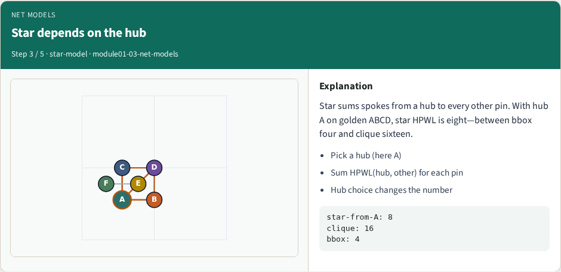
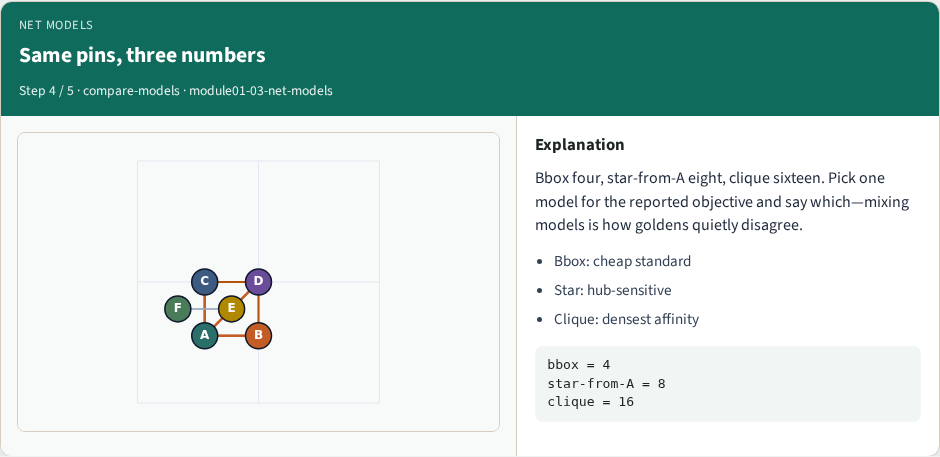
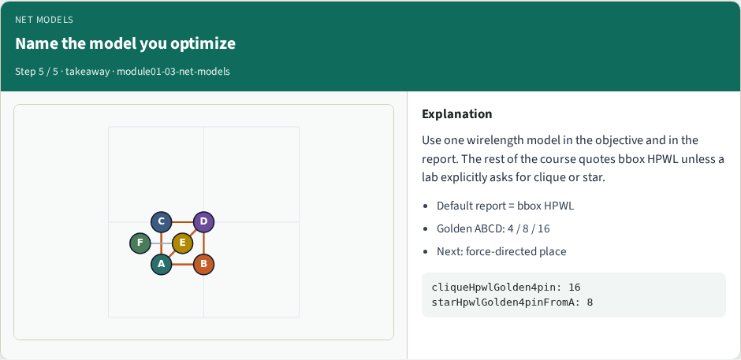

# Net models for wirelength

**Module id:** module01-03-net-models
**Lab:** net-models
**Tracks:** A (implement) · B (browser lab)

## Slide 1 — Net models for wirelength

Multi-pin nets need a model before you optimize. Bounding-box HPWL is the usual report. Clique sums every pairwise HPWL; star sums spokes from a hub. On the golden four-pin net ABCD, bbox HPWL is four, clique is sixteen, and star-from-A is eight—same pins, different numbers.

## Slide 2 — The idea

Bbox is cheap and standard. Clique overestimates affinity on multi-pin nets. Star depends on the hub choice. Use one model for the reported objective and say which—mixing them in one table is how goldens quietly disagree.

<!-- algorithm-walkthrough -->

## Slide 3 — Bbox HPWL is the default report

On the golden four-pin net A–B–C–D, the bounding box is two by two, so bbox HPWL is four. That is the cheap, standard teaching metric.

## Slide 4 — Clique sums every pair

Clique wirelength adds HPWL of every pairwise edge among the four pins. On golden ABCD that sum is sixteen—four times the bbox number.

## Slide 5 — Star depends on the hub

Star sums spokes from a hub to every other pin. With hub A on golden ABCD, star HPWL is eight—between bbox four and clique sixteen.

## Slide 6 — Same pins, three numbers

Bbox four, star-from-A eight, clique sixteen. Pick one model for the reported objective and say which—mixing models is how goldens quietly disagree.

## Slide 7 — Name the model you optimize

Use one wirelength model in the objective and in the report. The rest of the course quotes bbox HPWL unless a lab explicitly asks for clique or star.

<!-- /algorithm-walkthrough -->

## Slide 8 — Browser lab track

In the browser lab track, open the **net-models** lab from the tools shelf. Load the starter placement, run the algorithm once, and read HPWL—and density when the panel shows it. Work the challenges that lock the goldens, then come back to implement the same loop yourself.

## Slide 9 — Implement track

In the implement track, open this module’s examples and the course `common/` solvers. Parse `tiny_place.json`, run the algorithm with a deterministic seed, and print coordinates plus HPWL. Match the browser goldens before you claim the checklist.

## Slide 10 — Pitfalls

Common traps: celebrating HPWL while cells pile into one bin; ignoring fixed pads A and D; mixing bbox and clique models in one report; keeping only the final SA iterate instead of the best; and forgetting that timing weights change the objective, not just the label.

## Slide 11 — Your turn

Complete the checklist for at least one track—preferably both. Implement until your metrics match the starter goldens. When you’re ready, take the short quiz, then continue to the next module.
