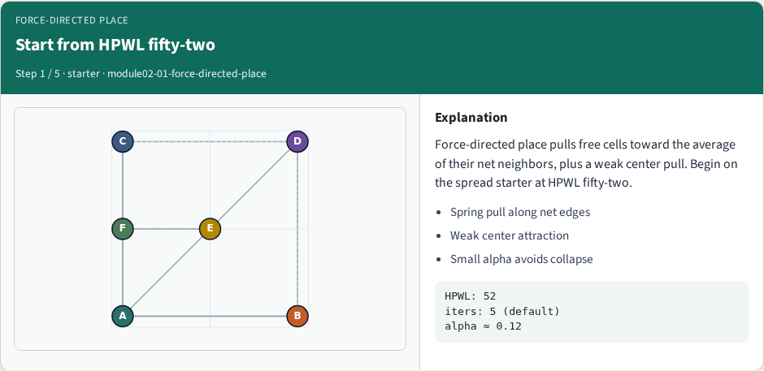
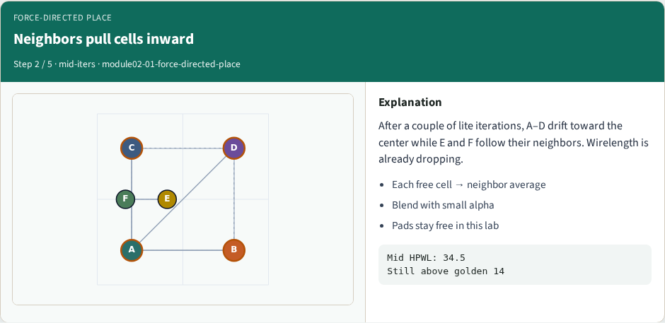
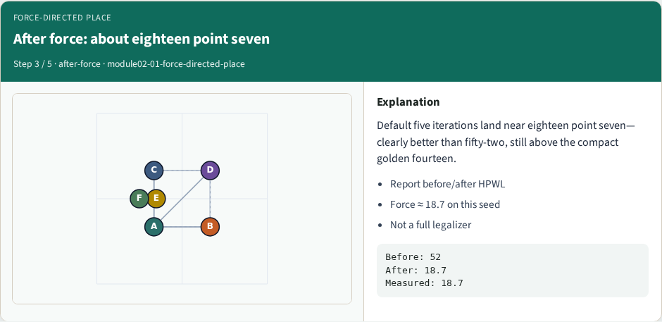
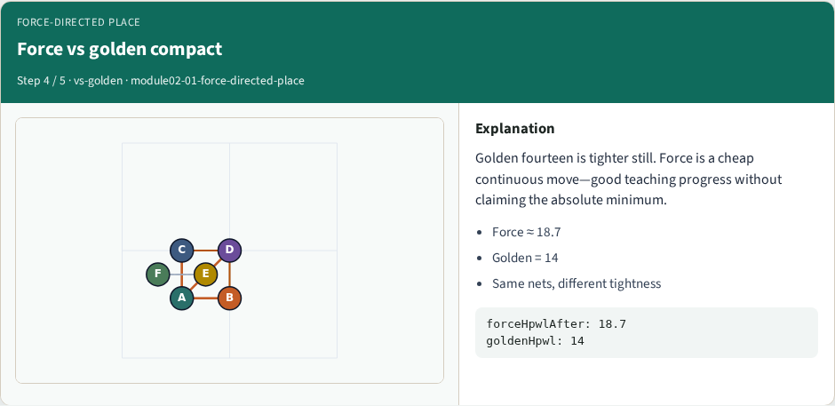
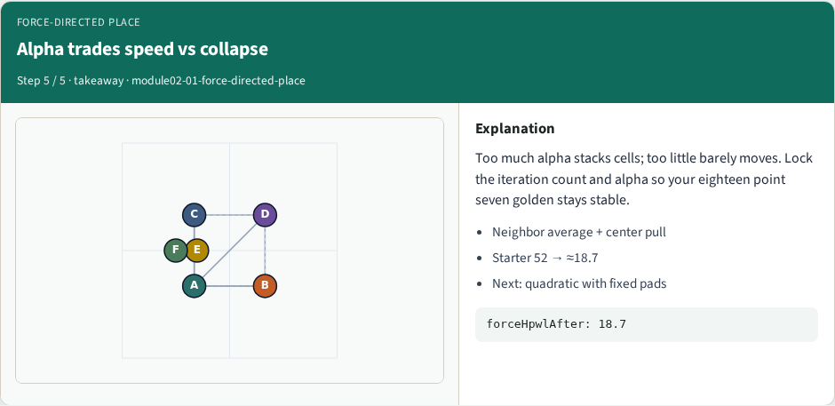

# Force-directed placement

Force-directed place pulls each free cell toward the average of its net neighbors, plus a weak center pull

---

## The idea
- Each iteration
- Fixed pads stay put
- Too much alpha collapses the design; too little barely moves
- Report HPWL before and after with the same net model

---

## Pseudocode
- Force-directed place blends each free cell toward its neighbor average with step alpha
- Fixed pads do not move
- Open this module's examples file and find the Pseudocode section
- That written sketch is what you implement on the implement track and what the browser

---

## Algorithm sketch
- From starter fifty-two

---

## Algorithm sketch — try these

```
INPUT: positions, nets, α, iters, fixed pads
OUTPUT: updated positions + HPWL
each iter, for free cell c:
  tgt ← avg neighbor coords (+ weak center)
  pos[c] ← (1−α)·pos[c] + α·tgt
pads stay fixed
GOLDEN starter 52 → ≈18.7 after defaults
```

---

## Start from HPWL fifty-two


---

## Neighbors pull cells inward


---

## After force: about eighteen point seven


---

## Force vs golden compact


---

## Alpha trades speed vs collapse


---

## Browser lab track
- In the browser lab track, open the **force-directed-place** lab from the tools shelf
- Load the starter placement, run the algorithm once
- Work the challenges that lock the goldens

---

## Implement track
- In the implement track
- Parse `tiny_place.json`, run the algorithm with a deterministic seed
- Match the browser goldens before you claim the checklist

---

## Pitfalls
- Common traps

---

## Your turn
- Complete the checklist for at least one track, preferably both
- Implement until your metrics match the starter goldens
- When you’re ready, take the short quiz, then continue to the next module

