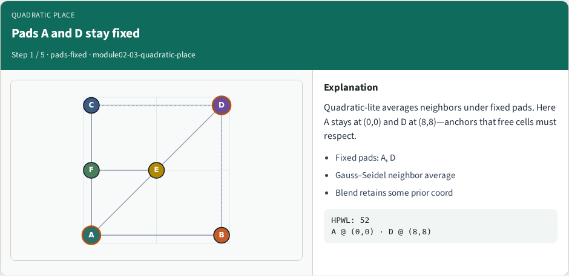
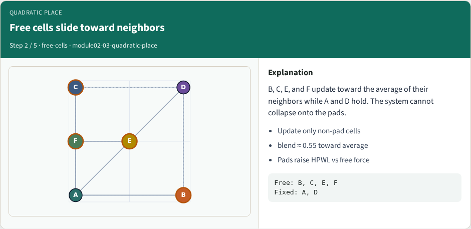
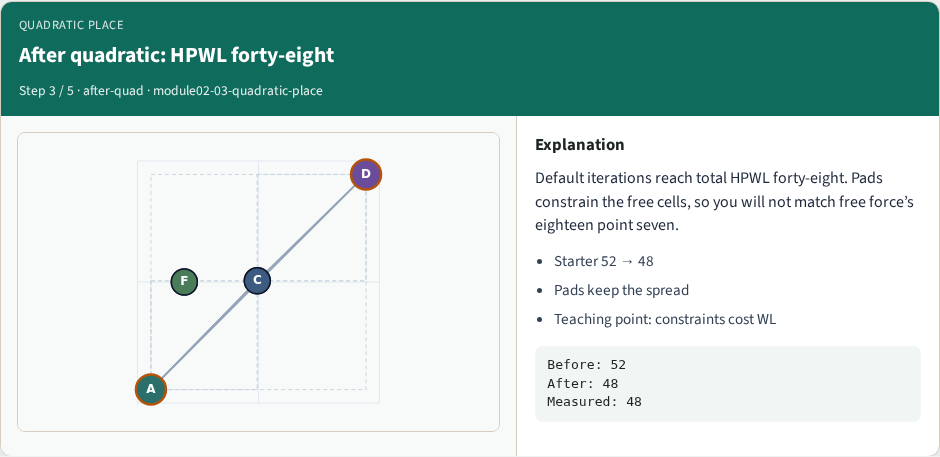
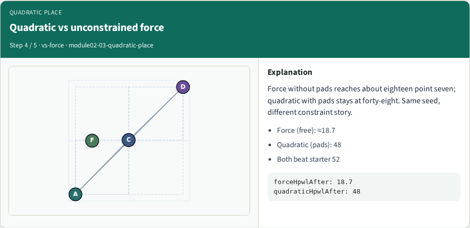
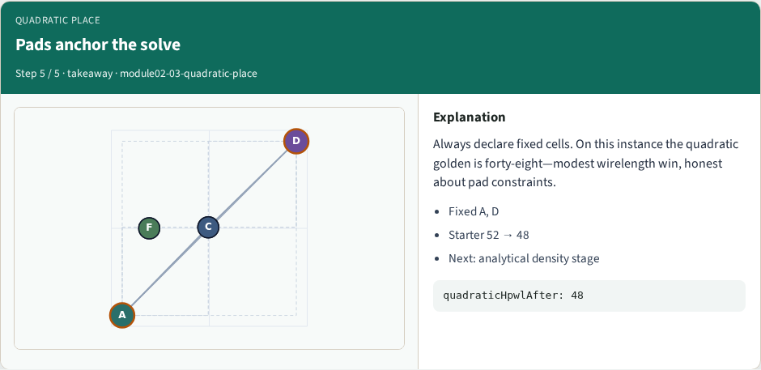

# Quadratic placement

**Module id:** module02-03-quadratic-place
**Lab:** quadratic-place
**Tracks:** A (implement) · B (browser lab)

## Slide 1 — Quadratic placement

Quadratic-lite placement averages neighbors under fixed pads—here A and D stay pinned. From starter HPWL fifty-two the solve reaches forty-eight. Pads constrain the free cells, so you will not match free force’s eighteen point seven on this instance.

## Slide 2 — The idea

Gauss–Seidel style: replace each free cell with a blend of neighbor average and prior coordinate so the solve does not collapse. Fixed pads anchor the system. Teaching point: pad constraints raise HPWL versus unconstrained force on the same seed.


## Slide 3 — Pseudocode

Quadratic-lite solves free cells toward neighbor averages under pinned pads. Damping keeps the system from collapsing.

Open this module's examples file and find the Pseudocode section. That written sketch is what you implement on the implement track and what the browser challenges measure.

## Slide 4 — Algorithm sketch

With A and D fixed, the teaching solve reaches HPWL forty-eight from fifty-two—modest win, honest about pad constraints.

```text
INPUT: positions, nets, fixed pads {A,D}
OUTPUT: free-cell coords + HPWL
repeat: for free c:
  blend toward neighbor average (damped)
pads A,D remain pinned
GOLDEN starter 52 → HPWL 48
```


<!-- algorithm-walkthrough -->

## Slide 5 — Pads A and D stay fixed



Quadratic-lite averages neighbors under fixed pads. Here A stays at (0,0) and D at (8,8)—anchors that free cells must respect.

## Slide 6 — Free cells slide toward neighbors



B, C, E, and F update toward the average of their neighbors while A and D hold. The system cannot collapse onto the pads.

## Slide 7 — After quadratic: HPWL forty-eight



Default iterations reach total HPWL forty-eight. Pads constrain the free cells, so you will not match free force’s eighteen point seven.

## Slide 8 — Quadratic vs unconstrained force



Force without pads reaches about eighteen point seven; quadratic with pads stays at forty-eight. Same seed, different constraint story.

## Slide 9 — Pads anchor the solve



Always declare fixed cells. On this instance the quadratic golden is forty-eight—modest wirelength win, honest about pad constraints.

<!-- /algorithm-walkthrough -->


## Slide 10 — Browser lab track

In the browser lab track, open the **quadratic-place** lab from the tools shelf. Load the starter placement, run the algorithm once, and read HPWL—and density when the panel shows it. Work the challenges that lock the goldens, then come back to implement the same loop yourself.

## Slide 11 — Implement track

In the implement track, open this module's EXAMPLES.md Pseudocode section and the course common solvers. Parse `tiny_place.json`, run the algorithm with a deterministic seed, and print coordinates plus HPWL. Match the browser goldens before you claim the checklist.

## Slide 12 — Pitfalls

Common traps: celebrating HPWL while cells pile into one bin; ignoring fixed pads A and D; mixing bbox and clique models in one report; keeping only the final SA iterate instead of the best; and forgetting that timing weights change the objective, not just the label.

## Slide 13 — Your turn

Complete the checklist for at least one track—preferably both. Implement until your metrics match the starter goldens. When you’re ready, take the short quiz, then continue to the next module.
