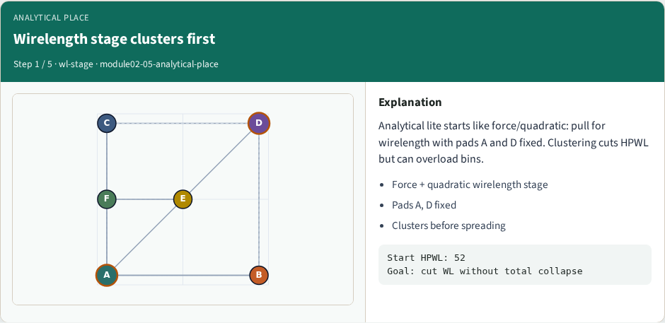
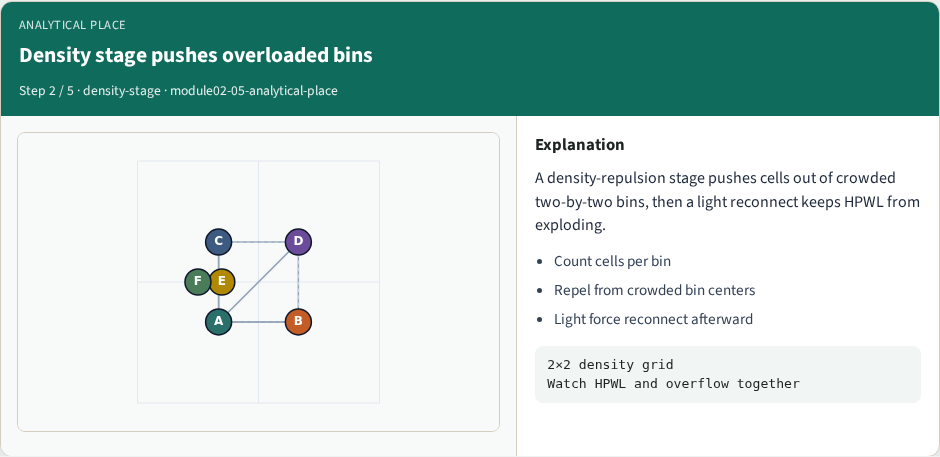
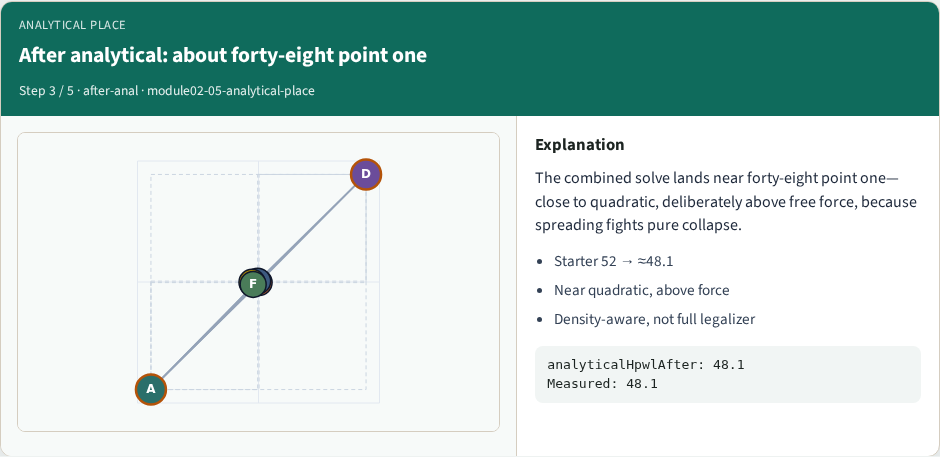
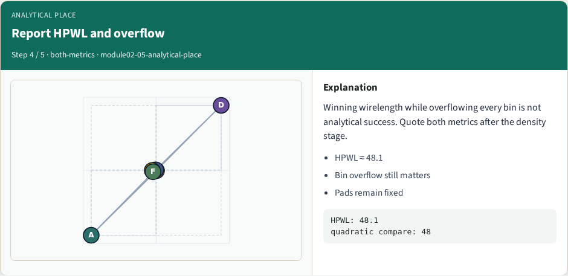
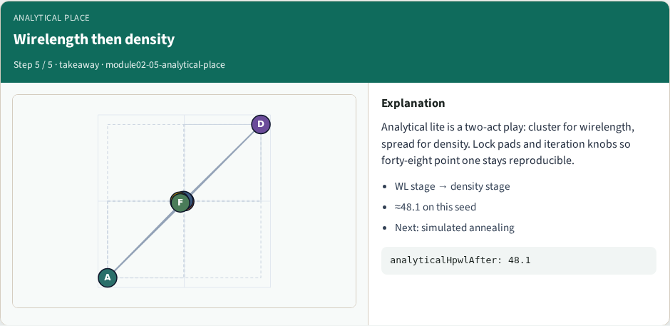

# Analytical / density-aware place

**Module id:** module02-05-analytical-place
**Lab:** analytical-place
**Tracks:** A (implement) · B (browser lab)

## Slide 1 — Analytical / density-aware place

Analytical lite first pulls for wirelength, then spreads for density with pads A and D fixed. From starter fifty-two you should land near forty-eight point one—close to quadratic, deliberately above free force, because spreading fights pure collapse.

## Slide 2 — The idea

Wirelength stage clusters; density stage pushes cells out of overloaded bins; a light reconnect keeps HPWL from exploding. Watch both HPWL and overflow—winning wirelength while overflowing every bin is not analytical success.


## Slide 3 — Pseudocode

Analytical lite is three stages in pseudocode: wirelength clustering, density repulsion from overloaded bins, then a light reconnect so HPWL does not explode.

Open this module's examples file and find the Pseudocode section. That written sketch is what you implement on the implement track and what the browser challenges measure.

## Slide 4 — Algorithm sketch

Default teaching run lands near forty-eight point one HPWL. Winning wirelength while overflowing every bin is not success—report both metrics.

```text
INPUT: positions, bins, pads
OUTPUT: positions, HPWL, overflow
stage1: wirelength pull (force/quad style)
stage2: push out of overloaded bins
stage3: light reconnect for HPWL
report HPWL and overflow together
GOLDEN lite ≈48.1 HPWL after defaults
```


<!-- algorithm-walkthrough -->

## Slide 5 — Wirelength stage clusters first



Analytical lite starts like force/quadratic: pull for wirelength with pads A and D fixed. Clustering cuts HPWL but can overload bins.

## Slide 6 — Density stage pushes overloaded bins



A density-repulsion stage pushes cells out of crowded two-by-two bins, then a light reconnect keeps HPWL from exploding.

## Slide 7 — After analytical: about forty-eight point one



The combined solve lands near forty-eight point one—close to quadratic, deliberately above free force, because spreading fights pure collapse.

## Slide 8 — Report HPWL and overflow



Winning wirelength while overflowing every bin is not analytical success. Quote both metrics after the density stage.

## Slide 9 — Wirelength then density



Analytical lite is a two-act play: cluster for wirelength, spread for density. Lock pads and iteration knobs so forty-eight point one stays reproducible.

<!-- /algorithm-walkthrough -->


## Slide 10 — Browser lab track

In the browser lab track, open the **analytical-place** lab from the tools shelf. Load the starter placement, run the algorithm once, and read HPWL—and density when the panel shows it. Work the challenges that lock the goldens, then come back to implement the same loop yourself.

## Slide 11 — Implement track

In the implement track, open this module's EXAMPLES.md Pseudocode section and the course common solvers. Parse `tiny_place.json`, run the algorithm with a deterministic seed, and print coordinates plus HPWL. Match the browser goldens before you claim the checklist.

## Slide 12 — Pitfalls

Common traps: celebrating HPWL while cells pile into one bin; ignoring fixed pads A and D; mixing bbox and clique models in one report; keeping only the final SA iterate instead of the best; and forgetting that timing weights change the objective, not just the label.

## Slide 13 — Your turn

Complete the checklist for at least one track—preferably both. Implement until your metrics match the starter goldens. When you’re ready, take the short quiz, then continue to the next module.
