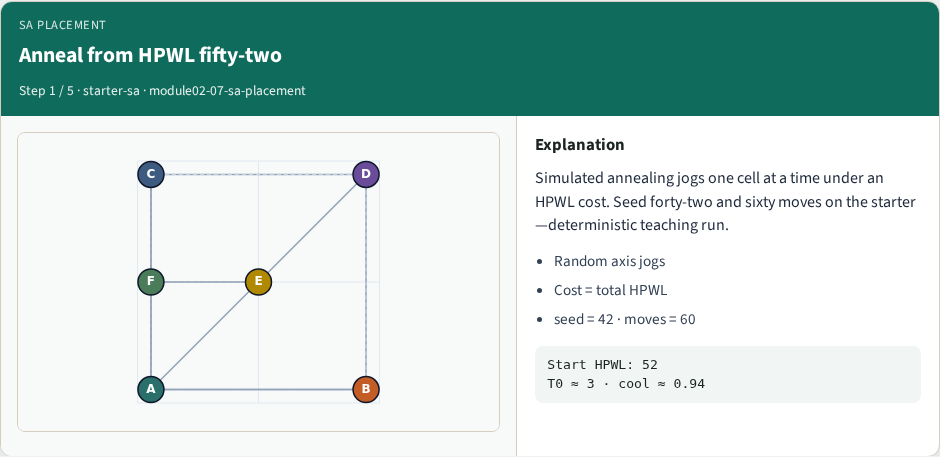
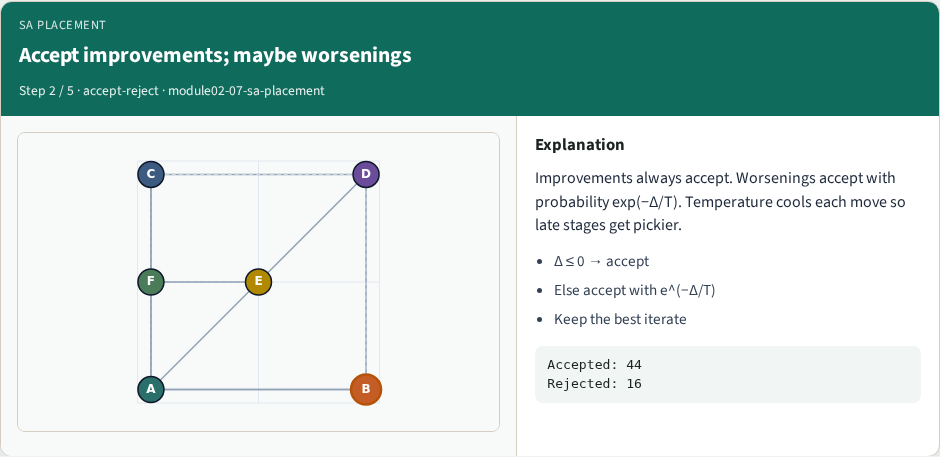
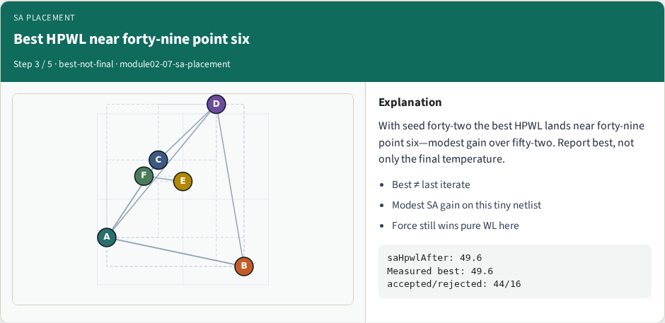
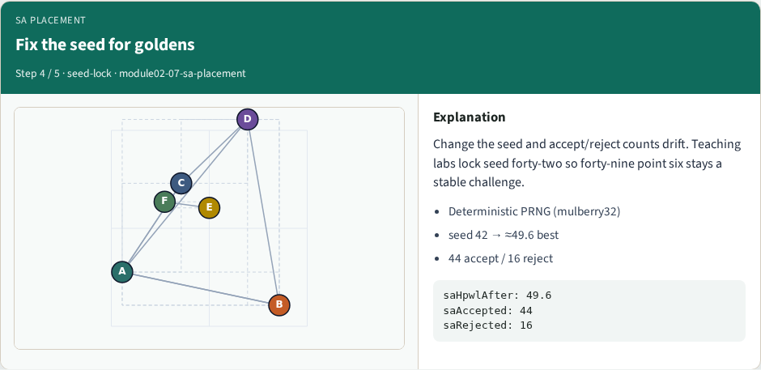
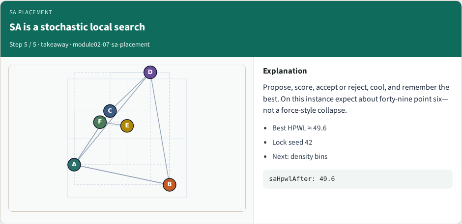

# Simulated annealing placement — step-by-step (for slides / transcript)

**Module:** `module02-07-sa-placement`  
**Lab / algo:** `sa-placement`  
**Viewer:** `/tools/algorithm-walkthrough/?algo=sa-placement&step=1`

Use each **Caption** as spoken prose (or a shortened slide note).
Use **Bullets** on the PPT; pair with the PNG in `assets/steps/`.

## Step 1 — Anneal from HPWL fifty-two



**Caption (transcript):** Simulated annealing jogs one cell at a time under an HPWL cost. Seed forty-two and sixty moves on the starter—deterministic teaching run.

**Slide bullets:**

- Random axis jogs
- Cost = total HPWL
- seed = 42 · moves = 60

**On-screen metrics:**

```
Start HPWL: 52
T0 ≈ 3 · cool ≈ 0.94
```

## Step 2 — Accept improvements; maybe worsenings



**Caption (transcript):** Improvements always accept. Worsenings accept with probability exp(−Δ/T). Temperature cools each move so late stages get pickier.

**Slide bullets:**

- Δ ≤ 0 → accept
- Else accept with e^(−Δ/T)
- Keep the best iterate

**On-screen metrics:**

```
Accepted: 44
Rejected: 16
```

## Step 3 — Best HPWL near forty-nine point six



**Caption (transcript):** With seed forty-two the best HPWL lands near forty-nine point six—modest gain over fifty-two. Report best, not only the final temperature.

**Slide bullets:**

- Best ≠ last iterate
- Modest SA gain on this tiny netlist
- Force still wins pure WL here

**On-screen metrics:**

```
saHpwlAfter: 49.6
Measured best: 49.6
accepted/rejected: 44/16
```

## Step 4 — Fix the seed for goldens



**Caption (transcript):** Change the seed and accept/reject counts drift. Teaching labs lock seed forty-two so forty-nine point six stays a stable challenge.

**Slide bullets:**

- Deterministic PRNG (mulberry32)
- seed 42 → ≈49.6 best
- 44 accept / 16 reject

**On-screen metrics:**

```
saHpwlAfter: 49.6
saAccepted: 44
saRejected: 16
```

## Step 5 — SA is a stochastic local search



**Caption (transcript):** Propose, score, accept or reject, cool, and remember the best. On this instance expect about forty-nine point six—not a force-style collapse.

**Slide bullets:**

- Best HPWL ≈ 49.6
- Lock seed 42
- Next: density bins

**On-screen metrics:**

```
saHpwlAfter: 49.6
```

