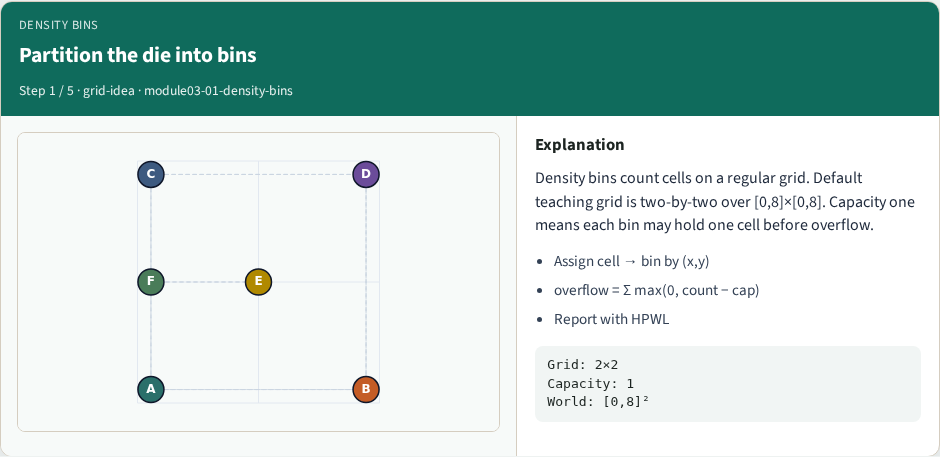
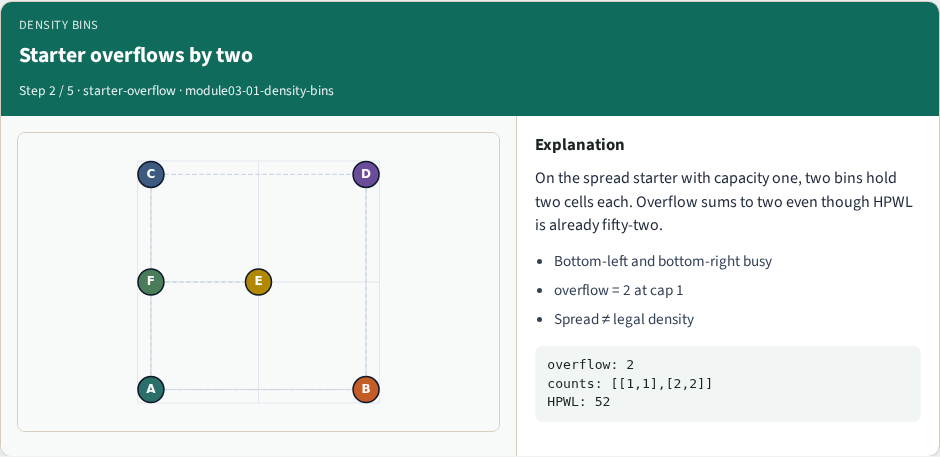
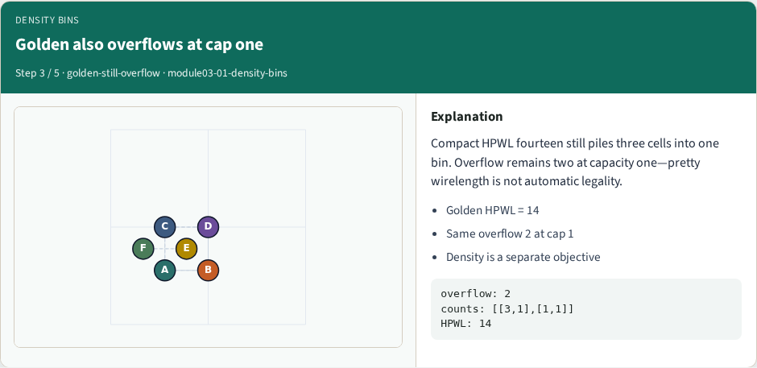
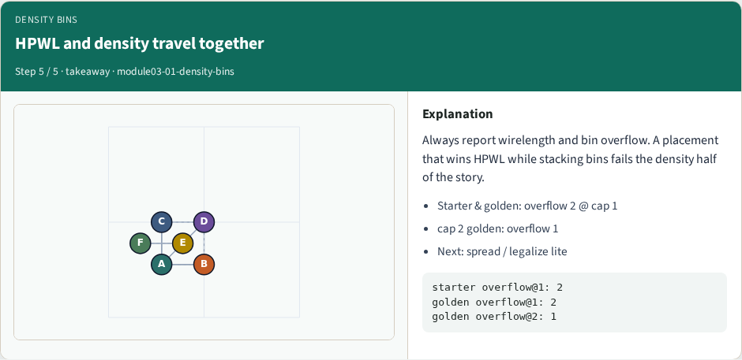

# Density bins and overflow — step-by-step (for slides / transcript)

**Module:** `module03-01-density-bins`  
**Lab / algo:** `density-bins`  
**Viewer:** `/tools/algorithm-walkthrough/?algo=density-bins&step=1`

Use each **Caption** as spoken prose (or a shortened slide note).
Use **Bullets** on the PPT; pair with the PNG in `assets/steps/`.

## Step 1 — Partition the die into bins



**Caption (transcript):** Density bins count cells on a regular grid. Default teaching grid is two-by-two over [0,8]×[0,8]. Capacity one means each bin may hold one cell before overflow.

**Slide bullets:**

- Assign cell → bin by (x,y)
- overflow = Σ max(0, count − cap)
- Report with HPWL

**On-screen metrics:**

```
Grid: 2×2
Capacity: 1
World: [0,8]²
```

## Step 2 — Starter overflows by two



**Caption (transcript):** On the spread starter with capacity one, two bins hold two cells each. Overflow sums to two even though HPWL is already fifty-two.

**Slide bullets:**

- Bottom-left and bottom-right busy
- overflow = 2 at cap 1
- Spread ≠ legal density

**On-screen metrics:**

```
overflow: 2
counts: [[1,1],[2,2]]
HPWL: 52
```

## Step 3 — Golden also overflows at cap one



**Caption (transcript):** Compact HPWL fourteen still piles three cells into one bin. Overflow remains two at capacity one—pretty wirelength is not automatic legality.

**Slide bullets:**

- Golden HPWL = 14
- Same overflow 2 at cap 1
- Density is a separate objective

**On-screen metrics:**

```
overflow: 2
counts: [[3,1],[1,1]]
HPWL: 14
```

## Step 4 — Raise capacity to ease overflow


**Caption (transcript):** With capacity two on the golden placement, overflow drops to one. Capacity is part of the spec—quote it with the overflow number.

**Slide bullets:**

- cap 1 → overflow 2
- cap 2 → overflow 1
- Same coordinates, new budget

**On-screen metrics:**

```
density2x2Cap2GoldenOverflow: 1
Measured: 1
```

## Step 5 — HPWL and density travel together



**Caption (transcript):** Always report wirelength and bin overflow. A placement that wins HPWL while stacking bins fails the density half of the story.

**Slide bullets:**

- Starter & golden: overflow 2 @ cap 1
- cap 2 golden: overflow 1
- Next: spread / legalize lite

**On-screen metrics:**

```
starter overflow@1: 2
golden overflow@1: 2
golden overflow@2: 1
```

