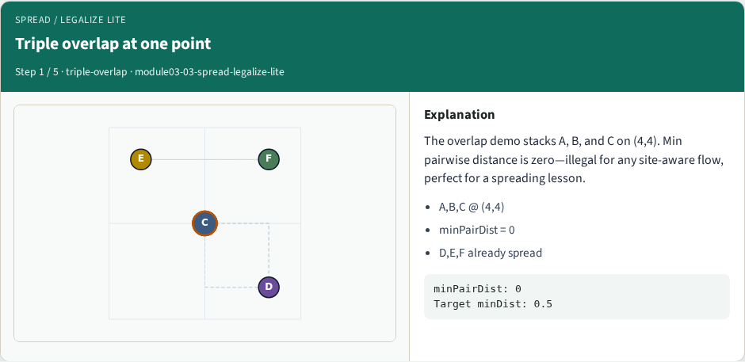
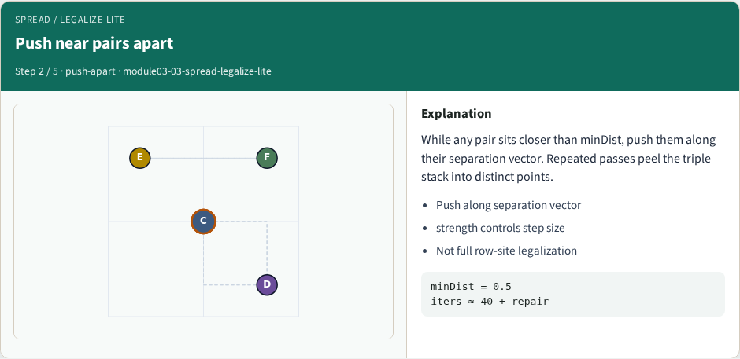
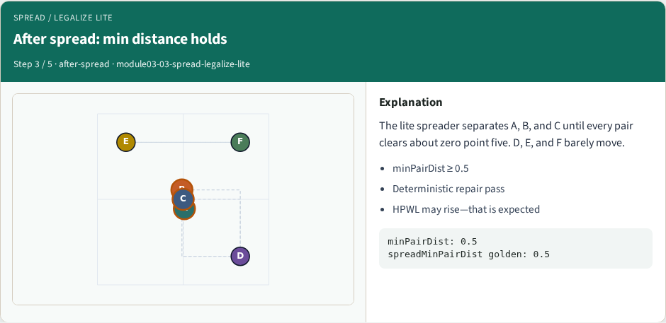
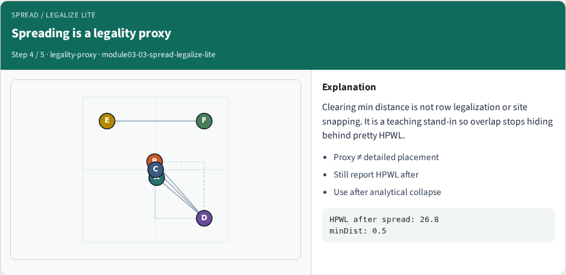
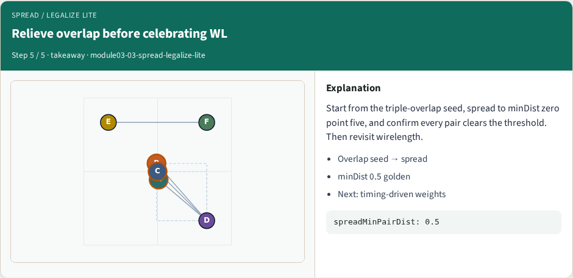

# Spreading / overlap relief

Spreading pushes overlapping or near pairs apart until a minimum pairwise distance holds

---

## The idea
- While any pair sits closer than minDist, push them along their separation vector
- Finish with a deterministic repair pass so the result is stable
- Spreading is a legality proxy, not full row-site legalization
- <!-- algorithm-walkthrough -->

---

## Triple overlap at one point

---

## Push near pairs apart

---

## After spread: min distance holds

---

## Spreading is a legality proxy

---

## Relieve overlap before celebrating WL

---

## Browser lab track
- In the browser lab track, open the **spread-legalize-lite** lab from the tools shelf
- Load the starter placement, run the algorithm once
- Work the challenges that lock the goldens

---

## Implement track
- In the implement track, open this module’s examples and the course `common/` solvers
- Parse `tiny_place.json`, run the algorithm with a deterministic seed
- Match the browser goldens before you claim the checklist

---

## Pitfalls
- Common traps

---

## Your turn
- Complete the checklist for at least one track, preferably both
- Implement until your metrics match the starter goldens
- When you’re ready, take the short quiz, then continue to the next module

