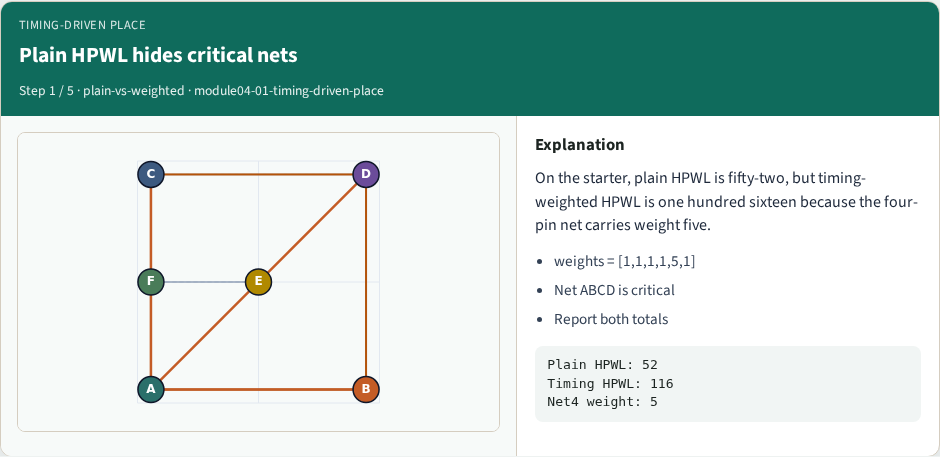
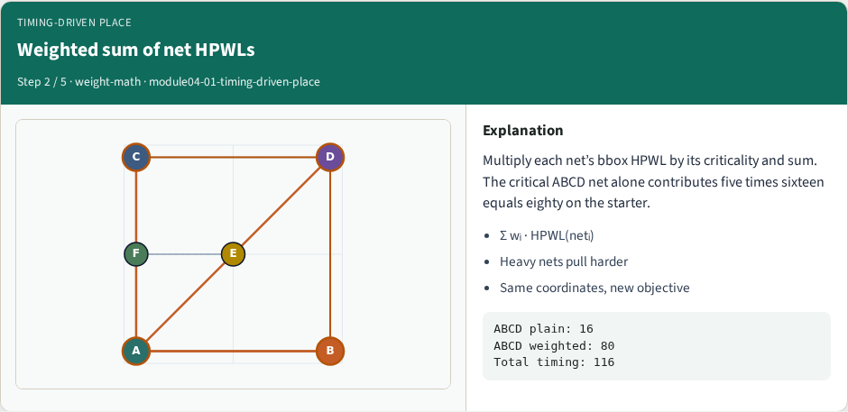
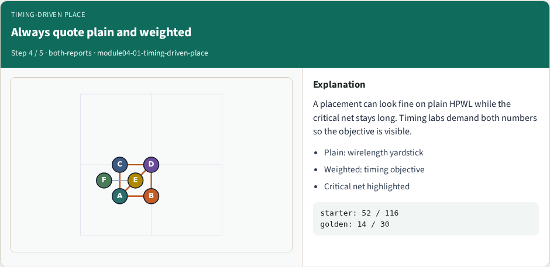

# Timing-driven placement

Timing-driven place weights critical nets in the wirelength objective

---

## The idea
- Multiply each net’s HPWL by its criticality weight and sum
- Heavy weights pull critical nets shorter even when plain HPWL looks fine
- Always report both plain and weighted totals so you can see what the objective actually
- <!-- algorithm-walkthrough -->

---

## Plain HPWL hides critical nets

---

## Weighted sum of net HPWLs

---

## Golden timing cost drops to thirty

---

## Always quote plain and weighted

---

## Weights change what you optimize

---

## Browser lab track
- In the browser lab track, open the **timing-driven-place** lab from the tools shelf
- Load the starter placement, run the algorithm once
- Work the challenges that lock the goldens

---

## Implement track
- In the implement track, open this module’s examples and the course `common/` solvers
- Parse `tiny_place.json`, run the algorithm with a deterministic seed
- Match the browser goldens before you claim the checklist

---

## Pitfalls
- Common traps

---

## Your turn
- Complete the checklist for at least one track, preferably both
- Implement until your metrics match the starter goldens
- When you’re ready, take the short quiz, then continue to the next module

