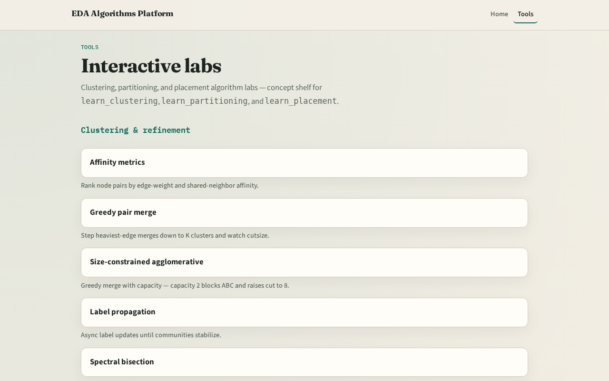

# Detailed routing in the stack

You committed coarse paths in global routing

---

## Two tracks
- Track B is the browser lab: route nets, watch track heat, inspect vias, clear challenges
- Track A is implement: Python solvers on tiny_dr.json
- Use either or both
- Browser first for intuition is fine

---

## Course map
- Foundations cover the routing grid and pin access
- Algorithms cover Lee maze, A*, track usage, and via assignment
- DRC and rip-up cover spacing lite and detailed rip-up
- Sequential detailed ties the flow together
- Offline compare and wrap close the path

---

## Prerequisites
- Finish learn_global_routing so GCell graphs and edge usage deposits already make sense
- Directed track usage is finer-grained, not the same keys as GCell edges

---

## How to move
- Read each module README
- Odd module slots leave room to insert algorithms later without renumbering

---

## Next
- Complete the quiz for this part
- Open the routing grid graph and enumerate M1 and M2 tracks on the twelve-by-eight grid

