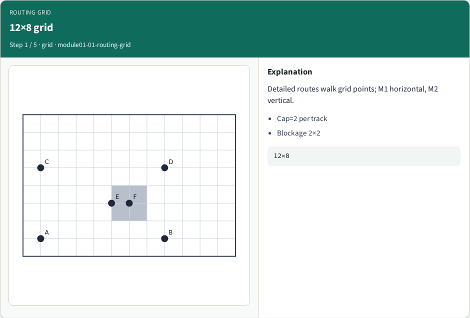
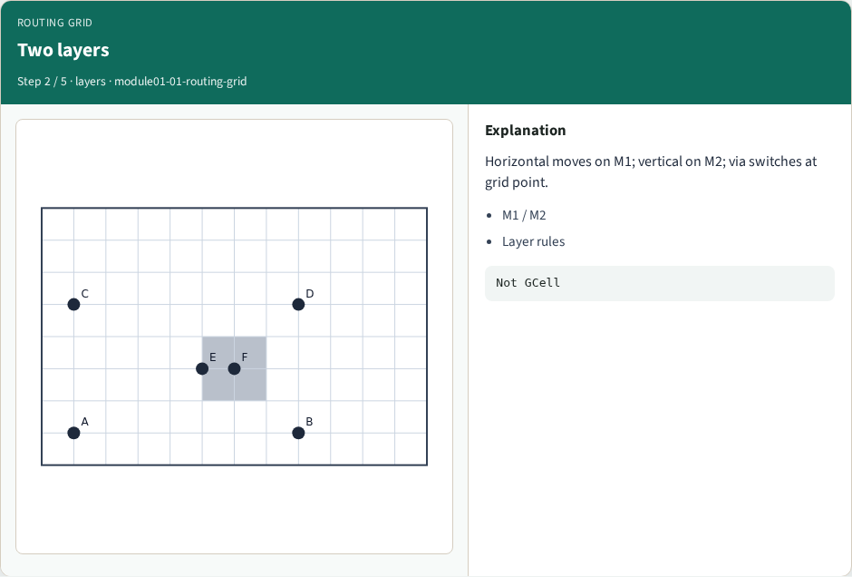
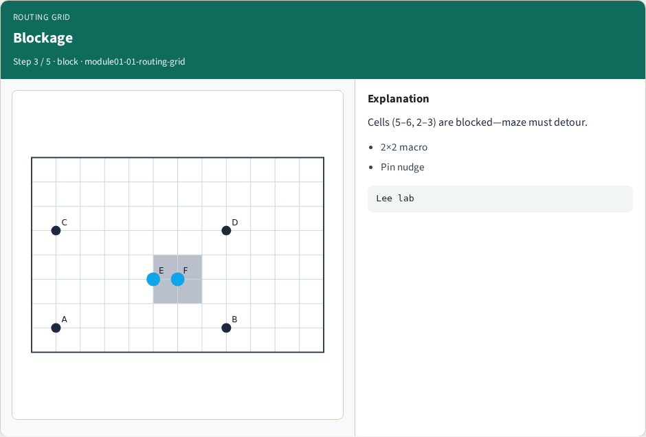
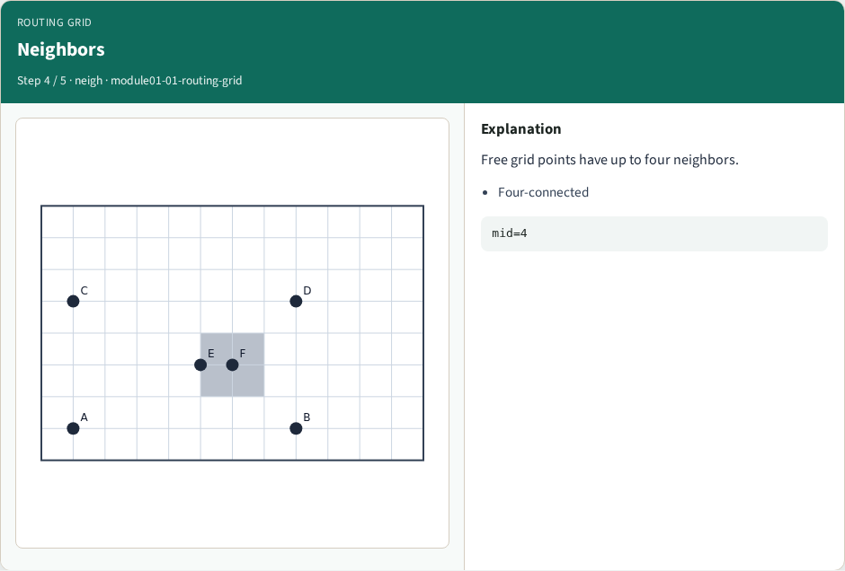
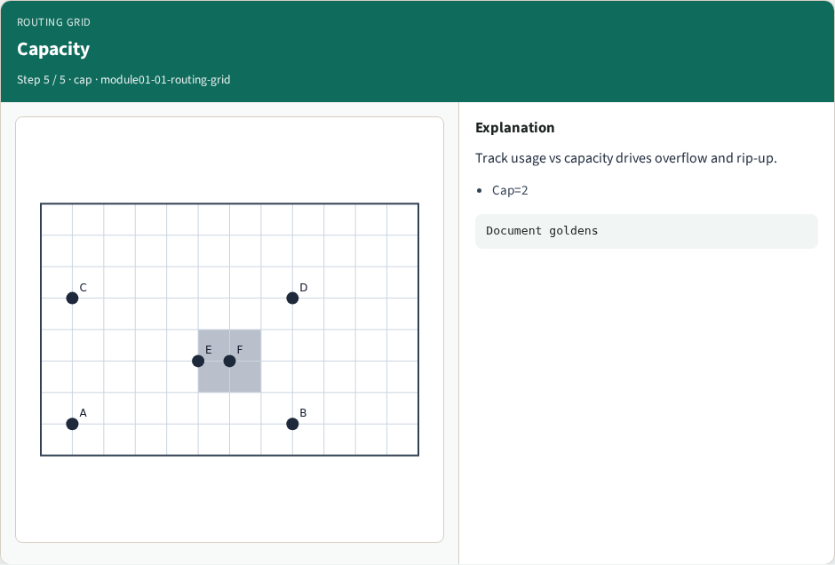
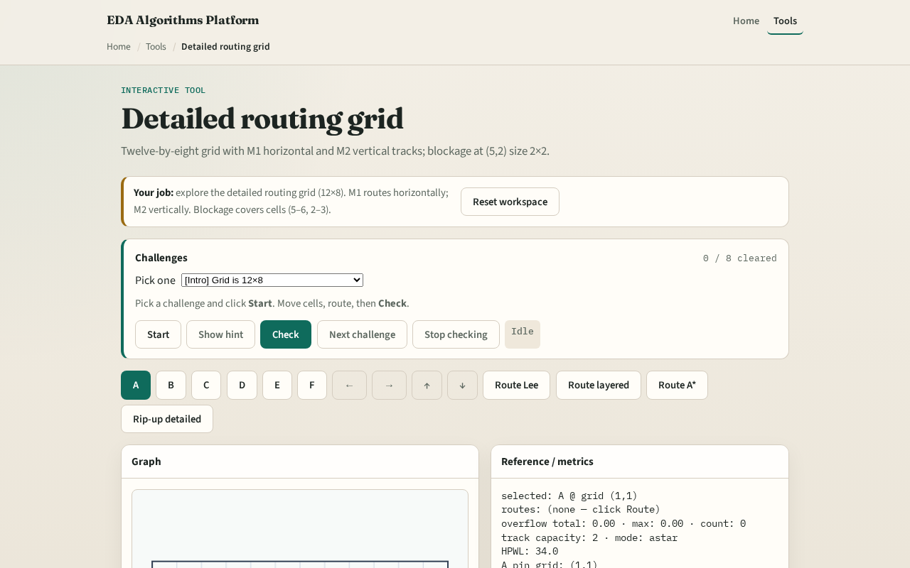

# Routing grid graph

**Module id:** module01-01-routing-grid
**Lab:** routing-grid
**Tracks:** A (implement) · B (browser lab)

## Slide 1 — Why a track graph

Detailed routers do not hop GCell to GCell. They walk a fine grid whose edges are directed tracks: M1 horizontal and M2 vertical. Before any maze or A* route, you must enumerate those tracks on our twelve-by-eight toy grid.

## Slide 2 — The idea

For each grid point at column x and row y, add a directed M1 edge to the right neighbor when x plus one is less than nx, and a directed M2 edge upward when y plus one is less than ny. Canonical keys sort endpoints so left-to-right and bottom-to-top always win. On twelve by eight you get eighty-eight M1 edges and eighty-four M2 edges.

<!-- algorithm-walkthrough -->

## Slide 3 — 12×8 grid

Detailed routes walk grid points; M1 horizontal, M2 vertical.

## Slide 4 — Two layers

Horizontal moves on M1; vertical on M2; via switches at grid point.

## Slide 5 — Blockage

Cells (5–6, 2–3) are blocked—maze must detour.

## Slide 6 — Neighbors

Free grid points have up to four neighbors.

## Slide 7 — Capacity

Track usage vs capacity drives overflow and rip-up.

<!-- /algorithm-walkthrough -->

## Slide 8 — Browser lab track

Open the **routing-grid** lab. Toggle layer M1 and M2 overlays. Highlight one horizontal track between columns one and two on row one. Read the track list in the metrics panel and match the counts.

## Slide 9 — Implement track

Inspect `h_edge`, `v_edge`, and `track_key` in `common/drutil.py`. Print sample M1 and M2 keys for tiny_dr. Verify diagonals are absent and layers match movement axis.

## Slide 10 — Pitfalls

Counting grid points instead of directed tracks. Treating M1 and M2 as interchangeable. Forgetting blockages still occupy cells even if tracks exist between free neighbors.

## Slide 11 — Your turn

Finish the checklist. Sketch M1 on one row from memory. Next: map pin placements to access points on the grid.
