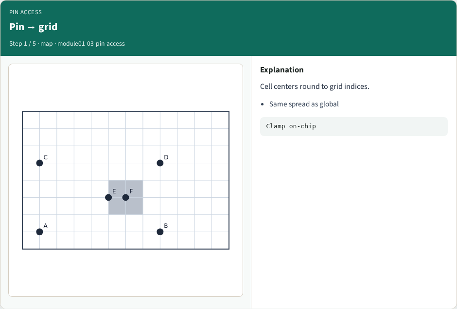
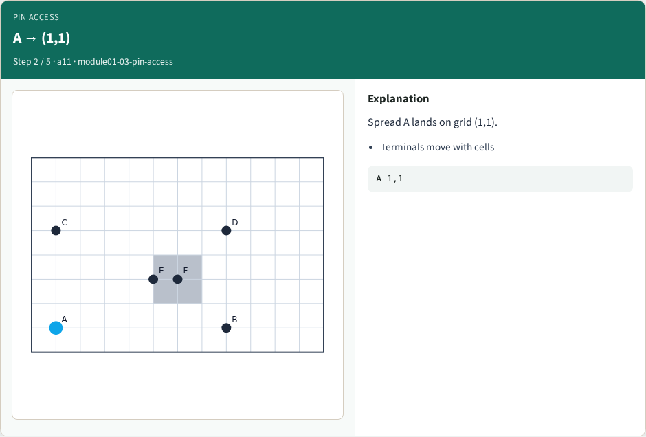
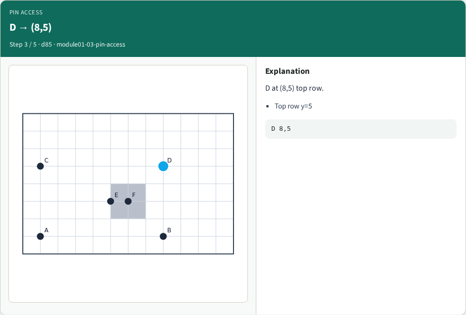
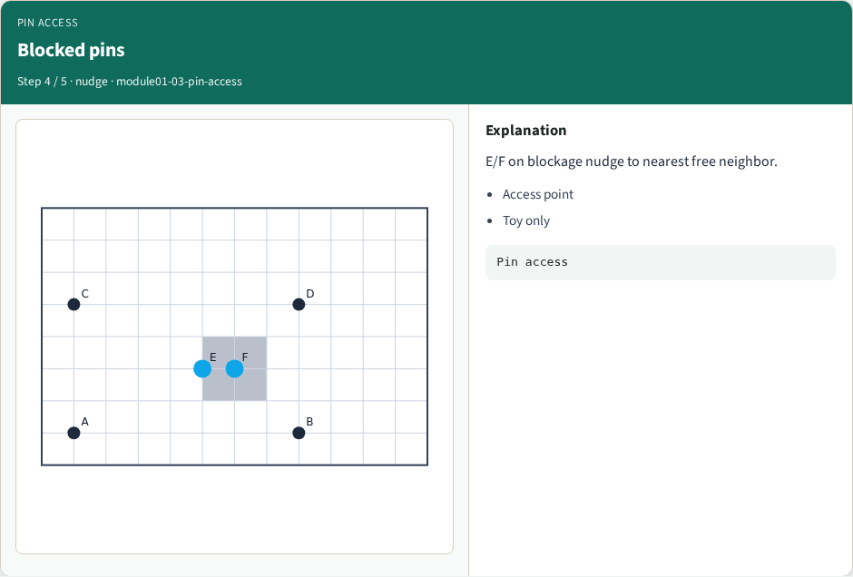
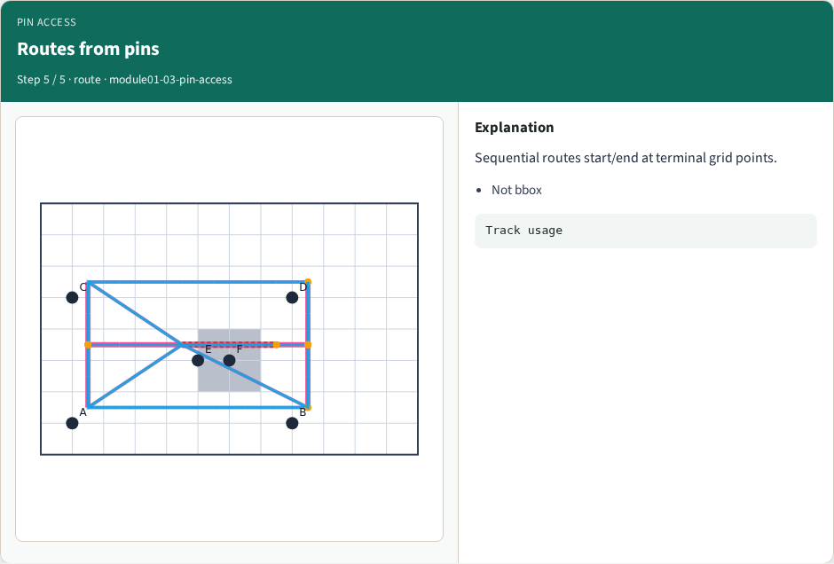
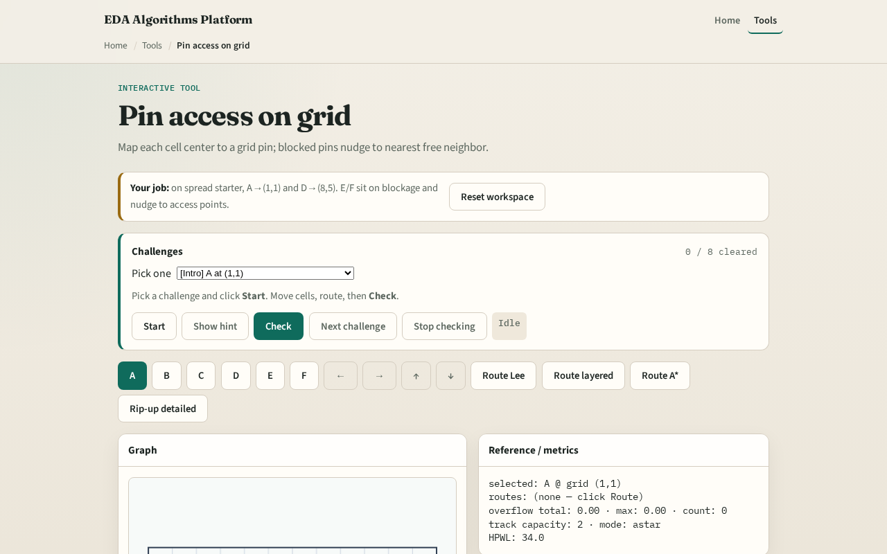

# Pin access points

**Module id:** module01-03-pin-access
**Lab:** pin-access
**Tracks:** A (implement) · B (browser lab)

## Slide 1 — Pins need grid access

A detailed route starts and ends at grid access points—integer cells the router can reach. Legal placement gives you x y coordinates; this module converts them with round-and-clamp and nudges off blockages when needed.

## Slide 2 — The idea

pin_grid of x y returns column gx equals round of x clamped zero to nx minus one, and row gy likewise. Cell A at one comma one maps to one comma one. Cell E at five comma three sits near the blockage at five comma two; nudge to a free neighbor if the pin lands inside the blocked rectangle.

<!-- algorithm-walkthrough -->

## Slide 3 — Pin → grid

Cell centers round to grid indices.

## Slide 4 — A → (1,1)

Spread A lands on grid (1,1).

## Slide 5 — D → (8,5)

D at (8,5) top row.

## Slide 6 — Blocked pins

E/F on blockage nudge to nearest free neighbor.

## Slide 7 — Routes from pins

Sequential routes start/end at terminal grid points.

<!-- /algorithm-walkthrough -->

## Slide 8 — Browser lab track

Open **pin-access**. Hover each cell and read its access grid point. Move a pin across the blockage boundary and watch the access index shift. Confirm all six cells on tiny_dr match your Track A printout.

## Slide 9 — Implement track

Implement or call `terminals(positions, data)` in `common/drutil.py`. Assert A through F on spread placement. Print access points before any routing lab.

## Slide 10 — Pitfalls

Using GCell floor divide from global routing instead of per-grid rounding. Off-by-one at the chip edge without clamp. Ignoring blockages when assigning access.

## Slide 11 — Your turn

Complete access points for all six cells. Next: Lee maze routing around the central blockage.
