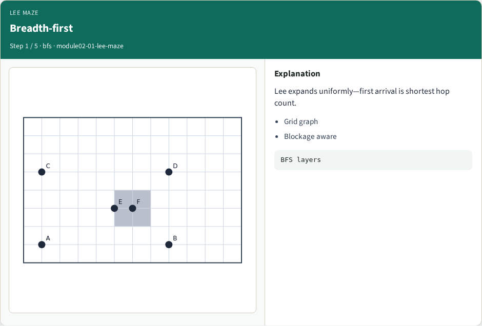
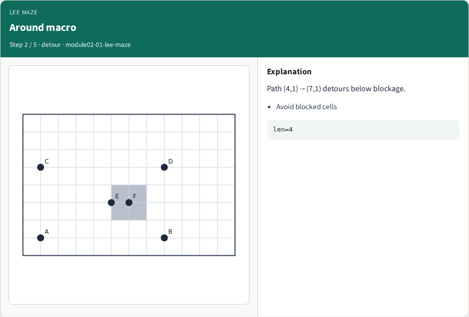
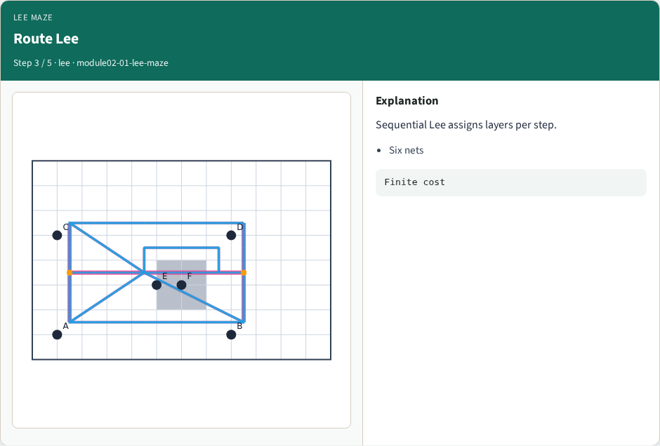
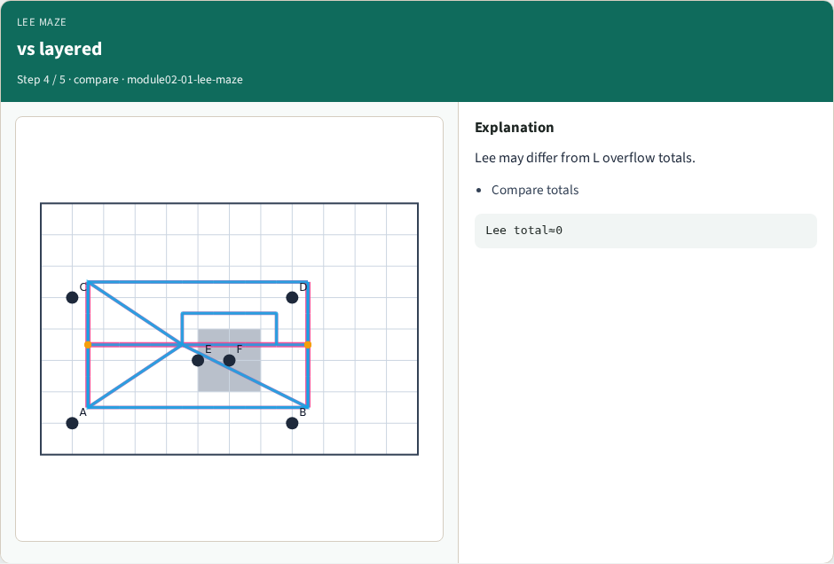
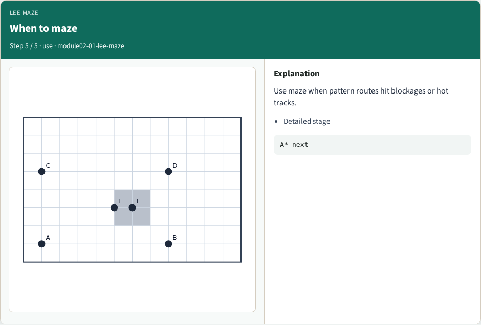
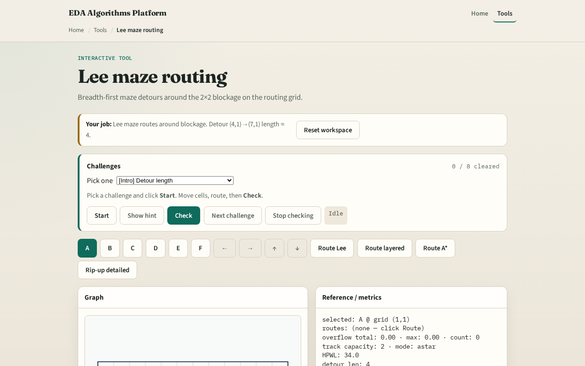

# Lee maze routing

**Module id:** module02-01-lee-maze
**Lab:** lee-maze
**Tracks:** A (implement) · B (browser lab)

## Slide 1 — Cell paths before layers

Lee maze finds a shortest path on grid cells ignoring track congestion—ideal for teaching detours around blockages before A* adds capacity penalties.

## Slide 2 — The idea

Seed a BFS queue with start and path list. Pop, expand neighbors4 skipping blocked cells, return the first path that reaches the goal. If the queue empties, return None. Shortest cell hop count wins.

<!-- algorithm-walkthrough -->

## Slide 3 — Breadth-first

Lee expands uniformly—first arrival is shortest hop count.

## Slide 4 — Around macro

Path (4,1)→(7,1) detours below blockage.

## Slide 5 — Route Lee

Sequential Lee assigns layers per step.

## Slide 6 — vs layered

Lee may differ from L overflow totals.

## Slide 7 — When to maze

Use maze when pattern routes hit blockages or hot tracks.

<!-- /algorithm-walkthrough -->

## Slide 8 — Browser lab track

Open **lee-maze**. Route from four comma one to seven comma one with the blockage at five comma two visible. Watch maze pick a longer detour above or below the blocked rectangle.

## Slide 9 — Implement track

Implement `lee_maze(start, goal, blocked, nx, ny)`. Block cells inside five comma two two by two and show the path avoids them. Match the browser overlay.

## Slide 10 — Pitfalls

Treating blockages as track usage instead of forbidden cells. Forgetting BFS needs visited on cells not edges. Returning a path through a blocked cell because neighbor checks were skipped.

## Slide 11 — Your turn

Pass Lee maze goldens. Next: A* routing that respects track capacity.
