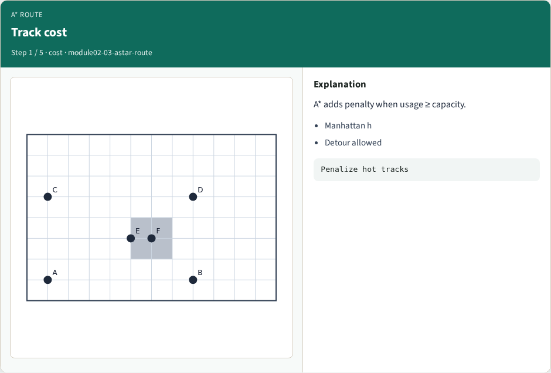
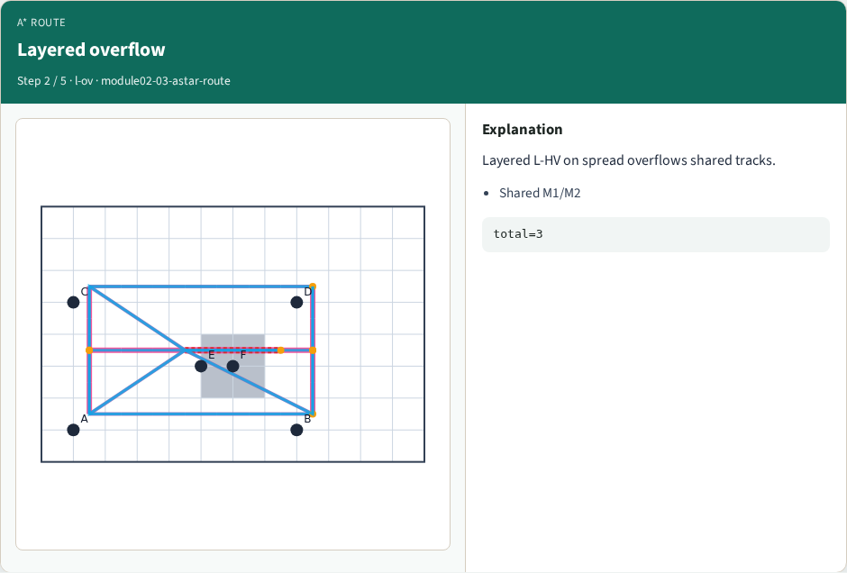
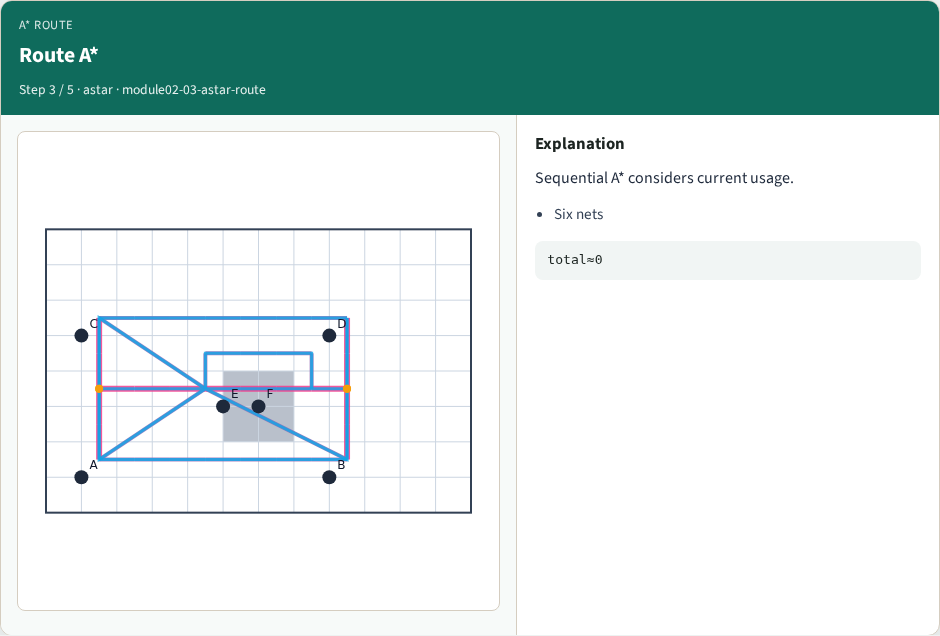
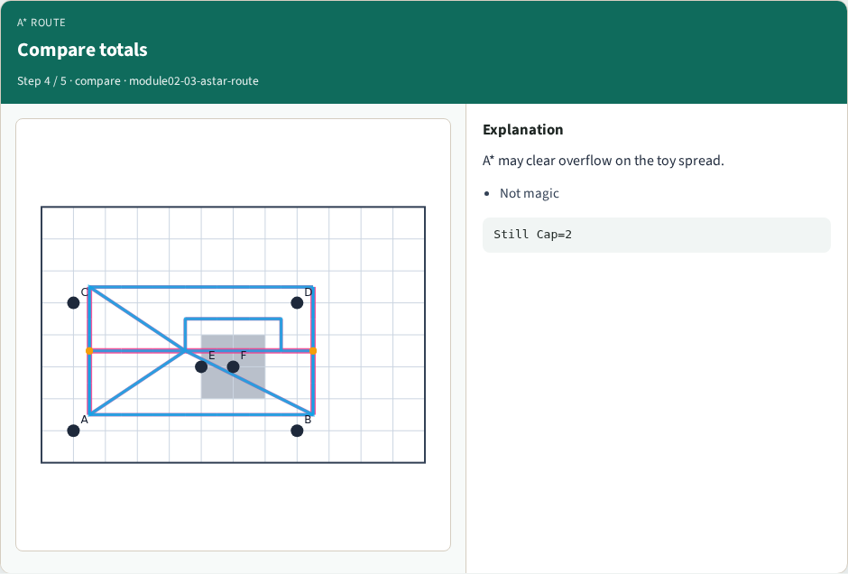
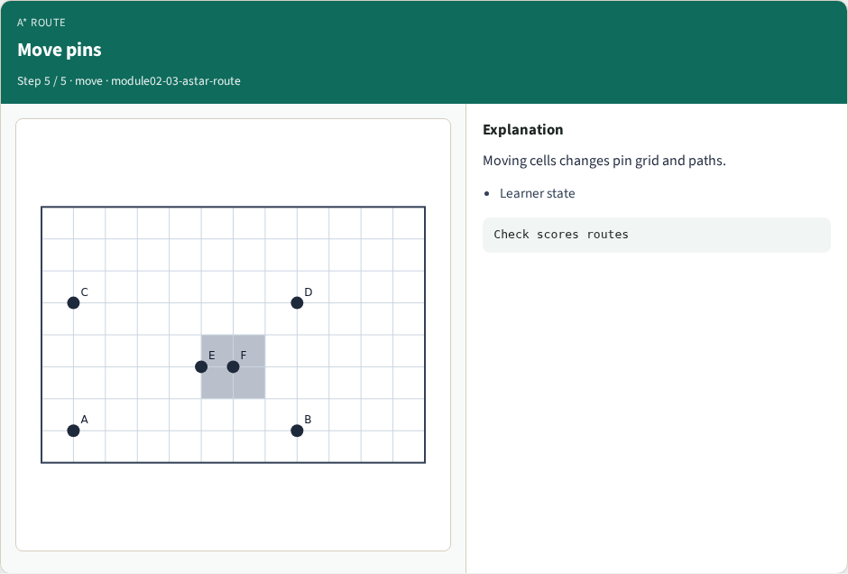
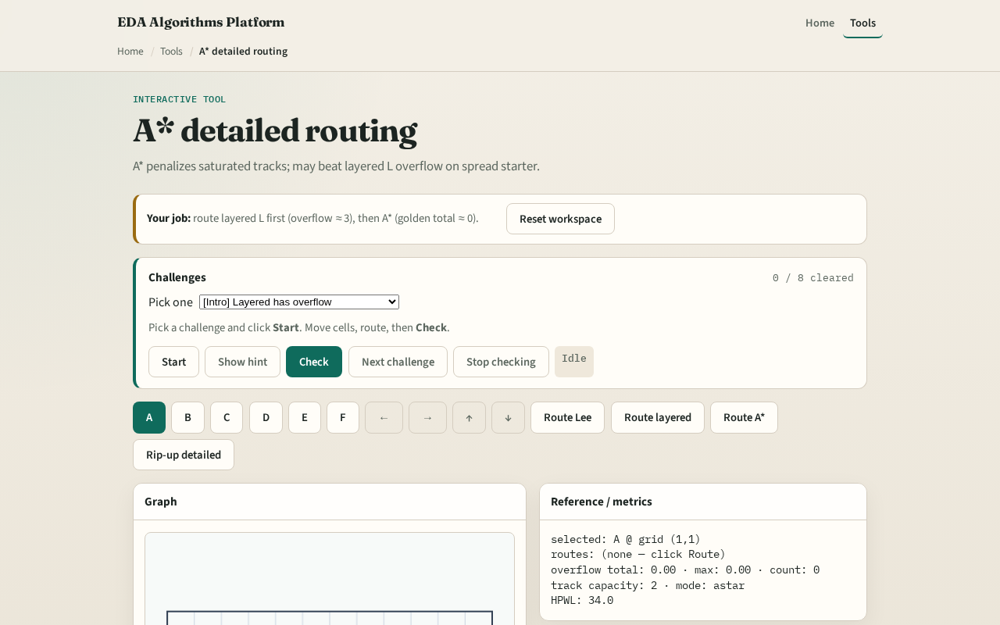

# A* detailed routing

**Module id:** module02-03-astar-route
**Lab:** astar-route
**Tracks:** A (implement) · B (browser lab)

## Slide 1 — Congestion-aware search

Lee ignores other nets. Production detailed routers penalize hot tracks. Our A* adds a heavy step cost when usage is already at capacity so routes detour around congested M1 or M2 edges.

## Slide 2 — The idea

Maintain open heap ordered by f equals g plus Manhattan distance to goal. Expand four neighbors on M1 for horizontal steps and M2 for vertical. Step cost is one plus ten times overflow penalty when usage meets capacity. First time you pop the goal, return the path.

<!-- algorithm-walkthrough -->

## Slide 3 — Track cost

A* adds penalty when usage ≥ capacity.

## Slide 4 — Layered overflow

Layered L-HV on spread overflows shared tracks.

## Slide 5 — Route A*

Sequential A* considers current usage.

## Slide 6 — Compare totals

A* may clear overflow on the toy spread.

## Slide 7 — Move pins

Moving cells changes pin grid and paths.

<!-- /algorithm-walkthrough -->

## Slide 8 — Browser lab track

Open **astar-route**. Pre-fill M1 edge one comma one to two comma one at capacity one and watch A* pick a longer detour. Clear the block and confirm the shortest path returns.

## Slide 9 — Implement track

Implement or call `astar_route(start, goal, usage, cap, nx, ny, blocks)`. Block the hot edge and show A* cannot go direct; unblock a vertical detour path exists.

## Slide 10 — Pitfalls

Using undirected track keys inconsistently. Checking capacity on the wrong layer for a move. Forgetting blockages still forbid cells even when tracks are free.

## Slide 11 — Your turn

Clear A* challenges. Next: deposit segments on tracks and measure overflow.
