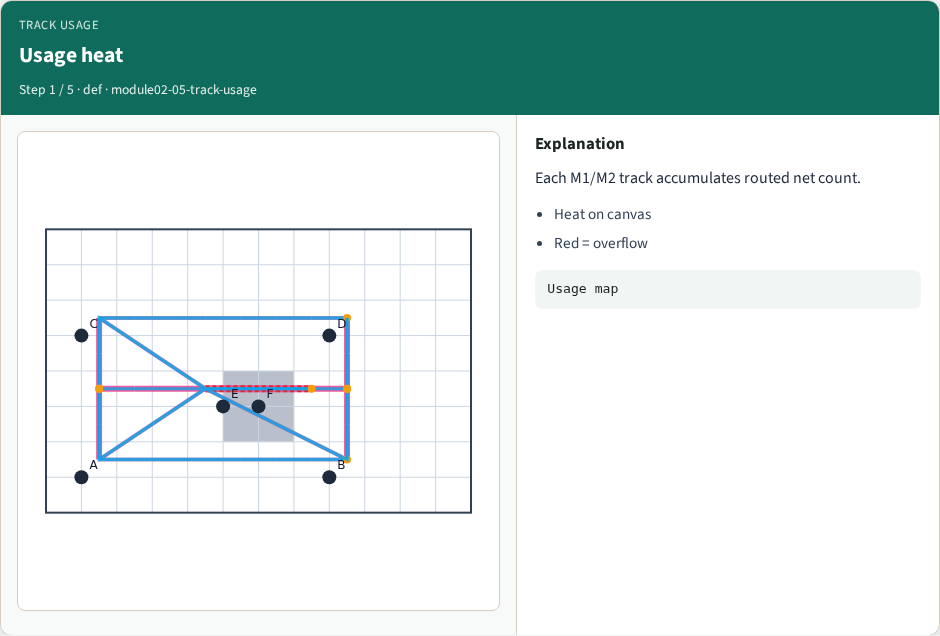
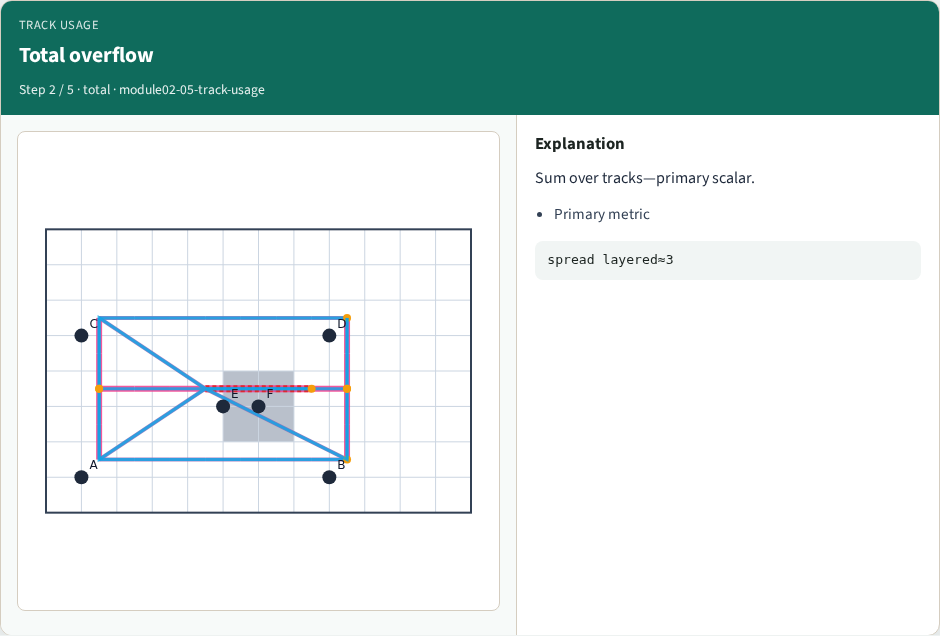
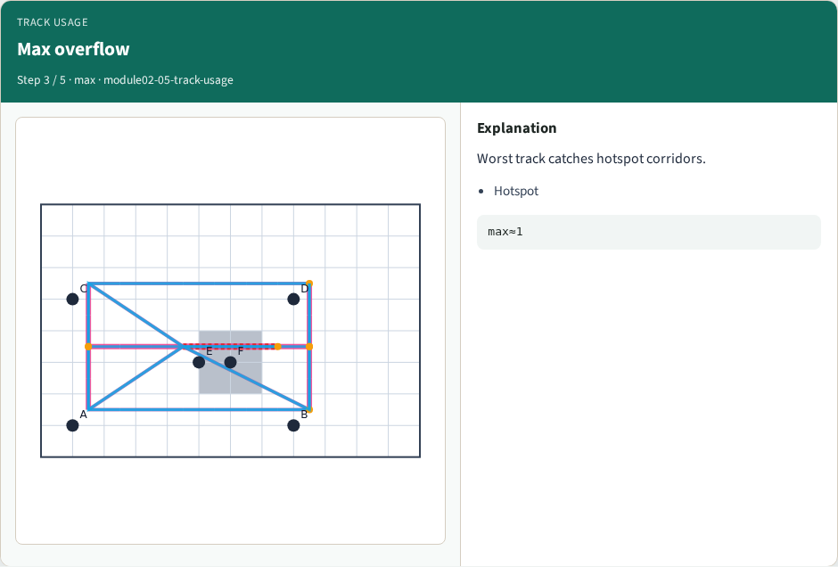
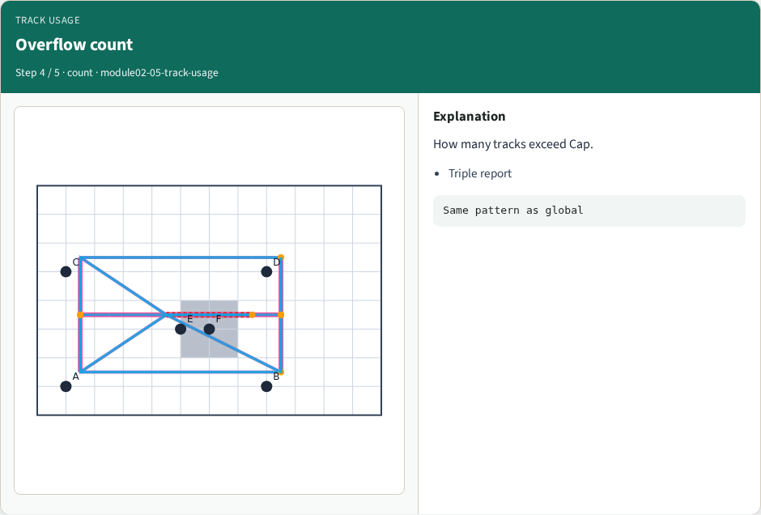
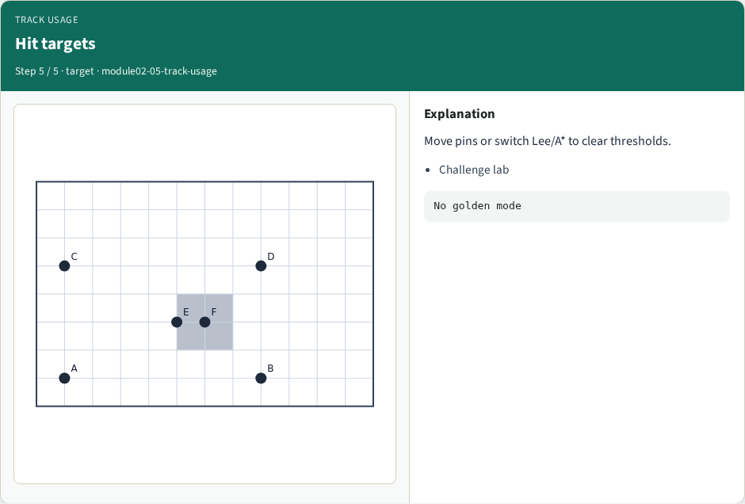

# Track usage and capacity — step-by-step (for slides / transcript)

**Module:** `module02-05-track-usage`  
**Lab / algo:** `track-usage`  
**Viewer:** `/tools/algorithm-walkthrough/?algo=track-usage&step=1`

Use each **Caption** as spoken prose (or a shortened slide note).
Use **Bullets** on the PPT; pair with the PNG in `assets/steps/`.

## Step 1 — Usage heat



**Caption (transcript):** Each M1/M2 track accumulates routed net count.

**Slide bullets:**

- Heat on canvas
- Red = overflow

**On-screen metrics:**

```
Usage map
```

## Step 2 — Total overflow



**Caption (transcript):** Sum over tracks—primary scalar.

**Slide bullets:**

- Primary metric

**On-screen metrics:**

```
spread layered≈3
```

## Step 3 — Max overflow



**Caption (transcript):** Worst track catches hotspot corridors.

**Slide bullets:**

- Hotspot

**On-screen metrics:**

```
max≈1
```

## Step 4 — Overflow count



**Caption (transcript):** How many tracks exceed Cap.

**Slide bullets:**

- Triple report

**On-screen metrics:**

```
Same pattern as global
```

## Step 5 — Hit targets



**Caption (transcript):** Move pins or switch Lee/A* to clear thresholds.

**Slide bullets:**

- Challenge lab

**On-screen metrics:**

```
No golden mode
```

