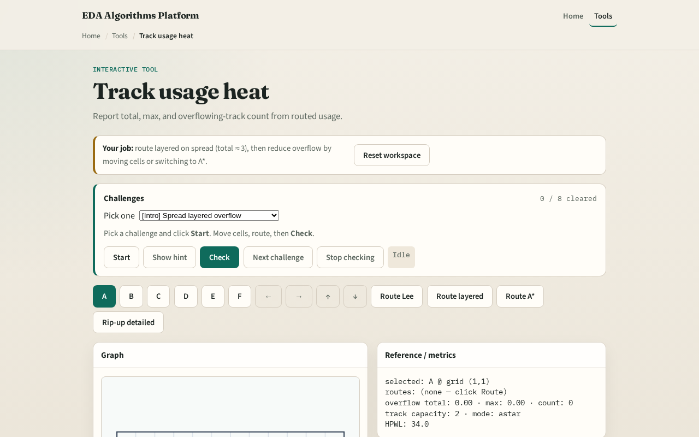

# When usage exceeds capacity

Each directed M1 or M2 track has capacity one on tiny_dr

---

## The idea
- Path_track_usage walks consecutive segment pairs
- Track_overflow computes max of zero and usage minus capacity per track
- Sequential L-HV on all six nets should yield positive total overflow at cap one

---

## Usage heat

---

## Total overflow

---

## Max overflow

---

## Overflow count

---

## Hit targets

---

## Browser lab track

---

## Implement track
- Implement `path_track_usage` and `track_overflow`
- Call sequential_detailed with mode l_hv on tiny_dr and assert total overflow is greater

---

## Pitfalls
- Computing overflow before summing all nets
- Using GCell edge usage from global routing instead of directed tracks
- Reporting negative overflow values

---

## Your turn
- Hit overflow targets
- Next: assign vias on two-layer L paths

