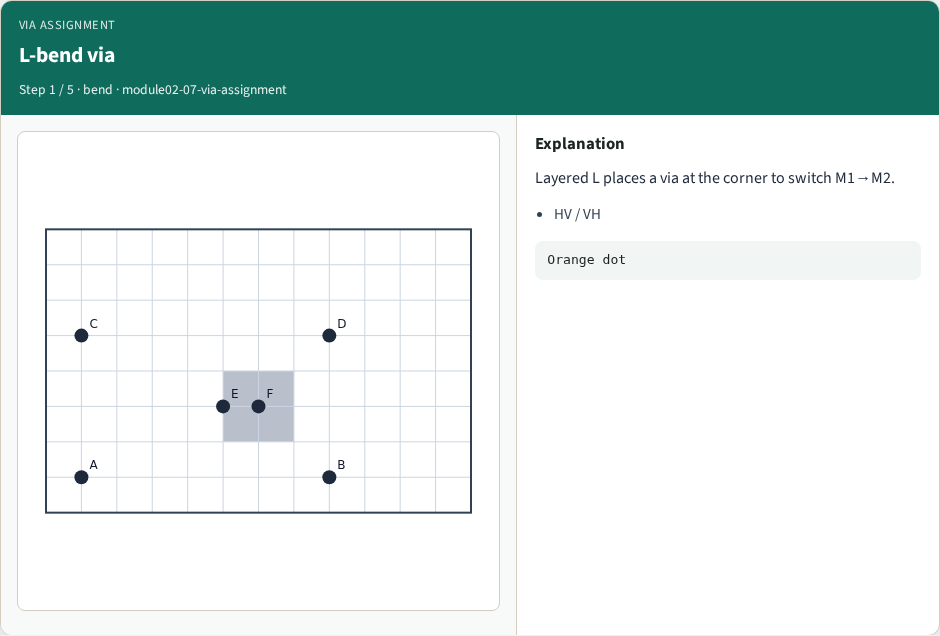
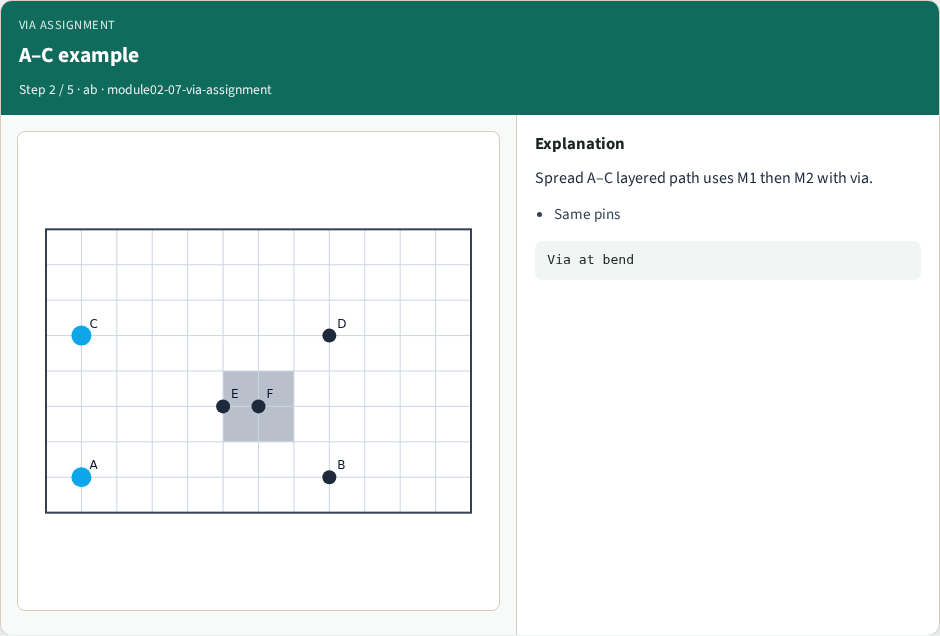
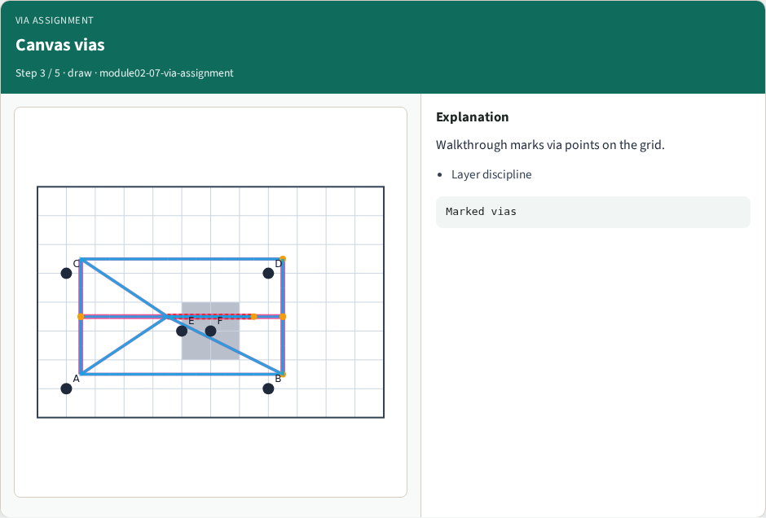
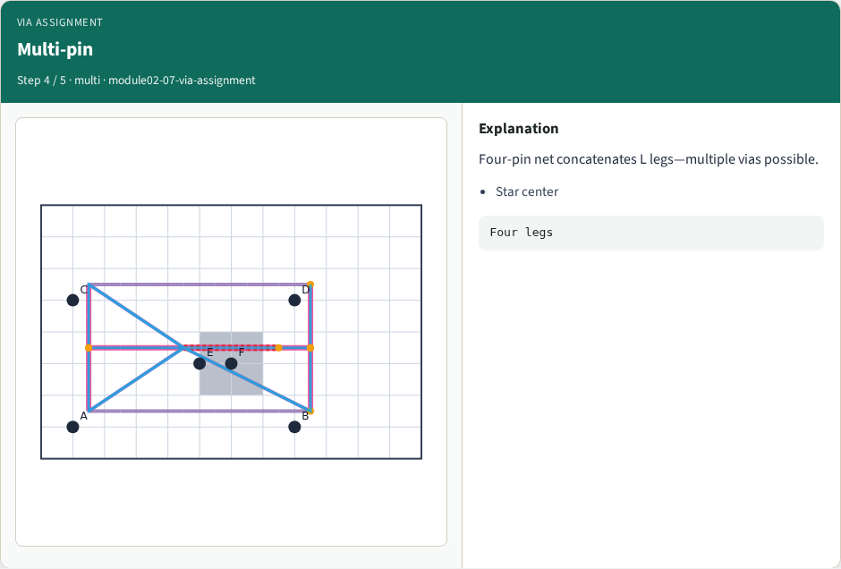
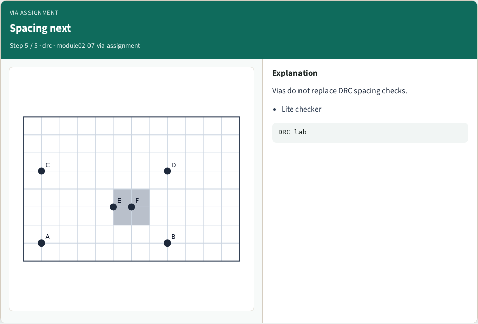
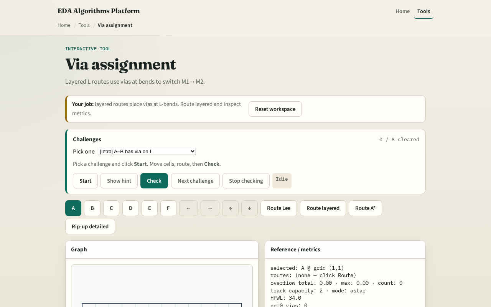

# Via assignment (2-layer)

**Module id:** module02-07-via-assignment
**Lab:** via-assignment
**Tracks:** A (implement) · B (browser lab)

## Slide 1 — Layer changes at bends

Real detailed routes switch between M1 and M2 at vias. Our L-route with layers walks horizontal on M1 and vertical on M2—or the VH variant—and marks via equals true at the bend cell.

## Slide 2 — The idea

Given start and goal, prefer HV walks horizontal on M1 to align columns, inserts a via segment at the bend, then walks vertical on M2. l_route_layers returns segment dicts with x y layer and optional via flag. A path from one comma one to five comma four in HV includes at least one via.

<!-- algorithm-walkthrough -->

## Slide 3 — L-bend via

Layered L places a via at the corner to switch M1→M2.

## Slide 4 — A–C example

Spread A–C layered path uses M1 then M2 with via.

## Slide 5 — Canvas vias

Walkthrough marks via points on the grid.

## Slide 6 — Multi-pin

Four-pin net concatenates L legs—multiple vias possible.

## Slide 7 — Spacing next

Vias do not replace DRC spacing checks.

<!-- /algorithm-walkthrough -->

## Slide 8 — Browser lab track

Open **via-assignment**. Route A to B with HV and read via markers in the segment list. Toggle VH on the same pair and compare the bend cell and layers.

## Slide 9 — Implement track

Implement `l_route_layers(a, b, prefer)`. Route net A–B on tiny_dr and print segments with via flags. Match the browser overlay.

## Slide 10 — Pitfalls

Skipping the via marker at the bend. Putting horizontal motion on M2 or vertical on M1. Forgetting the final segment must land on the goal coordinates.

## Slide 11 — Your turn

Ship Track A layer routes with vias. Next: DRC spacing lite on parallel tracks.
