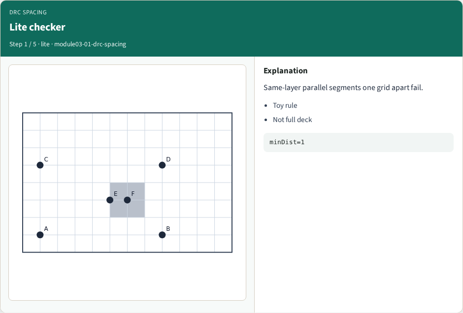
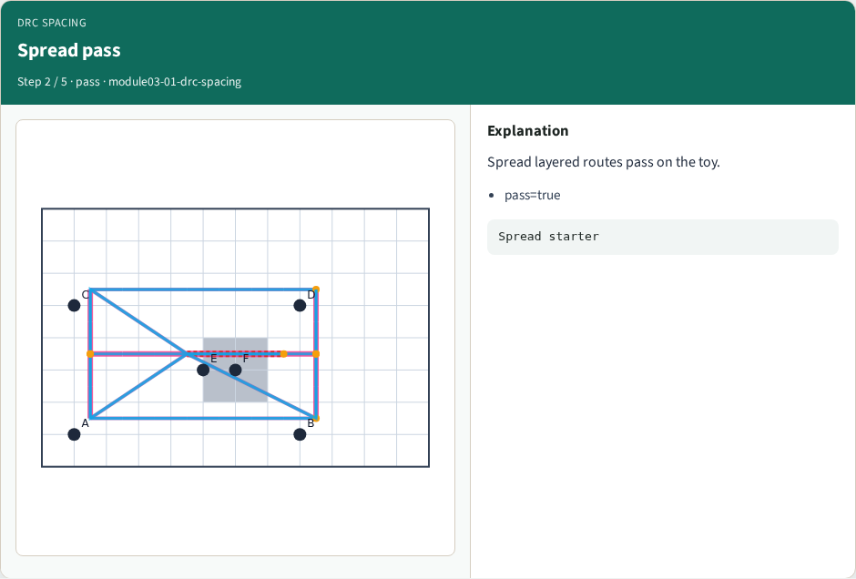
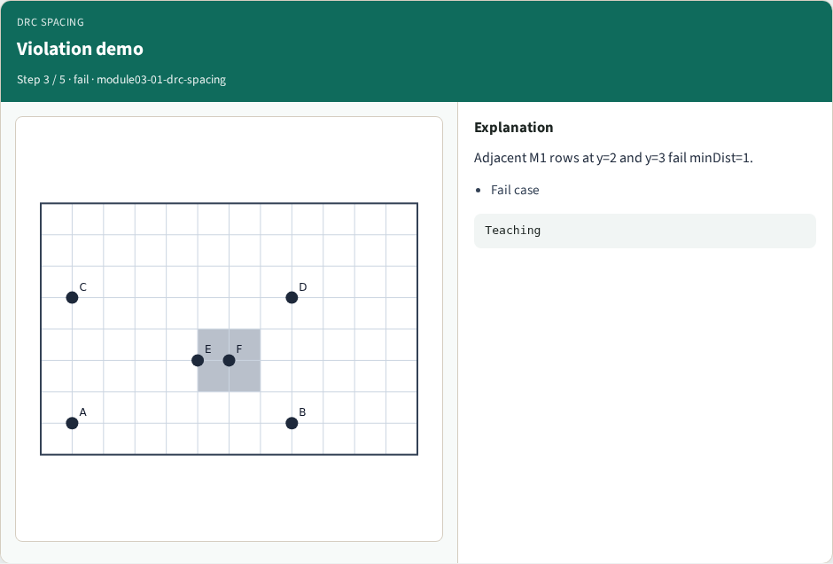
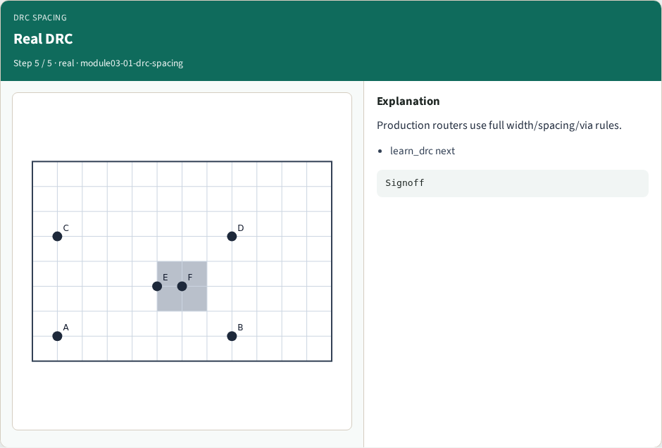
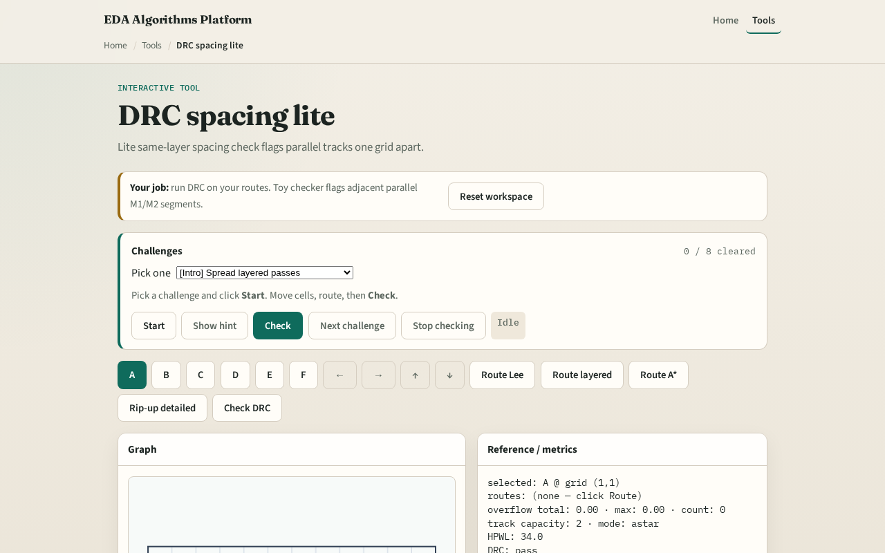

# DRC spacing lite

**Module id:** module03-01-drc-spacing
**Lab:** drc-spacing
**Tracks:** A (implement) · B (browser lab)

## Slide 1 — Geometry rules matter

Signoff DRC is vast; spacing lite teaches the idea: same-layer parallel segments too close fail even when tracks are logically free.

## Slide 2 — The idea

Group segment points by layer. For M1 pairs on the same row y, if horizontal distance is greater than zero but less than or equal to min_dist, return fail with violation coordinates. Likewise for M2 pairs on the same column x. Otherwise pass.

<!-- algorithm-walkthrough -->

## Slide 3 — Lite checker

Same-layer parallel segments one grid apart fail.

## Slide 4 — Spread pass

Spread layered routes pass on the toy.

## Slide 5 — Violation demo

Adjacent M1 rows at y=2 and y=3 fail minDist=1.

## Slide 6 — After route

Run checker on learner sequential routes.

## Slide 7 — Real DRC

Production routers use full width/spacing/via rules.

<!-- /algorithm-walkthrough -->

## Slide 8 — Browser lab track

Open **drc-spacing**. Place parallel M1 segments one track apart on adjacent rows and read the violation panel. Widen spacing and confirm pass.

## Slide 9 — Implement track

Implement `drc_spacing_lite(segments, min_dist)`. Feed the golden failing segment set from test_solvers and assert pass is false.

## Slide 10 — Pitfalls

Checking cross-layer pairs—this lite rule is same-layer only. Using Manhattan grid distance across rows for M1 horizontal segments. Treating DRC pass as proof of tape-out readiness.

## Slide 11 — Your turn

Clear DRC spacing challenges. Next: rip-up the hottest net and A* reroute.
