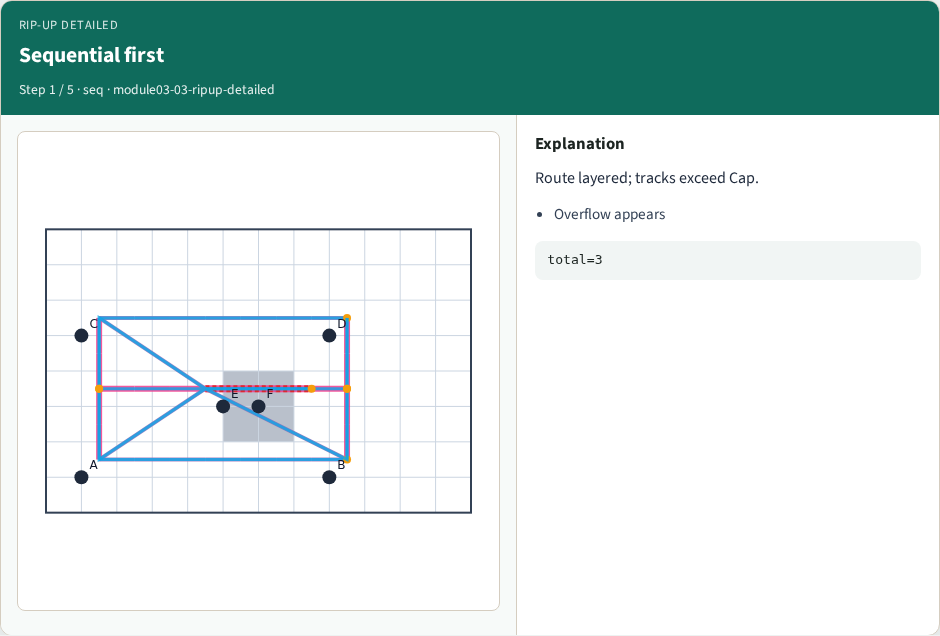
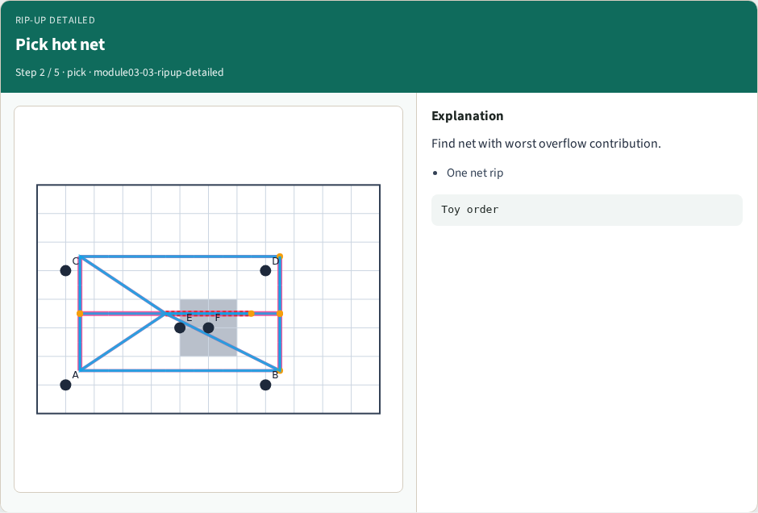
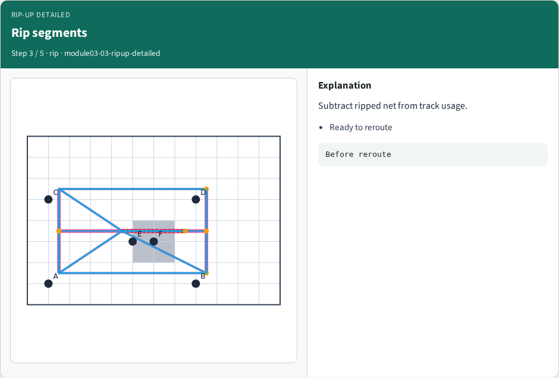
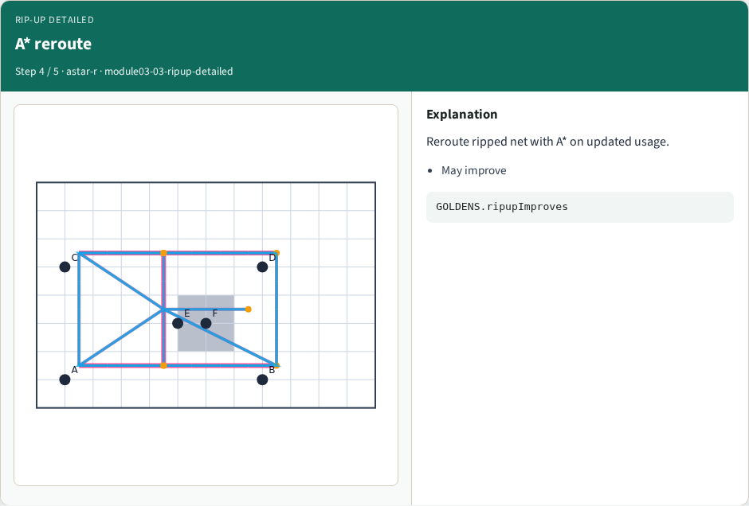
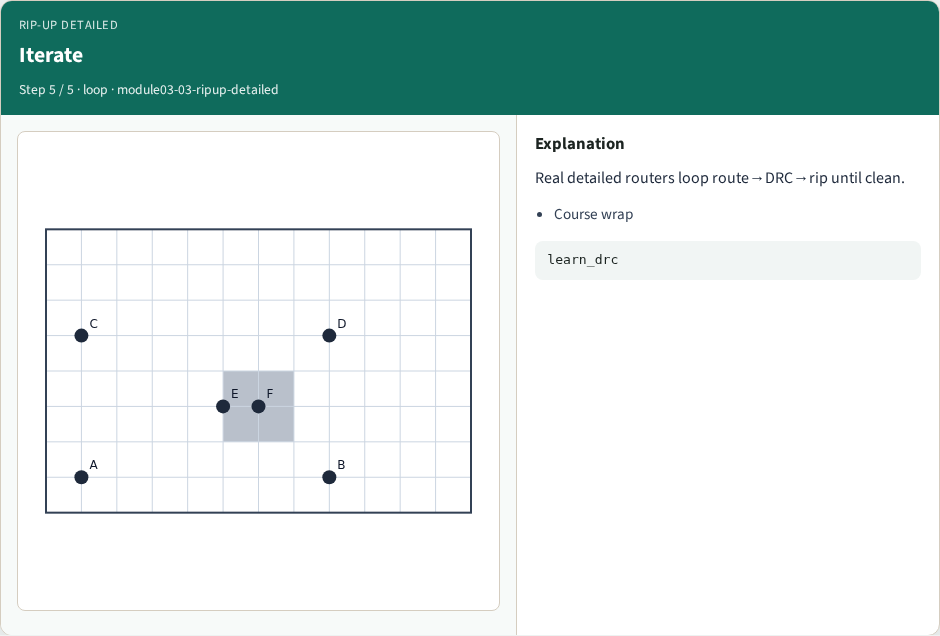

# Rip-up and reroute (detailed) — step-by-step (for slides / transcript)

**Module:** `module03-03-ripup-detailed`  
**Lab / algo:** `ripup-detailed`  
**Viewer:** `/tools/algorithm-walkthrough/?algo=ripup-detailed&step=1`

Use each **Caption** as spoken prose (or a shortened slide note).
Use **Bullets** on the PPT; pair with the PNG in `assets/steps/`.

## Step 1 — Sequential first



**Caption (transcript):** Route layered; tracks exceed Cap.

**Slide bullets:**

- Overflow appears

**On-screen metrics:**

```
total=3
```

## Step 2 — Pick hot net



**Caption (transcript):** Find net with worst overflow contribution.

**Slide bullets:**

- One net rip

**On-screen metrics:**

```
Toy order
```

## Step 3 — Rip segments



**Caption (transcript):** Subtract ripped net from track usage.

**Slide bullets:**

- Ready to reroute

**On-screen metrics:**

```
Before reroute
```

## Step 4 — A* reroute



**Caption (transcript):** Reroute ripped net with A* on updated usage.

**Slide bullets:**

- May improve

**On-screen metrics:**

```
GOLDENS.ripupImproves
```

## Step 5 — Iterate



**Caption (transcript):** Real detailed routers loop route→DRC→rip until clean.

**Slide bullets:**

- Course wrap

**On-screen metrics:**

```
learn_drc
```

