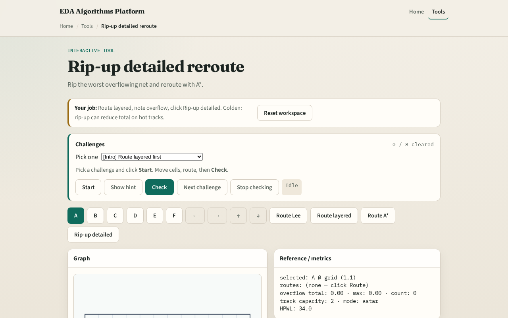

# Relieve track hotspots

When track overflow appears, detailed routers rip up contributing nets and reroute around congested tracks

---

## The idea
- Score each net by track overflow on its segments
- Subtract its route from usage
- Run astar_route between its pins with the remaining usage map
- Add the new segment track usage back
- Total overflow should not rise; ideally it drops versus the pre-rip state

---

## Sequential first

---

## Pick hot net

---

## Rip segments

---

## A* reroute

---

## Iterate

---

## Browser lab track

---

## Implement track
- Implement `ripup_detailed(routes, usage, cap, terminals_map, nets, nx, ny, blocks)`
- Assert total overflow after is less than or equal to before on tiny_dr sequential L seed

---

## Pitfalls
- Ripping a net but leaving ghost usage on its old tracks
- Rerouting with pattern L through the same hot track
- Picking the wrong net to rip, use overflow contribution not HPWL

---

## Your turn
- Clear rip-up challenges
- Next: tie it together with full sequential detailed routing

