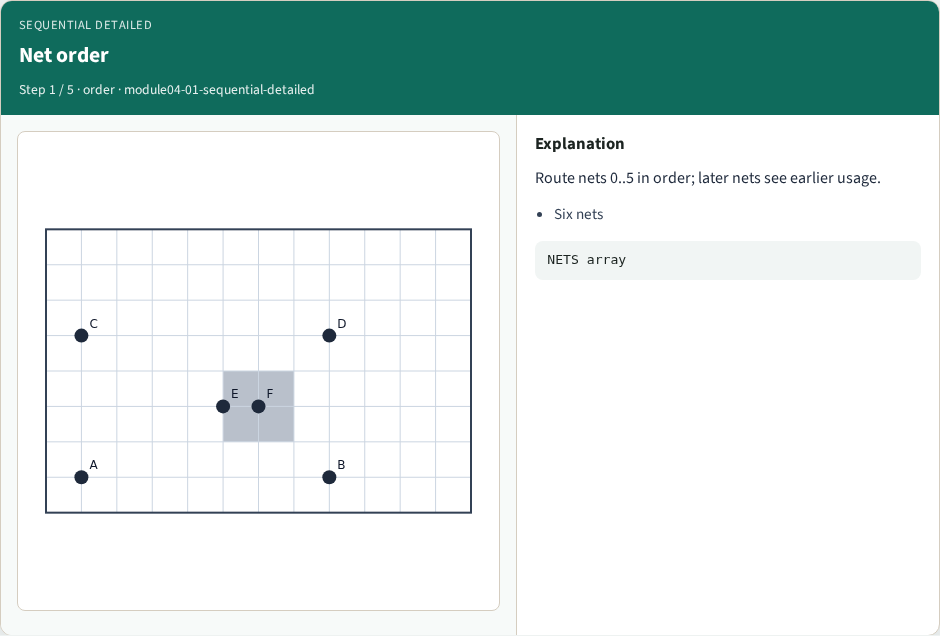
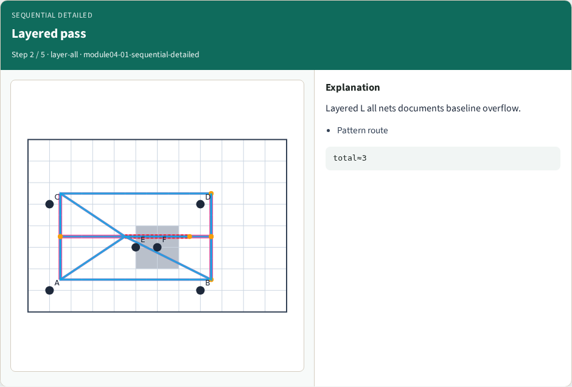
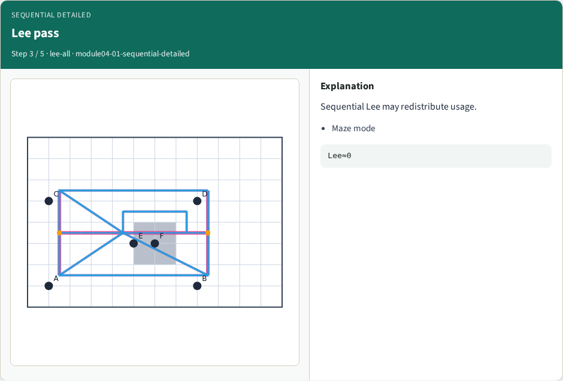
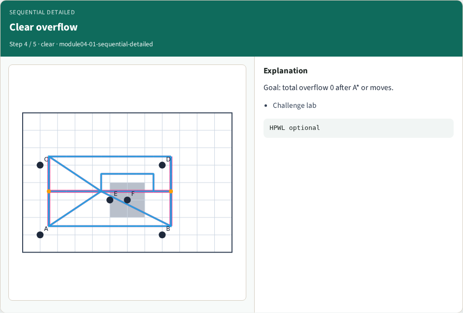
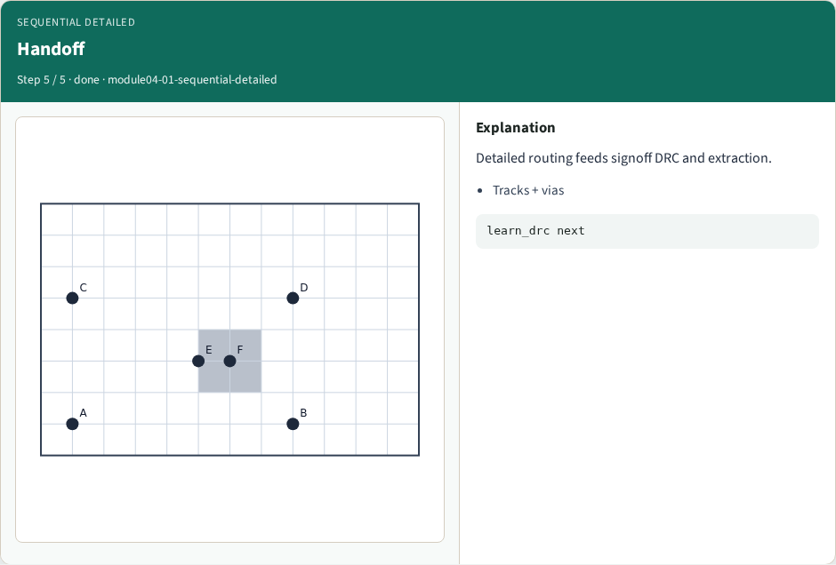
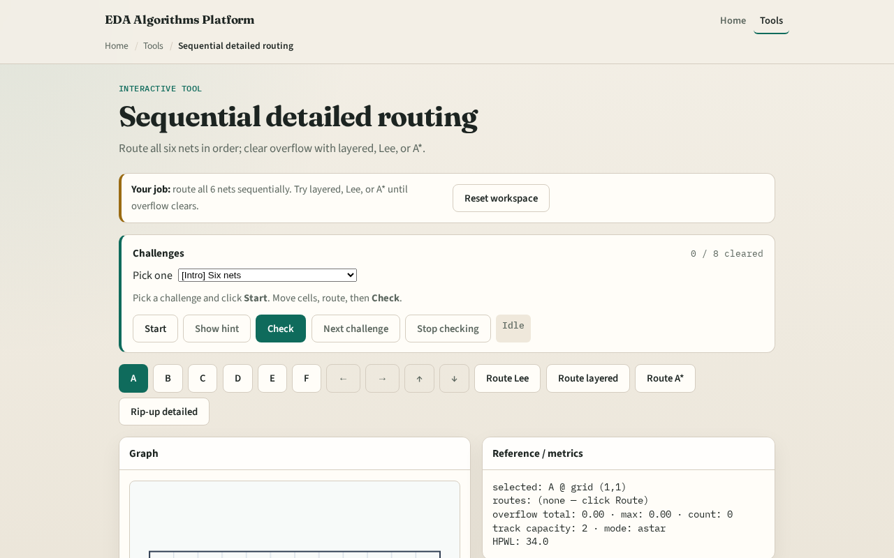

# Sequential detailed route

**Module id:** module04-01-sequential-detailed
**Lab:** sequential-detailed
**Tracks:** A (implement) · B (browser lab)

## Slide 1 — Order matters on tracks

Production detailed routers process nets in an order. Each net deposits usage on directed tracks; later nets see a more congested grid. Sequential L-HV on tiny_dr is our baseline stress test; A* mode shows congestion-aware ordering effects.

## Slide 2 — The idea

Initialize empty usage. For each net in list order, compute terminals, route with the chosen mode—l_hv for layer L, lee for cell maze, astar for congestion-aware—and increment usage on every track key in the route. Report final usage and track_overflow summary.

<!-- algorithm-walkthrough -->

## Slide 3 — Net order

Route nets 0..5 in order; later nets see earlier usage.

## Slide 4 — Layered pass

Layered L all nets documents baseline overflow.

## Slide 5 — Lee pass

Sequential Lee may redistribute usage.

## Slide 6 — Clear overflow

Goal: total overflow 0 after A* or moves.

## Slide 7 — Handoff

Detailed routing feeds signoff DRC and extraction.

<!-- /algorithm-walkthrough -->

## Slide 8 — Browser lab track

Open **sequential-detailed**. Route all nets in default order. Reorder mentally: would routing the four-pin net last change the hottest track?

## Slide 9 — Implement track

Implement `sequential_detailed` and `route_from_data`. Print usage and overflow after routing all six nets. Compare astar mode with l_hv on total overflow.

## Slide 10 — Pitfalls

Parallel deposit without order— hides rip-up motivation. Ignoring multi-pin net in order list. Resetting usage between nets accidentally.

## Slide 11 — Your turn

Complete sequential detailed routing. Offline compare and wrap come next.
