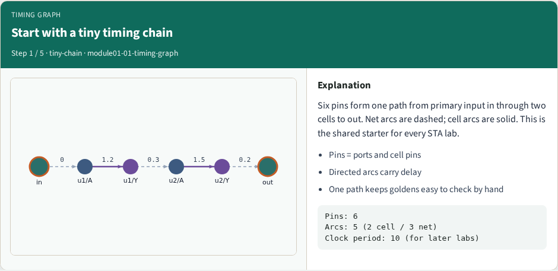
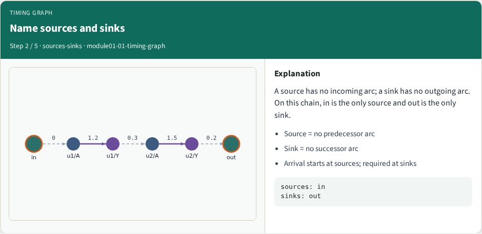
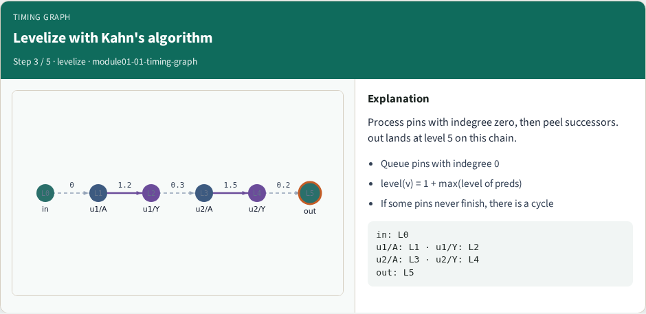
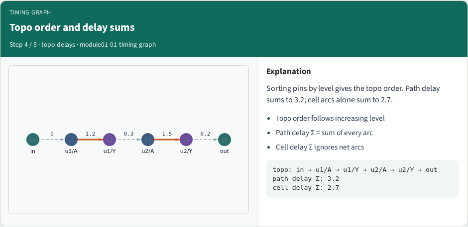
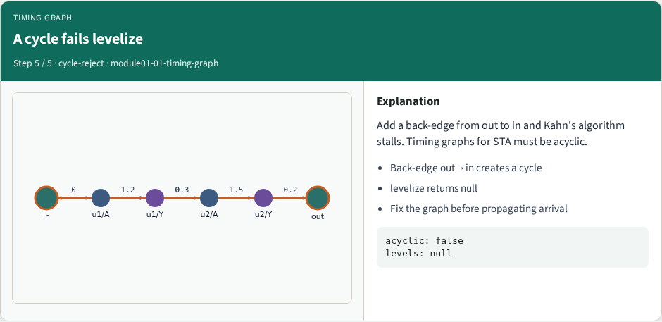

# Timing graph

**Module id:** module01-01-timing-graph
**Lab:** timing-graph
**Tracks:** A (implement) · B (browser lab)

## Slide 1 — Timing graph

Static timing starts with a directed timing graph. On our tiny chain, six pins and five arcs carry you from in through two cells to out. You will levelize the graph, name sources and sinks, and prove that a back-edge out to in makes levelize fail.

## Slide 2 — Goldens to remember

Goldens: six pins, five arcs, levels zero through five, path delay three point two. A cycle returns no levels. Keep these numbers handy—the browser challenges and Track A tests use the same instance.


## Slide 3 — Pseudocode

Pseudocode for this lab is Kahn levelize on a pin and arc timing graph. Inputs are pins and delayed arcs. The loop peels indegree-zero pins and writes levels. Stop with failure if a cycle leaves pins unvisited.

Open this module's examples file and find the Pseudocode section. That written sketch is what you implement on the implement track and what the browser challenges measure.

## Slide 4 — Algorithm sketch

On the tiny chain the sketch returns levels zero through five with out at five. Six pins and five arcs are the shared instance. Adding out to in makes levelize fail—that is the cycle golden.

```text
INPUT: pins, arcs (delay, kind cell|net)
OUTPUT: levels[] or FAIL(cycle)
indeg[v]←|preds|; Q←{v|indeg=0}; level[Q]=0
while Q:
  u←pop; for v in succ(u):
    indeg[v]−=1; level[v]←max(level[v],level[u]+1)
    if indeg[v]=0: push v
FAIL if not all visited else return levels
GOLDEN: 6 pins, 5 arcs; in:0 … out:5
```


<!-- algorithm-walkthrough -->

## Slide 5 — Start with a tiny timing chain



Six pins form one path from primary input in through two cells to out. Net arcs are dashed; cell arcs are solid. This is the shared starter for every STA lab.

## Slide 6 — Name sources and sinks



A source has no incoming arc; a sink has no outgoing arc. On this chain, in is the only source and out is the only sink.

## Slide 7 — Levelize with Kahn's algorithm



Process pins with indegree zero, then peel successors. out lands at level 5 on this chain.

## Slide 8 — Topo order and delay sums



Sorting pins by level gives the topo order. Path delay sums to 3.2; cell arcs alone sum to 2.7.

## Slide 9 — A cycle fails levelize



Add a back-edge from out to in and Kahn's algorithm stalls. Timing graphs for STA must be acyclic.

<!-- /algorithm-walkthrough -->


## Slide 10 — Browser lab track

In the browser lab, open **timing-graph**. Load the starter, run the analysis once, and read the metrics panel. Orient yourself—challenge panel, canvas, Check—then mirror the same goldens in code.

## Slide 11 — Implement track

In the implement track, use `common/tiny_timing.json` with the helpers in `common/graph.py` and `common/propagate.py`. Run `python3 common/test_propagate.py` (and the timing-graph test) until the goldens print ok.

## Slide 12 — Pitfall

Do not mix setup and hold required maps. Do not propagate before the graph is levelized. After an edit or exception, recompute—stale tags lie.

## Slide 13 — Your turn

Finish the checklist on at least one track—preferably both. When your numbers match the goldens, take the quiz, then continue.
