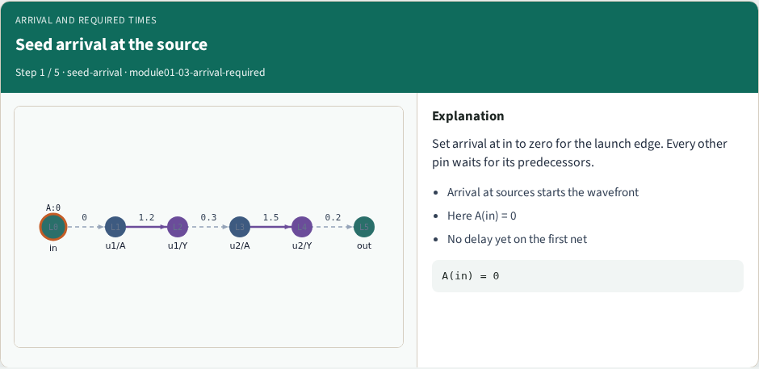
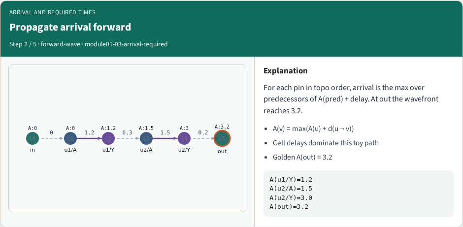
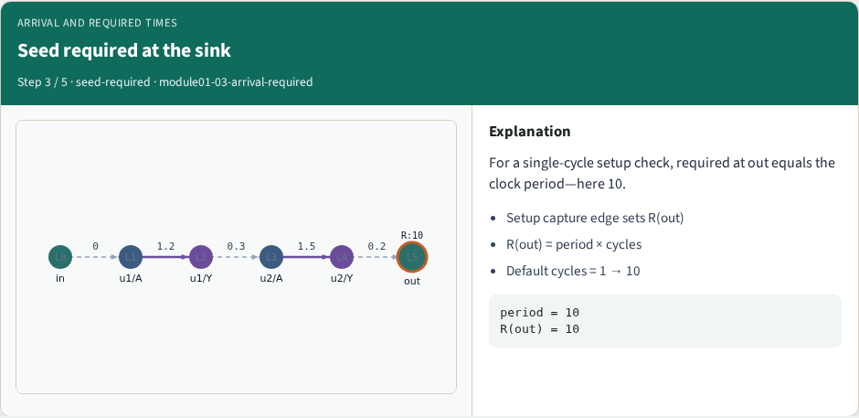
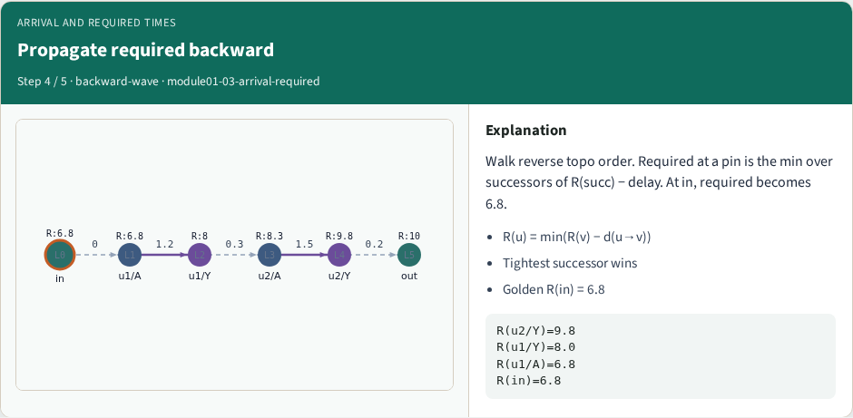
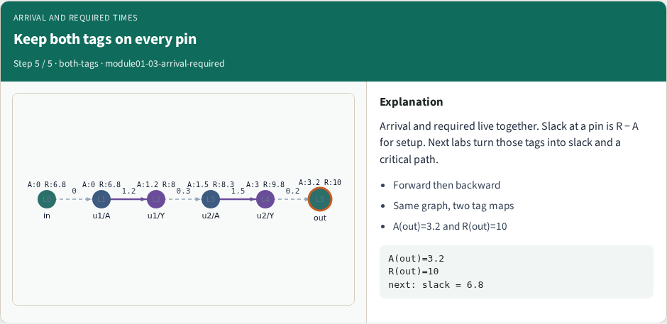

# Arrival and required times

Once the graph is levelized, you propagate tags

---

## Goldens to remember
- Forward: A(in)=0, A(u1/Y)=1.2, A(out)=3.2
- Backward setup: R(out)=10, R(in)=6.8
- Keep these numbers handy, the browser challenges and Track A tests use the same instance
- <!-- algorithm-walkthrough -->

---

## Seed arrival at the source

---

## Propagate arrival forward

---

## Seed required at the sink

---

## Propagate required backward

---

## Keep both tags on every pin

---

## Browser lab track
- In the browser lab, open **arrival-required**
- Load the starter, run the analysis once, and read the metrics panel
- Orient yourself, challenge panel, canvas, Check, then mirror the same goldens in code

---

## Implement track
- In the implement track
- Run `python3 common/test_propagate.py` (and the timing-graph test) until the goldens print

---

## Pitfall
- Do not mix setup and hold required maps
- Do not propagate before the graph is levelized
- After an edit or exception, recompute, stale tags lie

---

## Your turn
- Finish the checklist on at least one track, preferably both
- When your numbers match the goldens, take the quiz, then continue

