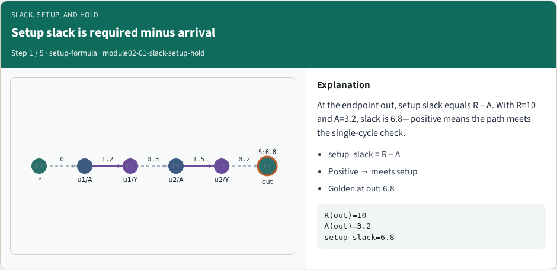
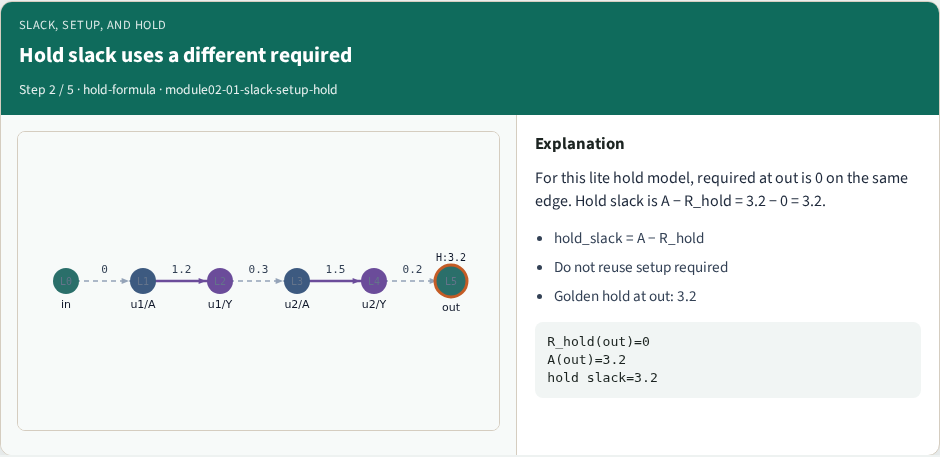
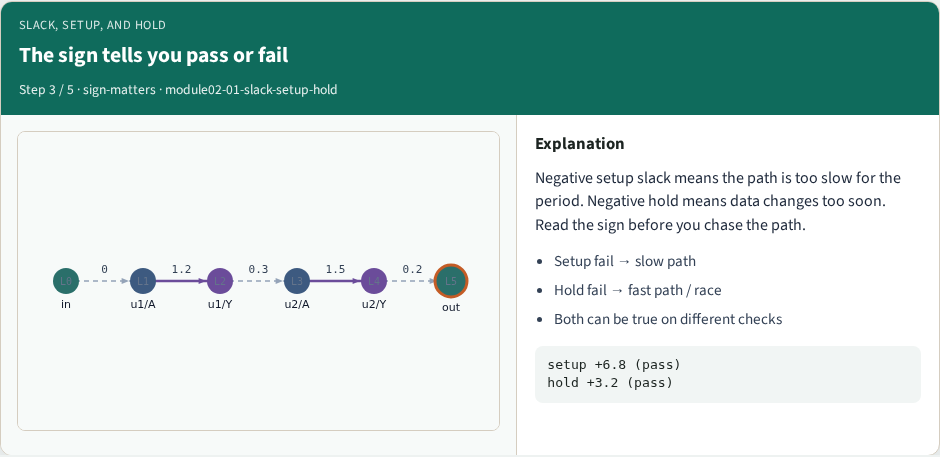
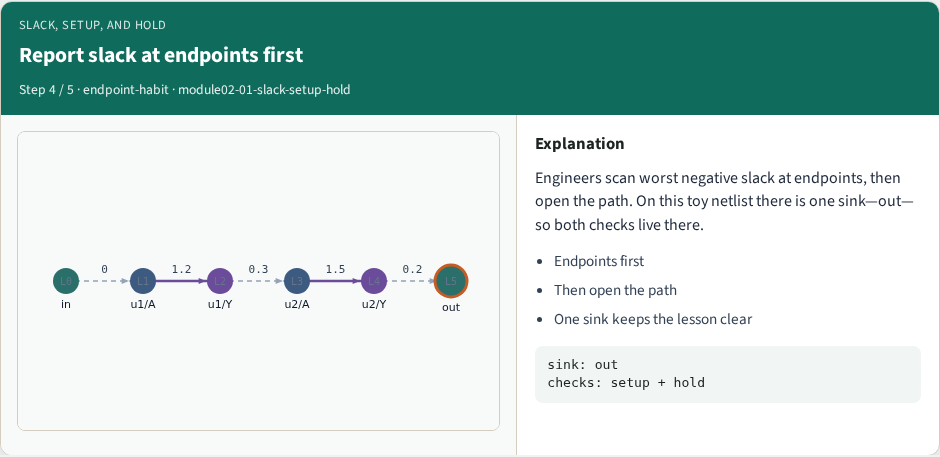
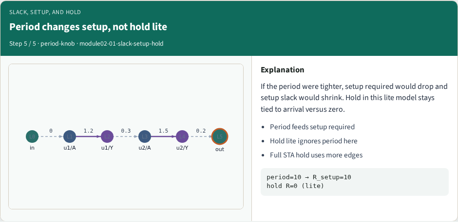

# Slack, setup, and hold — step-by-step (for slides / transcript)

**Module:** `module02-01-slack-setup-hold`  
**Lab / algo:** `slack-setup-hold`  
**Viewer:** `/tools/algorithm-walkthrough/?algo=slack-setup-hold&step=1`

Use each **Caption** as spoken prose (or a shortened slide note).
Use **Bullets** on the PPT; pair with the PNG in `assets/steps/`.

## Step 1 — Setup slack is required minus arrival



**Caption (transcript):** At the endpoint out, setup slack equals R − A. With R=10 and A=3.2, slack is 6.8—positive means the path meets the single-cycle check.

**Slide bullets:**

- setup_slack = R − A
- Positive → meets setup
- Golden at out: 6.8

**On-screen metrics:**

```
R(out)=10
A(out)=3.2
setup slack=6.8
```

## Step 2 — Hold slack uses a different required



**Caption (transcript):** For this lite hold model, required at out is 0 on the same edge. Hold slack is A − R_hold = 3.2 − 0 = 3.2.

**Slide bullets:**

- hold_slack = A − R_hold
- Do not reuse setup required
- Golden hold at out: 3.2

**On-screen metrics:**

```
R_hold(out)=0
A(out)=3.2
hold slack=3.2
```

## Step 3 — The sign tells you pass or fail



**Caption (transcript):** Negative setup slack means the path is too slow for the period. Negative hold means data changes too soon. Read the sign before you chase the path.

**Slide bullets:**

- Setup fail → slow path
- Hold fail → fast path / race
- Both can be true on different checks

**On-screen metrics:**

```
setup +6.8 (pass)
hold +3.2 (pass)
```

## Step 4 — Report slack at endpoints first



**Caption (transcript):** Engineers scan worst negative slack at endpoints, then open the path. On this toy netlist there is one sink—out—so both checks live there.

**Slide bullets:**

- Endpoints first
- Then open the path
- One sink keeps the lesson clear

**On-screen metrics:**

```
sink: out
checks: setup + hold
```

## Step 5 — Period changes setup, not hold lite



**Caption (transcript):** If the period were tighter, setup required would drop and setup slack would shrink. Hold in this lite model stays tied to arrival versus zero.

**Slide bullets:**

- Period feeds setup required
- Hold lite ignores period here
- Full STA hold uses more edges

**On-screen metrics:**

```
period=10 → R_setup=10
hold R=0 (lite)
```

