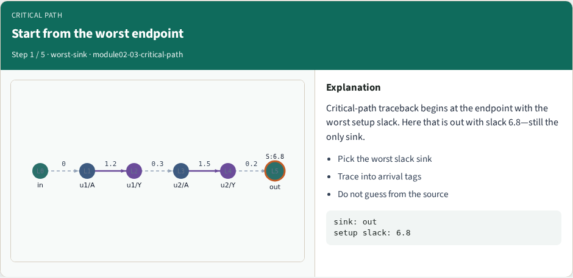
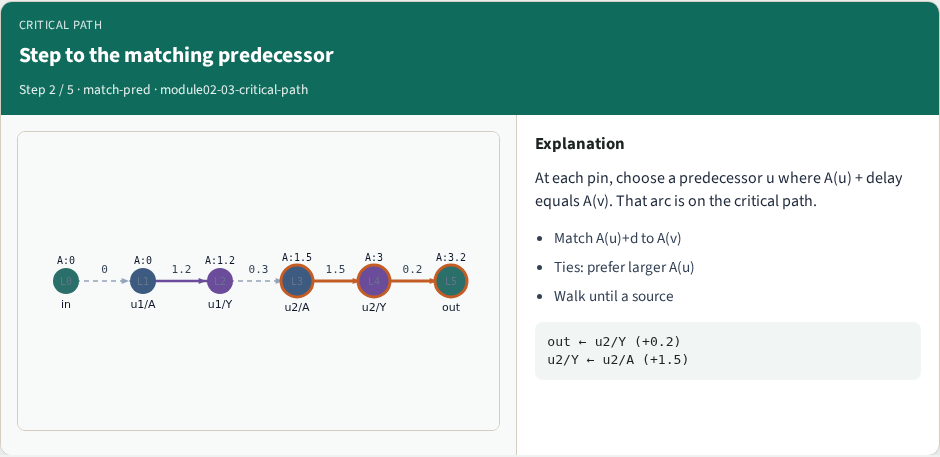
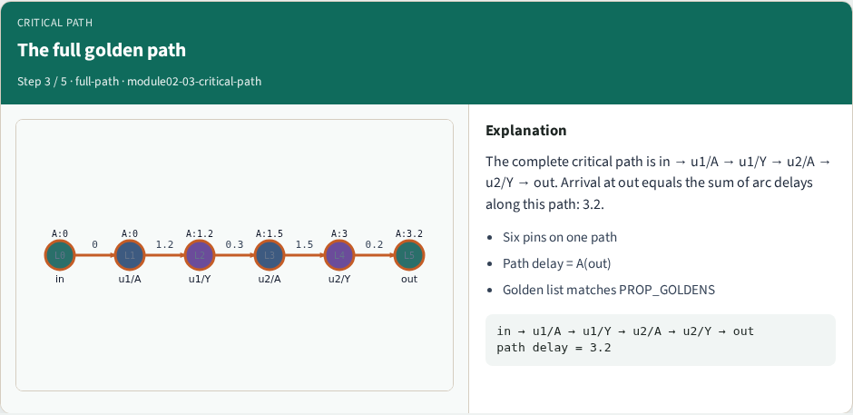
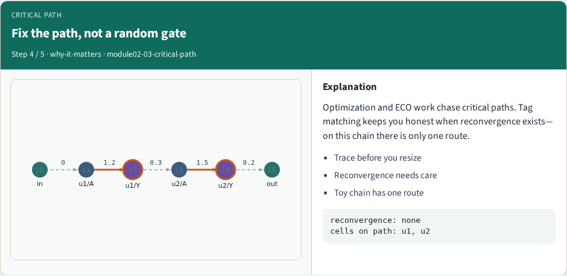
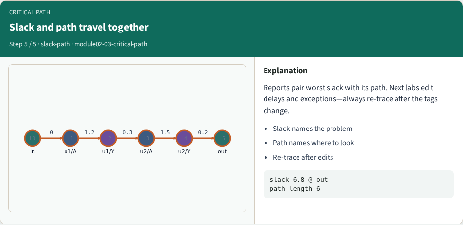

# Critical path

When slack is bad, or even when it is good, you still need the path

---

## Goldens to remember
- Critical path has six pins
- Path delay equals A(out)=3.2
- Always match A(u)+d to A(v)
- Keep these numbers handy, the browser challenges and Track A tests use the same instance
- <!-- algorithm-walkthrough -->

---

## Start from the worst endpoint

---

## Step to the matching predecessor

---

## The full golden path

---

## Fix the path, not a random gate

---

## Slack and path travel together

---

## Browser lab track
- In the browser lab, open **critical-path**
- Load the starter, run the analysis once, and read the metrics panel
- Orient yourself, challenge panel, canvas, Check, then mirror the same goldens in code

---

## Implement track
- In the implement track
- Run `python3 common/test_propagate.py` (and the timing-graph test) until the goldens print

---

## Pitfall
- Do not mix setup and hold required maps
- Do not propagate before the graph is levelized
- After an edit or exception, recompute, stale tags lie

---

## Your turn
- Finish the checklist on at least one track, preferably both
- When your numbers match the goldens, take the quiz, then continue

