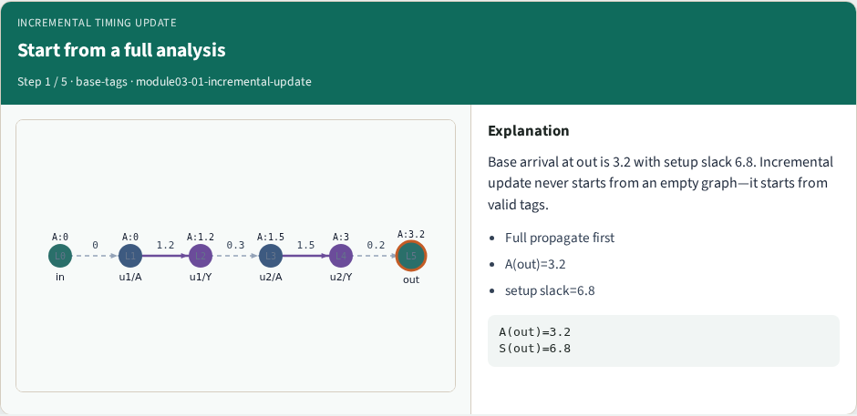
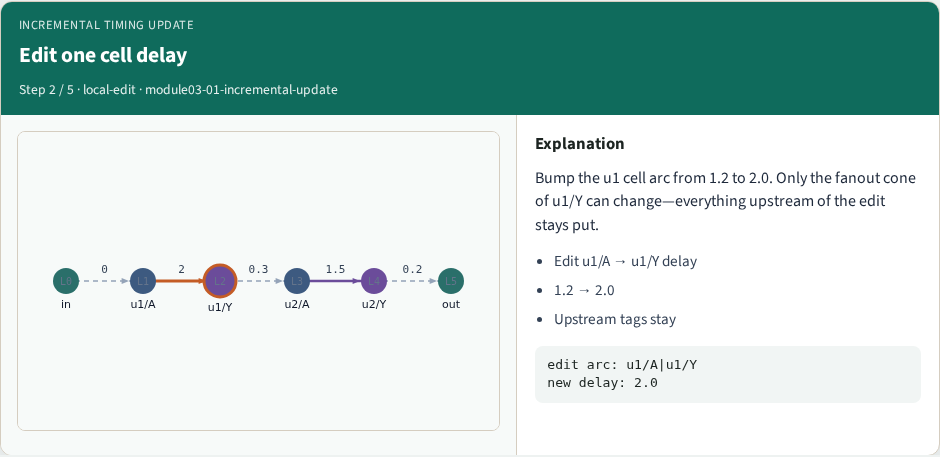
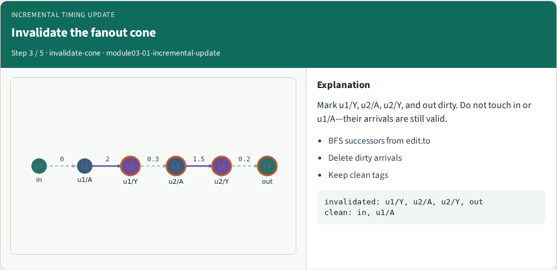
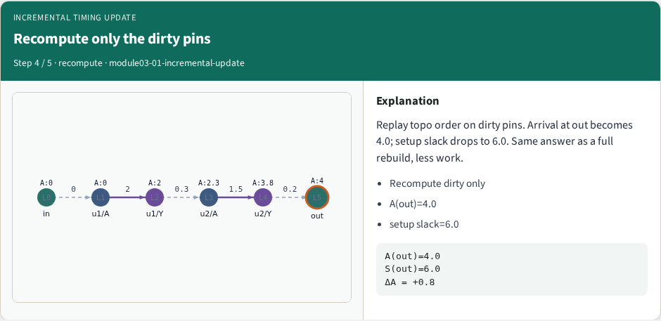
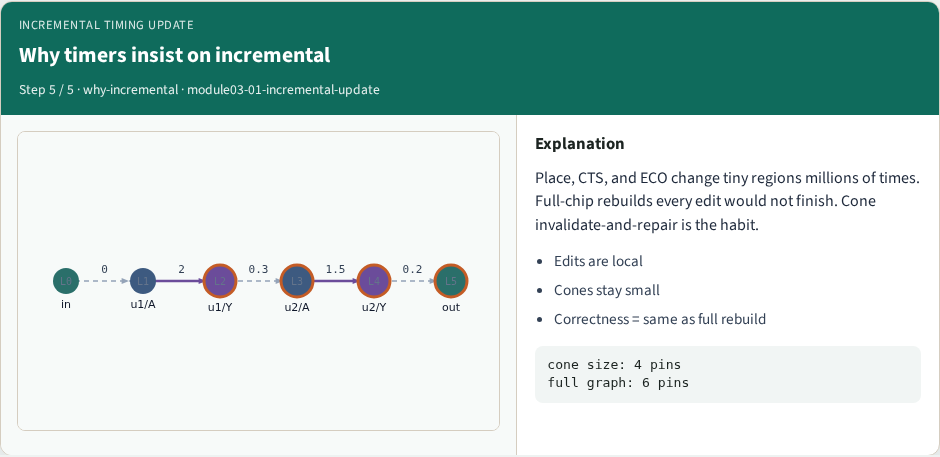

# Incremental timing update — step-by-step (for slides / transcript)

**Module:** `module03-01-incremental-update`  
**Lab / algo:** `incremental-update`  
**Viewer:** `/tools/algorithm-walkthrough/?algo=incremental-update&step=1`

Use each **Caption** as spoken prose (or a shortened slide note).
Use **Bullets** on the PPT; pair with the PNG in `assets/steps/`.

## Step 1 — Start from a full analysis



**Caption (transcript):** Base arrival at out is 3.2 with setup slack 6.8. Incremental update never starts from an empty graph—it starts from valid tags.

**Slide bullets:**

- Full propagate first
- A(out)=3.2
- setup slack=6.8

**On-screen metrics:**

```
A(out)=3.2
S(out)=6.8
```

## Step 2 — Edit one cell delay



**Caption (transcript):** Bump the u1 cell arc from 1.2 to 2.0. Only the fanout cone of u1/Y can change—everything upstream of the edit stays put.

**Slide bullets:**

- Edit u1/A → u1/Y delay
- 1.2 → 2.0
- Upstream tags stay

**On-screen metrics:**

```
edit arc: u1/A|u1/Y
new delay: 2.0
```

## Step 3 — Invalidate the fanout cone



**Caption (transcript):** Mark u1/Y, u2/A, u2/Y, and out dirty. Do not touch in or u1/A—their arrivals are still valid.

**Slide bullets:**

- BFS successors from edit.to
- Delete dirty arrivals
- Keep clean tags

**On-screen metrics:**

```
invalidated: u1/Y, u2/A, u2/Y, out
clean: in, u1/A
```

## Step 4 — Recompute only the dirty pins



**Caption (transcript):** Replay topo order on dirty pins. Arrival at out becomes 4.0; setup slack drops to 6.0. Same answer as a full rebuild, less work.

**Slide bullets:**

- Recompute dirty only
- A(out)=4.0
- setup slack=6.0

**On-screen metrics:**

```
A(out)=4.0
S(out)=6.0
ΔA = +0.8
```

## Step 5 — Why timers insist on incremental



**Caption (transcript):** Place, CTS, and ECO change tiny regions millions of times. Full-chip rebuilds every edit would not finish. Cone invalidate-and-repair is the habit.

**Slide bullets:**

- Edits are local
- Cones stay small
- Correctness = same as full rebuild

**On-screen metrics:**

```
cone size: 4 pins
full graph: 6 pins
```

