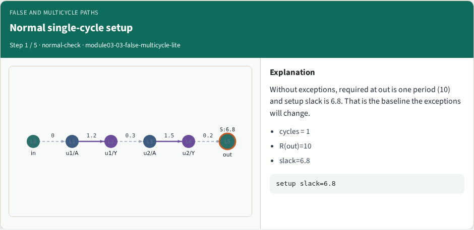
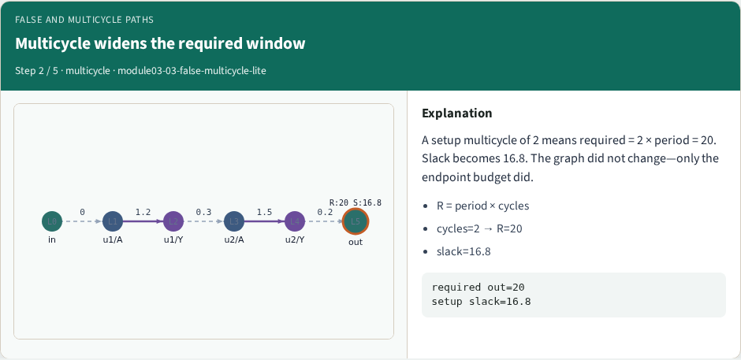
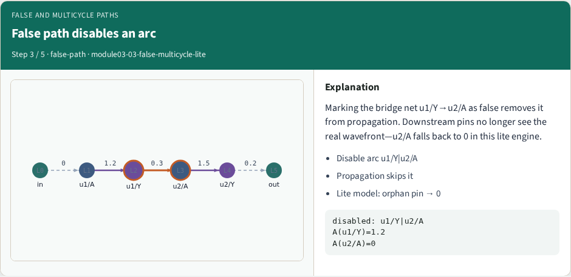
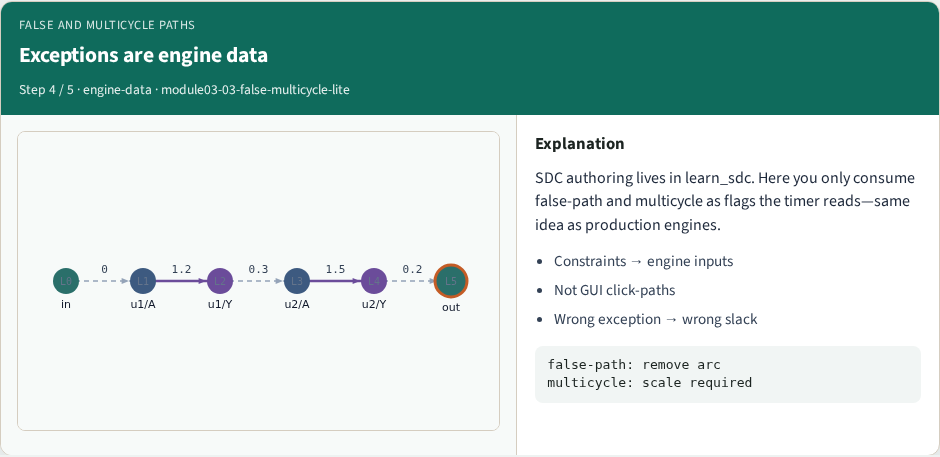
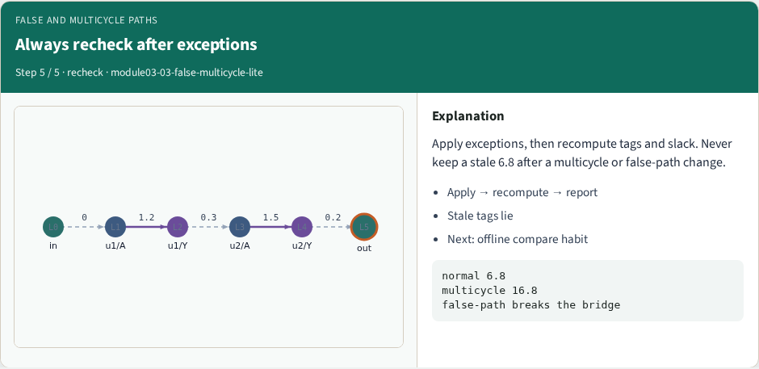

# False and multicycle paths (engine view)

Exceptions change which arcs propagate and how large the required window is

---

## Goldens to remember
- Multicycle cycles=2 → R(out)=20, slack=16.8
- False-path disables u1/Y→u2/A so A(u2/A) falls to 0 in the lite model
- Keep these numbers handy, the browser challenges and Track A tests use the same instance

---

## Pseudocode
- Exceptions enter the same propagate sketch
- False paths omit disabled arcs
- Multicycle setup multiplies the sink required by setup cycles times the period
- Open this module's examples file and find the Pseudocode section
- That written sketch is what you implement on the implement track and what the browser

---

## Algorithm sketch
- Default slack at out is six point eight
- Two cycles raises required to twenty and slack to sixteen point eight
- Disabling u1/Y to u2/A removes that timing path

---

## Algorithm sketch — try these

```
INPUT: G, disable set S, setup_cycles
OUTPUT: setup slack at sink
A ← prop_arrival using arcs ∉ S
R ← prop_required; R[sink]←period×cycles
slack ← R[sink] − A[sink]
GOLDEN default: slack(out)=6.8
cycles=2 → R[out]=20, slack=16.8
disable u1/Y→u2/A breaks that path
```

---

## Normal single-cycle setup


---

## Multicycle widens the required window


---

## False path disables an arc


---

## Exceptions are engine data


---

## Always recheck after exceptions


---

## Browser lab track
- In the browser lab, open **false-multicycle-lite**
- Load the starter, run the analysis once, and read the metrics panel
- Orient yourself, challenge panel, canvas, Check, then mirror the same goldens in code

---

## Implement track
- In the implement track
- Run `python3 common/test_propagate.py` (and the timing-graph test) until the goldens print

---

## Pitfall
- Do not mix setup and hold required maps
- Do not propagate before the graph is levelized
- After an edit or exception, recompute, stale tags lie

---

## Your turn
- Finish the checklist on at least one track, preferably both
- When your numbers match the goldens, take the quiz, then continue

